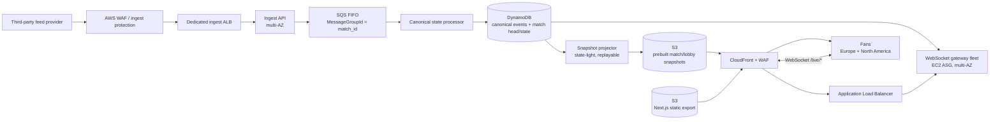
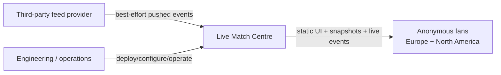
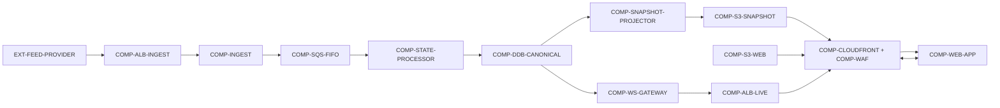
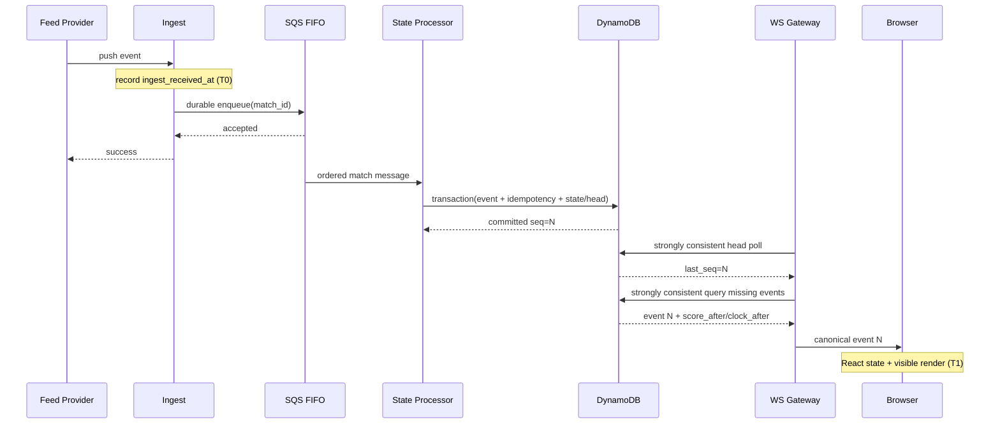
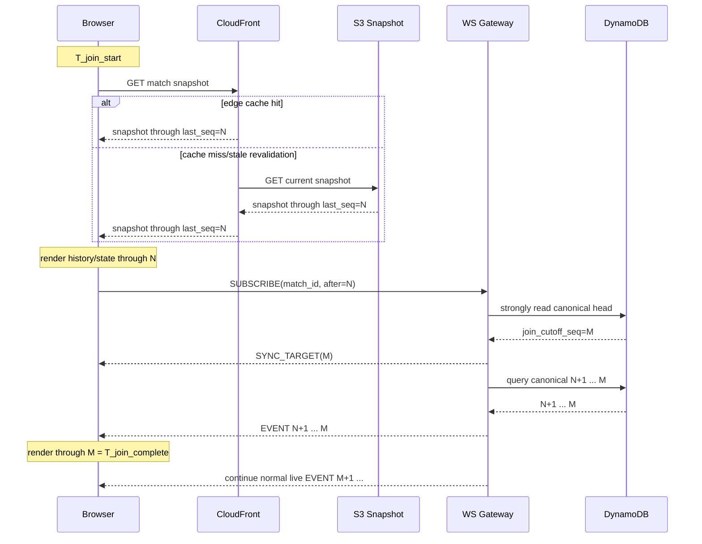
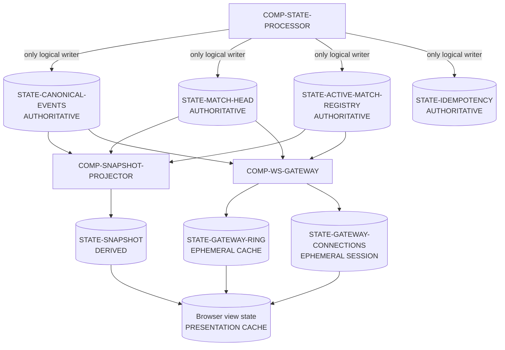
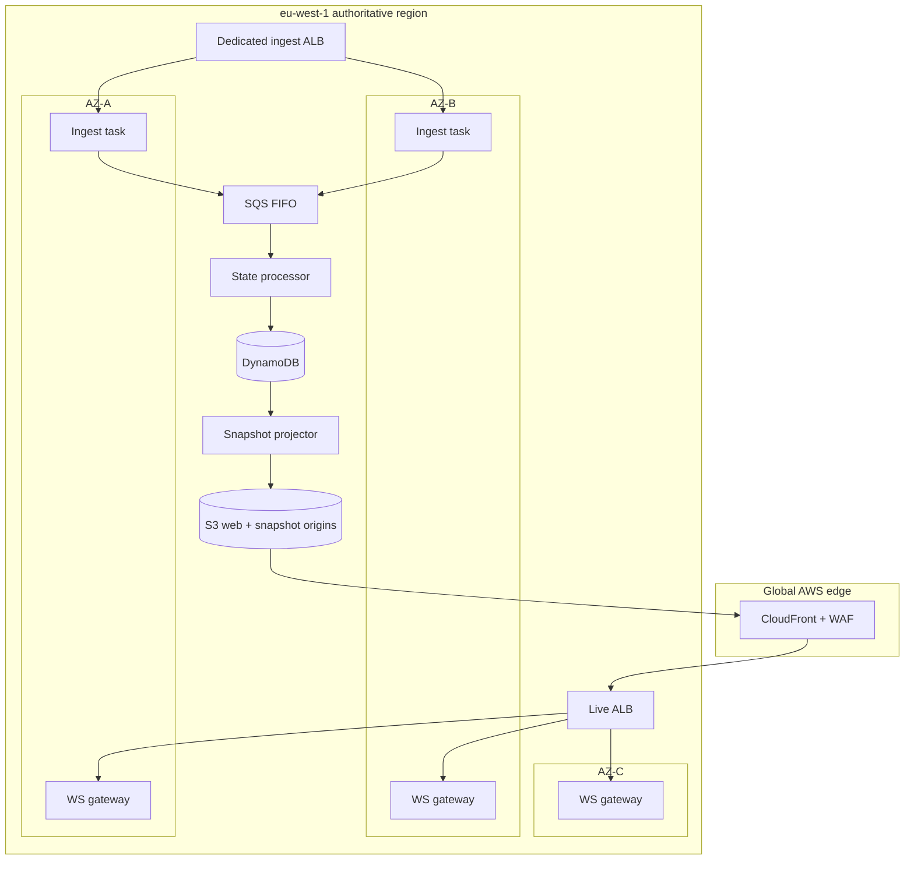
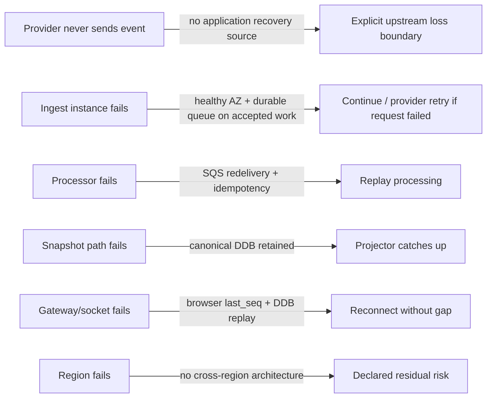
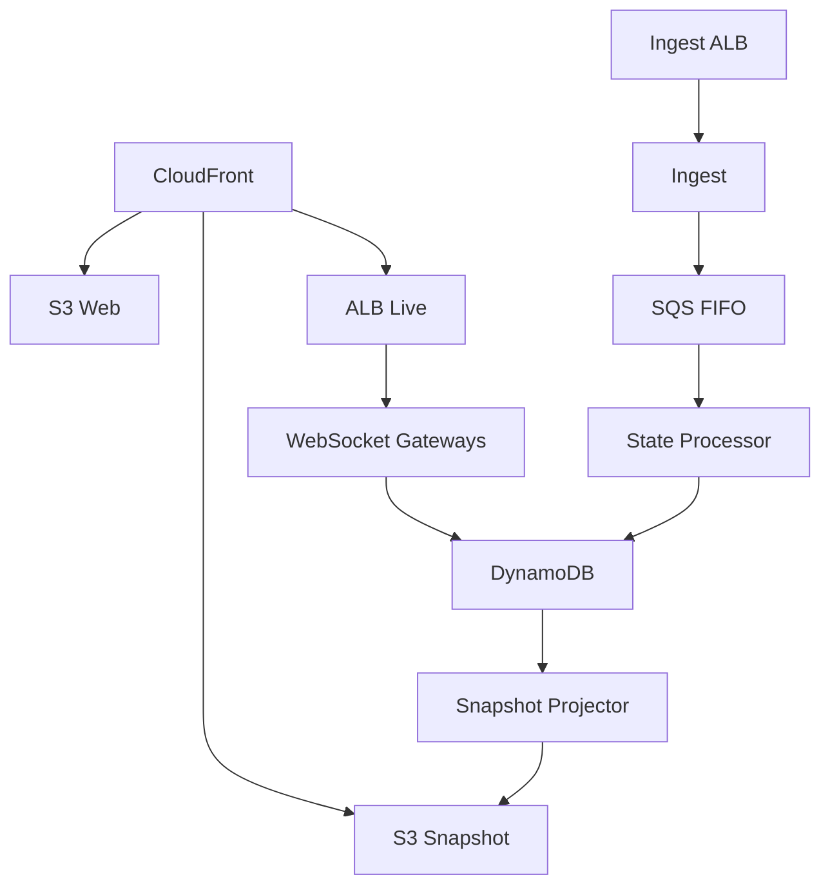

# EQC-AC Architecture Contract — Live Match Centre Take-Home

**Architecture ID:** `ARCH-LMC-001`  
**Architecture Version:** `v0.24.2`  
**EQC-AC Standard:** `EQC-AC v1.5.1`  
**Date:** 2026-08-19  
**Status:** `REVIEW`  
**Readiness:** `ARCH_BLOCKED_EXTERNAL_ASSUMPTION`  
**Concurrent blocking statuses:** `ARCH_BLOCKED_UNVALIDATED_CRITICAL_ASSUMPTION`, `ARCH_BLOCKED_COST_UNKNOWN`  
**System:** Production Live Match Centre  
**Governing assignment:** `requirement.pdf` — *Take-Home Assignment: Senior Fullstack Engineer*  
**AI control document:** `AGENTS.md` — *Live Match Centre Take-Home — AI/Implementation Control Contract*  
**Purpose:** Turn the assignment into a complete, explicit architecture contract before compressing the result into the required `proposal.md` and before choosing/finalizing the POC.

## Architecture Identity — Normative Metadata

```yaml
architecture_id: ARCH-LMC-001
title: "Live Match Centre Take-Home Architecture Contract"
eqc_ac_version: "1.5.1"
architecture_version: "v0.24.2"
status: review
system_id: SYS-LMC
owner: candidate
last_updated: 2026-08-19
governing_requirements:
  - requirement.pdf
governing_eqc_documents:
  - EQC-AC-v1.5.1
  - AGENTS.md
governing_eqc_es_root: NOT_REGISTERED_TAKE_HOME_WORKSPACE
eqc_es_registration:
  status: DEFERRED_INTERNAL_WORKING_DOCUMENT
  type_if_registered: other
  profile: EQC-AC
```

`NOT_REGISTERED_TAKE_HOME_WORKSPACE` is explicit rather than omitted: this take-home is not currently a formal EquationCode document portfolio. If imported into that portfolio, it must be registered under EQC-ES without changing EQC-ES registry semantics.

> **Important packaging note:** This is an internal working architecture document. The assignment's final ZIP asks for `proposal.md`, `README.md`, `poc/`, and agent instruction files actually used. This architecture contract should not be placed in the final ZIP unless deliberately reclassified as an agent instruction file or the reviewer explicitly requests it.

---

# 0. Architecture Decision Summary

The proposed production system is an **AWS, single-region/multi-AZ authoritative backend with global CloudFront delivery**, a durable ordered ingest path, DynamoDB as the canonical event/state store, S3 + CloudFront for very fast snapshot/history delivery, and a **custom WebSocket fan-out tier** behind CloudFront and an Application Load Balancer.

The architecture deliberately does **not** use API Gateway WebSockets, AppSync Events, or a per-recipient managed pub/sub service for live delivery. At 100,000 viewers, per-message fan-out pricing can become the dominant cost. Instead, the design pays primarily for a bounded number of gateway instances, load-balancer capacity, and network egress.

The key data path is:



The WebSocket gateways do **not** need a separate Redis/Kafka/pub-sub tier. Each gateway independently observes the eight match high-water marks in DynamoDB at a short fixed interval using **strongly consistent reads on the base table**, fetches newly committed canonical events with strongly consistent queries, and broadcasts them to its own connected viewers. This makes origin/database work scale with **gateway count and match count**, not directly with viewer count.

Snapshot materialization is deliberately separated from canonical event processing. A replayable snapshot projector observes the same durable match heads, catches up from canonical events, and publishes full lobby/match snapshots to S3. A temporary S3/projector failure therefore cannot block canonical event processing or live delivery.

For late join/reload/wake-up:

```text
CloudFront snapshot
    -> {full history, score, clock anchor, last_seq}
    -> open/reopen WebSocket with after=last_seq
    -> gateway replays canonical events after last_seq
    -> continue live
```

The architecture-critical POC assumption is:

> **A small, horizontally scalable WebSocket gateway fleet can sustain the required concurrent connections and surge while broadcasting the assignment's event burst with enough server-side latency headroom to keep the end-to-end goal p95 under 2 seconds.**

That assumption is intentionally not marked proven. It is the POC target.

---

# 1. System Goal and Non-Goals

## 1.1 Goal

Build a production Live Match Centre for anonymous, read-only fans that:

- shows every live match and its current score/minute in a lobby, with goals/cards updating live;
- streams goals/cards and match events without manual refresh;
- provides the full play-by-play/run-of-play history supplied by the feed immediately on late join/reload/wake-up;
- keeps visible score, clock, and event history coherent;
- prevents application-induced duplicate/disappearing/out-of-order display;
- keeps goal latency at `p95 <= 2s` from ingest to viewer screen;
- keeps other-event latency at `p95 <= 5s`;
- remains materially equivalent at 100 viewers and 100,000 viewers;
- handles `+40,000` viewers within two minutes;
- fits within `<= $3,000/month` at the declared peak-month workload;
- supports weekly deployment during live matches without visible data gaps.

These are assignment facts, not inferred requirements.

## 1.2 Non-goals

The following are explicitly out of scope unless needed to satisfy the assignment:

- user accounts;
- authentication for fans;
- write actions from fans;
- video/audio streaming;
- betting/trading features;
- social/chat features;
- a full event-provider reconciliation product;
- a second provider;
- a full multi-region active-active backend;
- analytics/data warehouse architecture;
- Kubernetes;
- service mesh;
- Kafka/MSK;
- a managed WebSocket service billed per fan message;
- cloud deployment of the POC;
- full production implementation.

## 1.3 Provider-boundary non-goal

The application cannot guarantee recovery of an event **never delivered by the third-party provider**. The architecture guarantee starts when the application has durably accepted an event.

```text
provider loss != application loss
```

---

# 2. System Context

## 2.1 Actors

| ID | Actor | Relationship |
|---|---|---|
| `ACT-FAN` | Anonymous fan | Public read-only consumer |
| `ACT-FEED` | Third-party feed provider | Pushes match events |
| `ACT-ENGINEERING` | Engineering/deployment operator | Deploys and operates system |
| `ACT-REVIEWER` | Take-home reviewer | Evaluates architecture and POC evidence |

## 2.2 External systems

### `EXT-FEED-PROVIDER`

**Known from assignment**

- Pushes approximately `10 events/s total`.
- Bursts to approximately `50 events/s`.
- Delivery is best-effort.
- There is no long retry window.
- Score and clock are derived from the event stream.

**Not supplied by assignment**

The assignment does not state whether the provider supplies:

- a globally unique event ID;
- a per-match monotonic sequence;
- an occurrence timestamp;
- duplicate deliveries;
- replay;
- snapshot/reconciliation endpoint;
- authentication mechanism;
- IP ranges;
- schema versioning guarantees.

These must not be silently promoted to guarantees.

## 2.3 Responsibility boundary

### System owns

- durable acceptance of events after successful ingest;
- application canonical sequence;
- application-side idempotency;
- derived match state;
- canonical history;
- current snapshot materialization;
- viewer resume/replay;
- live delivery;
- fan-facing ordering;
- deployment continuity;
- downstream gap recovery from the application's canonical store.

### System does not own

- whether the provider generated the correct event;
- whether the provider delivered every real-world event;
- provider-side duplicate semantics that cannot be distinguished from legitimate identical events;
- provider outage/replay capability not stated in the assignment.

---

# 2A. Stakeholders, Concerns, Views

## 2A.1 Stakeholder/concern registry

| Concern ID | Stakeholder | Concern | Priority | Architecture response |
|---|---|---|---|---|
| `CONCERN-LIVE` | Fan | Goal feels live | HARD | End-to-end p95 budget, persistent push |
| `CONCERN-TRUST` | Fan | No gaps/dupes/order doubt | HARD | Sequence + idempotency + replay |
| `CONCERN-JOIN` | Fan | Full history within 2s | HARD | Edge-cached prebuilt snapshot |
| `CONCERN-SURGE` | Fan/ops | +40k/2min | HARD | Pre-scaled gateway capacity + autoscaling |
| `CONCERN-GEO` | Fan | EU + NA | HARD input | CloudFront global edge; one backend region initially |
| `CONCERN-COST` | Business | <= $3k/month | HARD | Custom fan-out + compact payload + cost sensitivity |
| `CONCERN-DEPLOY` | Fan/engineering | Live deploy invisible | HARD | Resumeable connection + draining |
| `CONCERN-UPSTREAM` | Engineering | Provider is best-effort | HARD boundary | Fast durable ingress; honest loss boundary |
| `CONCERN-EXPLAIN` | Reviewer | Every number/decision defensible | HARD assignment process | Evidence/assumption registry |

## 2A.2 Required architecture views

| View ID | Concern answered | Concrete representation |
|---|---|---|
| `VIEW-CONTEXT` | Who/what is outside vs inside the system? | §2 + §4.5.1 |
| `VIEW-COMPONENT` | What production components exist and why? | §4.1 + §4.5.2 + §5 |
| `VIEW-INTERACTION` | How does an event become visible and how does late join work? | §4.5.3 + §4.5.4 + §6 |
| `VIEW-STATE` | Who owns canonical truth and which copies are derived? | §4.5.5 + §8 |
| `VIEW-DEPLOYMENT` | Where do components run and what is multi-AZ/global? | §4.5.6 + §10 |
| `VIEW-FAILURE` | What survives failures and what is unrecoverable? | §4.5.7 + §11 |
| `VIEW-CAPACITY` | What scales with viewers vs matches/gateways? | §4.5.8 + §11A + §12 |
| `VIEW-COST` | What dominates monthly cost and which variables control it? | §4.5.9 + §16 |

All views use the component/interface/state IDs in this document and are projections of the same governed model.

## 2A.3 Controlled vocabulary

Normative terms (`MUST`, `MUST NOT`, `SHOULD`, `MAY`, `UNKNOWN`, `ASSUMPTION`, `EXTERNAL FACT`, `INFERENCE`, `DECISION`, `INVARIANT`, `BUDGET`, `BLOCKED`, `VALIDATED`, `WAIVED`, `DEGRADED`) inherit their EQC-AC v1.5.1 meanings.

### Identifier / unit / notation conventions

```yaml
time_basis:
  server_wall_clock: UTC timestamps from synchronized/controlled hosts for evidence runs
  process_elapsed_time: monotonic clocks for within-process segments
  browser_elapsed_time: performance/monotonic browser clock
  cross_host_latency: requires documented clock synchronization or measured server-time offset calibration
latency_units: milliseconds unless explicitly stated
rate_units: events/second or connections/second
capacity_units: concurrent connections/viewers
bytes:
  planning_calculations: decimal bytes unless otherwise labelled
cost:
  aws_pricing_input_currency: USD unless the pricing source states otherwise
  governing_budget_currency: UNKNOWN because the assignment says "$3,000" without naming currency
  period: month unless otherwise labelled
  normalization_rule: convert/compare in one explicitly declared currency before a hard-budget PASS
percentiles:
  p95: empirical 95th percentile of the declared end-to-end sample population
sequence:
  seq: per-match application commit/replay sequence
unknown_marker: UNKNOWN
architecture_ids:
  component: COMP-...
  state: STATE-...
  invariant: INV-...
  policy: POLICY-...
  interface: IFACE-...
  flow: FLOW-...
  decision: ADR-ARCH-...
  assumption: ASM-...
  risk: RISK-...
  validation: VAL-...
  evidence: EVID-...
```

A rate or percentile without its population/boundary is not considered a complete architecture measurement.

| Term | Meaning in this architecture |
|---|---|
| **received** | bytes/request reached `COMP-INGEST`; not yet durable |
| **accepted** | normalized event has been durably enqueued in SQS FIFO and the system may acknowledge the provider |
| **committed** | canonical event + idempotency record + derived match head/state transaction completed in DynamoDB |
| **canonical sequence (`seq`)** | application-owned per-match monotonic order assigned to committed accepted events |
| **provider occurrence time** | provider-supplied event-time field if one exists; never silently substituted for canonical sequence |
| **snapshot** | derived complete lobby/match representation coherent through its declared `last_seq` |
| **resume sequence** | highest canonical sequence the viewer has applied |
| **live** | delivery after a known canonical sequence through the WebSocket path |
| **late join** | initial load, reload, reconnect after sleep, or any case where durable history must be reconstructed before continuing |
| **viewer-screen latency** | ingest measurement boundary to browser receipt/state update/render measurement point; not merely server-send latency |

`event time`, `ingest time`, `commit time`, and `viewer render time` are distinct clocks and MUST remain separately named.

## 2A.3A Architecture Proposition Classification

Every architecture-relevant proposition in this contract is classified as one of:

```text
GOVERNING_REQUIREMENT
EXTERNAL_FACT
ARCHITECTURE_DECISION
ASSUMPTION
MEASUREMENT
INFERENCE
WAIVER
```

Classification rules:

- `REQ-*` and the 45-point assignment matrix are `GOVERNING_REQUIREMENT`.
- `EVID-*` entries sourced from AWS/Next.js/provider documentation are `EXTERNAL_FACT` only to the exact scope/date/region/version stated by their evidence record.
- `ADR-ARCH-*`, topology selections, and approved architecture policies are `ARCHITECTURE_DECISION`.
- `ASM-*` and declared planning inputs without governing evidence are `ASSUMPTION`.
- `VAL-*` output becomes `MEASUREMENT` only after a run produces a traceable evidence artifact; planned criteria are not measurements.
- Calculations derived from facts/assumptions are `INFERENCE` unless the calculation itself is a measured observation.
- `WAIVER` exists only through §25B; current count is zero.

A proposition MUST NOT be promoted to a stronger class merely because it is convenient for the design. In particular, local `E2` POC evidence is not production proof.

## 2A.4 Model kinds

### `MK-COMPONENT-CONNECTOR`
Elements: component, datastore, external, browser, edge.  
Relationships: calls, pushes, queues-to, reads, writes, streams-to.

### `MK-STATE-OWNERSHIP`
Elements: state domain, owner, reader, writer.  
Rule: every authoritative mutable state domain has one logical writer.

### `MK-DEPLOYMENT`
Elements: runtime unit, AZ, edge, managed service, scaling group.

### `MK-FAILURE`
Elements: failure domain, recovery source, degraded mode.

## 2A.5 Cross-model correspondence rules

- Every runtime component in `VIEW-COMPONENT` maps to a deployment/runtime owner in `VIEW-DEPLOYMENT`, except browser/managed-edge abstractions.
- Every authoritative state write in `VIEW-STATE` maps to exactly one allowed writer in the dependency/interaction model.
- Every cross-component arrow in a diagram maps to an interaction ID in §6.
- Every WebSocket/live-delivery relationship maps to `FLOW-VIEWER-LIVE` plus `FLOW-GATEWAY-POLL` / `FLOW-GATEWAY-EVENT-READ`.
- Every late-join path maps to `STATE-SNAPSHOT` + `last_seq` + durable replay.
- Every failure claim maps to a recovery source or is explicitly declared unrecoverable.
- Every hard latency/cost/capacity claim maps to a workload/budget/validation item.
- Diagrams are projections of the registries; if a diagram and a registry disagree, the registry/contract is authoritative until the inconsistency is corrected.

---

# 3. Requirement Index

## 3.1 Hard assignment requirements

| Requirement ID | Assignment statement | Architecture binding | Status |
|---|---|---|---|
| `REQ-MATCHES` | 8 concurrent live matches | SQS groups, state partitions, gateway polling | SATISFIED_BY_DESIGN |
| `REQ-INGEST-STEADY` | ~10 events/s total | ingress + SQS FIFO + processor | SATISFIED_BY_DESIGN |
| `REQ-INGEST-BURST` | ~50 events/s | same | SATISFIED_BY_DESIGN |
| `REQ-VIEWERS` | 100,000 concurrent | WebSocket gateway fleet | **POC REQUIRED** |
| `REQ-SURGE` | +40,000 / 2 min | CloudFront handshake path + pre-scaled gateways | **POC REQUIRED** |
| `REQ-GEO` | ~60% Europe / ~40% North America | CloudFront edge + EU primary | NEEDS LATENCY VALIDATION |
| `REQ-GOAL-LAT` | p95 <=2s ingest -> viewer screen | latency budget | NEEDS END-TO-END EVIDENCE |
| `REQ-OTHER-LAT` | p95 <=5s | latency budget | NEEDS END-TO-END EVIDENCE |
| `REQ-LATE-JOIN` | full history <=2s | S3 snapshot + CloudFront + replay | NEEDS VALIDATION |
| `REQ-BUDGET` | <=$3k/month at peak | cost model | CONDITIONAL ON WORKLOAD/PAYLOAD |
| `REQ-DEPLOY` | weekly live deploys unnoticed | drain/reconnect/resume | NEEDS INTEGRATION VALIDATION |
| `REQ-FRONTEND` | Next.js App Router | static App Router app | SATISFIED_BY_DESIGN |
| `REQ-AWS` | AWS preferred | AWS architecture | SATISFIED |
| `REQ-SCORE-CLOCK` | derived from event stream | state processor + canonical `state_after` | SATISFIED_BY_DESIGN |
| `REQ-LOBBY` | lobby shows all live matches, score/minute, goals/cards live | canonical active-match registry + lobby snapshot + lifecycle/state deltas | SATISFIED_BY_DESIGN |
| `REQ-NO-BLANK` | never blank/manual refresh | edge snapshot + preserve-visible-state reconnect policy + explicit error state | SATISFIED_BY_DESIGN |
| `REQ-CORRECTNESS` | score agrees with events; no app-induced duplicate/disappear/out-of-order | transactional canonical state + sequence + replay + explicit correction history | SATISFIED_BY_DESIGN |
| `REQ-CROWD-EQUIV` | experience materially identical at 100 and 100k viewers | viewer-independent canonical path + scalable gateways | **POC REQUIRED** |

## 3.1A One-for-one assignment architecture completeness matrix

This matrix mirrors every explicit architecture requirement from the assignment so none is left implicit.

| # | Explicit assignment requirement | Architecture response | Evidence / remaining gate |
|---:|---|---|---|
| 1 | Production architecture | AWS production topology, multi-AZ application tier, durable managed services | Design complete; evidence gates remain |
| 2 | Full stack feed -> fan screen | ingest -> canonical state -> snapshot/live -> browser render | Covered end to end |
| 3 | Anonymous/read-only/public/no accounts | public static app + subscription-only live channel | Covered |
| 4 | Lobby shows every live match | lobby snapshot contains all active matches | Covered |
| 5 | Lobby shows current score and minute | canonical state -> lobby snapshot/live updates | Covered |
| 6 | Goals/cards update live without refresh | lobby subscribes to all active match IDs | Covered |
| 7 | Open a match at any point | snapshot + `last_seq` + live resume | Covered |
| 8 | Late join gets everything so far | full canonical snapshot/history | `VAL-SNAPSHOT-HANDOFF` |
| 9 | Reload gets everything so far | deterministic snapshot/replay | `VAL-SNAPSHOT-HANDOFF` |
| 10 | Return after phone sleeps | visibility/network/socket recovery retains UI and resumes | integration validation |
| 11 | Then keeps streaming | WebSocket resume/live path | POC + integration |
| 12 | Never blank feed | keep last valid UI; explicit unavailable state on initial failure | UI/integration validation |
| 13 | Never manual refresh | automatic snapshot/reconnect/replay | integration validation |
| 14 | Score agrees with events | canonical `score_after` bound to sequence/history | replay/property validation |
| 15 | Nothing appears twice | ingest/state idempotency + client sequence suppression | property validation |
| 16 | Nothing disappears | durable canonical log + replay | property validation |
| 17 | Nothing arrives/displays out of order | per-match canonical `seq`; gap pauses/replays | property validation |
| 18 | Goal p95 <=2s ingest -> screen | exact T0 ingest boundary -> T1 visible UI render | final e2e validation |
| 19 | Other-event p95 <=5s | same exact measurement boundary | final e2e validation |
| 20 | Full history visible <=2s | edge snapshot + gateway `SYNC_TARGET(join_cutoff_seq)` + replay/render through that target | snapshot/live handoff validation |
| 21 | Experience identical at 100 vs 100k | same protocol/state semantics; only gateway capacity scales | selected POC |
| 22 | 8 concurrent matches | match grouping/head/subscription model supports 8 | Covered |
| 23 | ~10 events/s total | minimal ingest/queue/state path | Covered by design |
| 24 | bursts ~50 events/s | SQS buffer + serialized per-match processor | validate; low architectural risk |
| 25 | Feed provider pushes events | HTTPS provider push endpoint | Covered |
| 26 | Feed best-effort/no long retry | fast durable ACK boundary; no invented upstream recovery | Covered |
| 27 | 100,000 concurrent viewers | horizontally scalable WebSocket gateways | **selected POC** |
| 28 | +40,000 viewers in 2 min | pre-scaled fleet + connection headroom + retry | **selected POC** |
| 29 | ~60% Europe/~40% North America | CloudFront global edge + EU authoritative region | geo validation |
| 30 | <=$3,000/month peak | transfer-first cost model + custom fanout | final current-price calculation |
| 31 | Weekly deploys during live matches | rolling replacement + drain + resume/replay | deploy validation |
| 32 | Viewers must not notice deploy | preserve rendered UI; background reconnect; no blank/loading reset | explicit validation |
| 33 | Score derived from event stream | sole canonical state processor | Covered |
| 34 | Clock derived from event stream | canonical feed-derived clock anchors; browser only extrapolates presentation | provider-schema dependency |
| 35 | Next.js App Router | static App Router frontend | Covered |
| 36 | Component-based frontend | explicit React component/data-layer boundaries | Covered |
| 37 | AWS preferred or justify alternative | AWS selected | Covered |
| 38 | Propose system actually build | one selected production topology | Covered |
| 39 | Reader can see whole system | context/component/flow/state/deployment views | Covered |
| 40 | Explain decisions | `ADR-ARCH-*` | Covered |
| 41 | Explain alternatives weighed | WebSocket/SSE/managed fanout/single-vs-multi-region/snapshot choices | Covered |
| 42 | Explain why winners won | composition-aware ADR rationale | Covered |
| 43 | Name assumption trusted least | provider identity/order/correction semantics are least trusted overall; gateway capacity is the riskiest local test | Covered |
| 44 | Riskiest assumption would invalidate design | `ASM-PROVIDER-SEMANTICS` invalidates strict correctness if false | Covered |
| 45 | If genuine highest risk cannot be local, test riskiest local one and note it | provider semantics cannot be tested without the real feed/schema; gateway capacity is selected local POC | Covered |

### Completeness rule

"Covered" means the architecture contains the mechanism. It does **not** mean unrun evidence has been fabricated. POC, geo, snapshot, deployment, cost, and end-to-end latency items remain explicit validation gates.

## 3.2 Quality-attribute scenarios

### `QA-GOAL-LATENCY`

```yaml
source: third-party feed
stimulus: goal event arrives at the application ingest boundary and `ingest_received_at` is recorded
environment: peak viewer load
artifact: ingest -> canonical state -> gateway -> browser
response: goal rendered in subscribed viewer UI
measure: p95 <= 2 seconds
```

### `QA-OTHER-LATENCY`

```yaml
source: third-party feed
stimulus: non-goal event arrives at the application ingest boundary and `ingest_received_at` is recorded
environment: peak viewer load
response: event rendered
measure: p95 <= 5 seconds
```

### `QA-LATE-JOIN`

```yaml
source: fan
stimulus: opens/reloads/wakes match page
environment: live match, peak load
response:
  snapshot is rendered, the live gateway establishes a synchronization target,
  and the browser visibly catches up through that target
measurement_boundary:
  T_join_start: browser navigation/reload/wake recovery begins
  join_cutoff_seq: canonical match head observed by the gateway when the live subscription is accepted
  T_join_complete: browser has visibly rendered every canonical event through join_cutoff_seq
measure: T_join_complete - T_join_start <= 2 seconds
postcondition:
  events committed after join_cutoff_seq continue under the normal live-event latency SLO
```

This prevents a stale snapshot from being counted as a successful late join merely because it is internally coherent. The 2-second requirement means the viewer is caught up to an explicit canonical synchronization boundary.

### `QA-SURGE`

```yaml
source: fans
stimulus: +40,000 connections within 120 seconds
environment: popular kickoff
response: new viewers receive snapshot and live connection without materially degrading existing viewers
measure: no material violation of latency/correctness requirements
```

### `QA-DEPLOY`

```yaml
source: engineering
stimulus: weekly production deployment
environment: live match
response: new connections go to new version; existing connection closes/drains only after resume path is ready; replay removes gaps
measure: no visible event loss/duplicate/order break and no blank/loading reset caused by deployment
```

### Latency measurement boundary — assignment-authoritative

The assignment measures goal and other-event latency **from ingest to the viewer's screen**.

This contract defines that boundary as:

```text
T0 = COMP-INGEST records ingest_received_at immediately when the pushed event
     crosses the application ingest boundary, before SQS durability work.

T1 = the browser has received the canonical event, updated React state, and
     completed the corresponding visible UI commit/render.

assignment latency = T1 - T0
```

`durably accepted`, `committed`, `gateway sent`, and `browser received` remain useful diagnostic timestamps, but none replaces T0/T1 for the assignment SLO.

Canonical/live envelopes retain `ingest_received_at` so controlled browser validation can measure the actual end-to-end boundary.

Because `T0` and `T1` originate on different hosts/processes in representative validation, `T1 - T0` is accepted only under `POLICY-MEASUREMENT-CLOCK`. Raw unsynchronized browser/server timestamps are not evidence.

## 3.3 Architecture principles

1. `MANDATORY` — durable acknowledgement before provider success response.
2. `MANDATORY` — one logical canonical sequence per match.
3. `MANDATORY` — client-visible state/history is sequence-bound.
4. `MANDATORY` — fan-out nodes are not authoritative state owners.
5. `MANDATORY` — reconnect/reload always has a replay source.
6. `DEFAULT_WITH_JUSTIFIED_EXCEPTION` — avoid per-viewer managed-message pricing.
7. `DEFAULT_WITH_JUSTIFIED_EXCEPTION` — avoid extra distributed systems until required by evidence.
8. `MANDATORY` — mutable external facts remain sourced/dated.

## 3.4 Requirement feasibility note

The assignment gives a **monthly budget** and a **peak concurrency**, but it does not state:

- how many hours per month 100,000 viewers persist;
- average live-event payload size;
- how viewers distribute among match pages versus the lobby;
- duration/frequency of the 50 events/s burst.

Therefore an exact monthly transfer cost is mathematically underdetermined from assignment data alone.

This is not treated as permission to ignore the budget. The architecture uses:

- a cost formula;
- explicit workload assumptions;
- sensitivity thresholds;
- a requirement that final `proposal.md` state the assumption.

If the required interpretation is **100,000 viewers continuously, 24x7 for a full month**, the outbound transfer component alone may breach $3,000 depending on payload volume. That interpretation would require either a different budget, much stronger payload aggregation/compression, or a different delivery economics model.

## 3.5 Requirement Conflict and Feasibility Gate

No hard assignment requirement is currently declared mutually contradictory, but one hard-feasibility question is unresolved because the assignment does not provide enough monthly workload information to prove the cost ceiling.

```yaml
feasibility_id: FEAS-ARCH-COST-001
requirements:
  - REQ-VIEWERS
  - REQ-SURGE
  - REQ-BUDGET
question: "Can the selected production topology remain <=$3,000/month under the governing interpretation of peak-month viewer-hours and measured payload/capacity?"
current_reason:
  - peak viewer-hours/month are not supplied
  - gateway instance count is POC-derived
  - final current regional prices/support-network costs are not yet frozen
  - the assignment does not name the `$3,000` budget currency
candidate_resolutions:
  - validate a declared peak-month workload and current price model
  - reduce bytes/fan-out cost without weakening correctness/latency
  - reopen ADR-ARCH-003 / other topology decisions
owner: candidate
status: blocked_pending_evidence
blocking_status: ARCH_BLOCKED_COST_UNKNOWN
```

If evidence proves that all hard requirements cannot coexist under the declared boundary/budget, status becomes `ARCH_BLOCKED_INFEASIBLE_REQUIREMENTS`. The architecture must then be redesigned or a requirement changed by its owner; it must not silently weaken latency, correctness, concurrency, or budget.

---

# 4. Architecture Overview

## 4.1 Selected architecture

### Frontend
- Next.js App Router.
- Static export (`output: 'export'`) because public pages do not require server-side user state.
- Static routes such as `/` and `/match`; match identity may be passed in query/navigation state rather than requiring arbitrary dynamic static-export paths.
- Hosted in S3.
- Delivered through CloudFront.

### Snapshot/history
- State processor creates a complete match snapshot after each committed canonical event.
- Snapshot contains:
  - full canonical event history needed by the UI;
  - derived score;
  - period;
  - clock anchor;
  - `last_seq`;
  - schema version.
- Written to S3 with a stable match key.
- CloudFront caches it briefly (target `~1s`, exact cache policy to be validated).
- Lobby snapshot is separately materialized.

### Ingest
- Dedicated provider-only ingest endpoint.
- **Dedicated ingest ALB**, separate from the fan WebSocket ALB, so kickoff/reconnect surges cannot consume the same load-balancer path used by the best-effort upstream feed.
- AWS WAF/allowlisting/HMAC where provider capabilities permit.
- Multi-AZ stateless ingest service.
- Performs bounded validation/normalization.
- assigns an internal `ingest_attempt_id`;
- derives a semantic event key only when `POLICY-EVENT-IDENTITY` has a provider-contract-supported identity rule;
- Sends event to SQS FIFO.
- Returns provider success only after SQS acknowledges.

### Ordering/state processor
- SQS FIFO `MessageGroupId = match_id`.
- Parallel across matches; serialized within one match.
- Processor derives canonical application sequence `seq`.
- DynamoDB transaction:
  - persists canonical event;
  - persists durable idempotency key;
  - advances match head/current state conditionally.
- Processor materializes S3 snapshot after commit.
- SQS message is deleted after the canonical DynamoDB transaction succeeds. Snapshot projection is independently replayable from committed state and cannot block the canonical queue.

### Live delivery
- CloudFront explicitly supports WebSockets to custom origins.
- `/live/*` behavior is non-cacheable and routes to an ALB.
- ALB routes persistent upgraded connections to a WebSocket gateway fleet.
- Gateway fleet runs in an EC2 Auto Scaling Group across >=3 AZs.
- Each gateway:
  - holds only ephemeral connection state;
  - maps viewers to one of two delivery classes:
  - `LOBBY`: compact deltas for all active matches, limited to score/clock/period and lobby-visible goals/cards/corrections;
  - `MATCH`: full canonical events for one selected match;
  - polls the eight DynamoDB match-head records at a short fixed interval;
  - fetches only newly committed events;
  - broadcasts compact frames;
  - keeps a small non-authoritative ring buffer for fast reconnect;
  - falls back to DynamoDB replay if the ring buffer is insufficient.

## 4.2 Why no Redis/Kafka in the selected architecture

At only eight live matches and 10-50 events/s, adding Redis Pub/Sub, Kinesis, Kafka/MSK, or another fan-out bus is not required to decouple producer rate from viewer count.

The gateway tier already needs the durable event store for replay. Polling eight high-water marks at a sub-second interval is bounded by:

```text
gateway_instances * 8 match heads
```

not:

```text
viewer_count
```

This keeps one fewer failure domain and one fewer live-delivery dependency.

If the number of matches grows by orders of magnitude later, a dedicated event bus becomes a reasonable revisit.

## 4.3 Why WebSocket instead of managed WebSocket fan-out

A managed connection/message service is operationally attractive, but the architecture must account for recipient-multiplied message economics at 100,000 viewers.

The selected option keeps broadcast compute under direct control:

```text
one canonical event
  -> N gateway processes
  -> many socket writes
```

rather than creating a cloud-billed managed message delivery for each recipient.

## 4.4 Why WebSocket instead of SSE

SSE is semantically attractive because traffic is server-to-client only and resume is simple. WebSocket wins in the selected composition because:

- CloudFront has explicit documented WebSocket support;
- ALB has explicit documented WebSocket support;
- compact/binary framing is available if cost/throughput requires it;
- the same persistent-channel abstraction supports explicit resume by `last_seq`;
- reconnect semantics can be implemented in the client deterministically.

This is a preference reversal: SSE wins on protocol simplicity; WebSocket wins after explicit CDN support, byte efficiency, and fan-out stress are considered together.

## 4.5 Concrete Architecture Views

### 4.5.1 `VIEW-CONTEXT`



**Boundary:** the system owns correctness after durable application acceptance. It does not own provider event generation or a never-delivered upstream event.

### 4.5.2 `VIEW-COMPONENT`



The component graph has one canonical mutable-state owner path and two derived fan-facing paths:

```text
snapshot/history path
live/replay path
```

### 4.5.3 `VIEW-INTERACTION` — Live Event



The assignment latency is `T1 - T0`.

### 4.5.4 `VIEW-INTERACTION` — Late Join / Reload / Wake



`SYNC_TARGET(M)` freezes the meaning of "caught up" for that join attempt. Events committed after `M` do not move the finish line; they are normal live traffic governed by the 2s/5s event SLOs.

If the phone wakes with an existing valid screen, the UI remains visible while the transport reconnects. It does not clear history while waiting.

### 4.5.5 `VIEW-STATE`



Authoritative truth can be reconstructed without S3, gateway memory, or browser state.

### 4.5.6 `VIEW-DEPLOYMENT`



The exact runtime instance/task count changes with capacity evidence; the logical ownership/topology does not.

### 4.5.7 `VIEW-FAILURE`



### 4.5.8 `VIEW-CAPACITY`

The scaling relationships are intentionally different by layer:

```text
provider ingest work
    ~ event rate
    ~ 10/s steady, 50/s burst

canonical processing work
    ~ event rate
    partitioned by 8 match IDs

gateway database observation work
    ~ gateway_count × match_count × poll_rate
    NOT viewer_count

gateway socket/fan-out work
    ~ connected viewers × delivered event rate
    THIS is the POC-critical scaling term

snapshot origin work
    ~ snapshot materialization rate
    viewer late-join GETs are mostly edge-served
```

At the provisional six-gateway peak:

```text
100,000 viewers / 6 ≈ 16,667 sockets per gateway average
40,000 / 120s / 6 ≈ 56 new connections/s per gateway average
6 × 8 × 4 polls/s = 192 match-head reads/s
```

The averages do not replace the hot-match/worst-concentration test.

### 4.5.9 `VIEW-COST`

```text
                         monthly sensitivity
                              ▲
                              │
        ┌─────────────────────┼────────────────────┐
        │                     │                    │
 live bytes/viewer       peak viewer-hours    fanout implementation
        │                     │                    │
        ▼                     ▼                    ▼
 CloudFront/egress       transfer volume      EC2 + ALB vs
 dominant term           multiplier           recipient-priced service
```

Cost priority:

1. viewer-delivered bytes;
2. gateway/ALB connection capacity;
3. observability/WAF;
4. DynamoDB/SQS/S3/processor, which are comparatively small at 10–50 canonical events/s.

This is why wire payload and peak-hours assumptions are explicit sensitivity points rather than hidden constants.

---

# 5. Component Contracts

## `COMP-WEB-APP`

**Kind:** browser application / static web artifact  
**Technology:** Next.js App Router + React + TypeScript  
**Purpose:** render lobby/match UI; merge snapshot + live canonical stream.

**Responsibilities**
- display cached initial shell immediately;
- fetch lobby or match snapshot;
- verify snapshot schema;
- establish live connection with `after=last_seq`;
- track the gateway's immutable `SYNC_TARGET`: scalar per-match cutoff for `MATCH`, or per-match cutoff map for `LOBBY`, for the current synchronization attempt;
- declare catch-up complete only when every canonical sequence through that target has been visibly applied;
- for lobby, apply `IFACE-LOBBY-SNAPSHOT-v1`, retain its `registry_version` + per-match `last_seq` map, then open one logical `LOBBY` subscription; the gateway sends match-added/removed plus compact state/key-event deltas across the active set rather than full run-of-play events;
- for a match page, open one `MATCH` subscription and receive the full canonical play-by-play for that match;
- on `visibilitychange`, `pageshow`, network restoration, or a stale/dead socket after phone sleep, retain visible state, reconnect, and resume from `last_seq`;
- never clear already-valid history merely because the live socket is reconnecting;
- if initial snapshot cannot be obtained, show an explicit unavailable/error state rather than an empty feed that looks valid;
- for `MATCH`, apply a live event only if its `seq` is the expected next canonical sequence; suppress duplicates/regressions and treat a gap as replay-required;
- for `LOBBY`, accept only a strictly newer per-match projection sequence/state version; canonical sequence gaps are expected because routine events are intentionally filtered;
- never interpret a sparse lobby sequence jump as a missing-event error by itself;
- reconnect and replay/resynchronize according to the delivery class;
- render canonical `score_after`/clock state carried with live events rather than independently inventing authoritative score state;
- extrapolate display clock only from a canonical running clock anchor using a monotonic browser timer;
- resynchronize clock when a newer canonical anchor arrives.

**Non-responsibilities**
- authoritative score;
- authoritative ordering;
- provider validation;
- permanent event storage.

### Component-based React/App Router structure

The assignment explicitly requires a component-based frontend. The logical component boundaries are:

```text
AppShell
├── LobbyPage
│   ├── LiveMatchList
│   │   └── LiveMatchCard
│   │       ├── ScoreDisplay
│   │       ├── MatchClock
│   │       └── KeyEventStrip
│   └── LiveConnectionBoundary
└── MatchPage
    ├── MatchHeader
    │   ├── ScoreDisplay
    │   └── MatchClock
    ├── EventTimeline
    │   └── EventRow
    └── LiveConnectionBoundary
```

Shared transport/state logic sits behind a small live-match data layer/hook/provider responsible for snapshot fetch, `last_seq`, WebSocket lifecycle, resume/replay, duplicate/gap handling, and canonical state updates. Visual components consume canonical view state and do not implement ordering/network rules themselves. Exact filenames remain a downstream FIC/code decision.

---

## `COMP-CLOUDFRONT`

**Kind:** edge/CDN  
**Purpose:** global entry point for static app, snapshots, and WebSocket handshakes/transport.

**Responsibilities**
- global edge routing;
- TLS at edge;
- cache static app/assets;
- cache snapshots with short freshness policy;
- forward `/live/*` as non-cacheable WebSocket traffic;
- attach WAF controls;
- keep AWS-origin-to-CloudFront transfer economics explicit.

**Non-responsibilities**
- canonical state;
- fan-out aggregation;
- live message durability.

---

## `COMP-S3-WEB`

Static Next.js export.

## `COMP-S3-SNAPSHOT`

Prebuilt lobby/match snapshots. Not authoritative.

- a match snapshot identifies scalar canonical `last_seq`;
- a lobby snapshot identifies a per-match `{match_id -> last_seq}` vector.

Both are sequence-bound derived state and must satisfy monotonic publication rules.

Snapshot cache contract:

```text
browser max-age = 0
CloudFront MinTTL = 0
CloudFront DefaultTTL = 1s
CloudFront MaxTTL = 1s
```

The exact deployed cache policy must be verified before production. The design intentionally tolerates a briefly stale snapshot because `last_seq` makes catch-up deterministic.

---

## `COMP-SNAPSHOT-PROJECTOR`

**Kind:** replayable derived-state projector  
**Purpose:** keep complete lobby/match snapshots fresh without coupling S3 availability to canonical processing.

**Responsibilities**
- obtain a consistent active-set cut by strongly reading `STATE-ACTIVE-MATCH-REGISTRY` (`R1`), strongly reading heads for that active set, then re-reading the registry (`R2`); if `R2.version != R1.version`, retry the cut;
- load its last successful snapshot/cursor on startup;
- query only missing canonical events;
- update in-memory derived snapshot;
- publish the full snapshot as one S3 object using conditional write preconditions;
- on update, use the ETag of the object version that was read (`If-Match`); for first creation use `If-None-Match: *`;
- on match-snapshot conflict, compare scalar `last_seq`: discard older/equal candidate or rebuild/retry;
- on lobby-snapshot conflict, compare the per-match sequence vector componentwise and rebuild if any governed match would regress;
- publish lobby snapshots under the same conditional-write rule using `IFACE-LOBBY-SNAPSHOT-v1`;
- expose `canonical_head_seq - snapshot_last_seq` lag.

**Recovery**
- no local state is authoritative;
- on restart, load S3 snapshot and catch up from DynamoDB;
- if S3 snapshot is absent/corrupt, rebuild from canonical events.

**Shutdown**
- stop initiating new head polls;
- allow or safely abandon an in-flight derived snapshot PUT;
- never block canonical processing shutdown on projector-local state;
- on next startup, reconcile from `last_seq` rather than trusting process memory.

**Non-responsibilities**
- canonical event ordering;
- provider acknowledgement;
- fan live delivery.

---

## `COMP-ALB-INGEST`

**Kind:** dedicated provider ingress load balancer  
**Purpose:** isolate the best-effort feed acceptance path from public fan connection/fan-out surges.

**Responsibilities**
- terminate/route provider HTTPS traffic to healthy ingest targets across AZs;
- maintain an independent traffic/failure path from `COMP-ALB-LIVE`;
- attach provider-specific WAF/authentication controls;
- preserve a short, bounded path to durable SQS acknowledgement.

**Non-responsibilities**
- fan WebSocket handshakes;
- public snapshot/static delivery;
- canonical state processing.

The extra load-balancer cost is intentional. Sharing the fan ALB would let the `+40,000 / 2 min` viewer surge directly compete with the feed path even though the provider has no long retry window.

---

## `COMP-INGEST`

**Kind:** stateless service  
**Placement:** multi-AZ  
**Purpose:** convert provider push into durable accepted work quickly.

**Input:** provider event envelope  
**Output:** SQS FIFO message

**Responsibilities**
- authenticate/authorize provider if provider capability exists;
- schema validation;
- bounded normalization;
- timestamp `ingest_received_at`;
- derive dedupe identity;
- enqueue durably;
- acknowledge only after enqueue success.

**Must not**
- perform expensive fan-out;
- wait for viewer-facing processing;
- own match state.

---

## `COMP-SQS-FIFO`

**Purpose:** durability, per-match ordered work serialization, burst buffer.

`MessageGroupId = match_id`.

Application idempotency remains necessary because SQS FIFO deduplication is not a permanent event-identity store.

---

## `COMP-STATE-PROCESSOR`

**Kind:** worker  
**Purpose:** sole logical writer of canonical match state.

**Responsibilities**
- consume one match group serially to avoid concurrent mutation;
- pass each accepted feed item through the provider-semantic canonicalization gate defined by `ADR-ARCH-007`;
- resolve semantic idempotency only under the provider-contract-supported identity rule;
- if the provider supplies authoritative sequence but does not guarantee in-order push, follow the provider-contract-defined bounded reorder/gap rule; **do not treat SQS arrival order as semantic truth**;
- assign application commit/replay `seq` only after semantic canonicalization;
- derive score and clock anchor;
- transactionally persist event + head/state/idempotency;
- persist the canonical `score_after` and clock anchor associated with each committed sequence;
- update the canonical active-match registry/version when provider-semantic match-start/end lifecycle events are accepted;- apply provider-defined correction/cancellation semantics without silently deleting prior canonical sequence entries;- recover cleanly after redelivery/restart.

**Non-responsibilities**
- viewer connections.

---

## `COMP-DDB-CANONICAL`

**Kind:** durable canonical datastore  
**Capacity mode:** on-demand initially.

Stores:
- the complete canonical play-by-play event log keyed by `(match_id, seq)`, including goals, cards, and routine/run-of-play events supplied by the provider;
- canonical active-match registry with monotonic `registry_version`;
- match head/current state;
- idempotency record keyed by normalized provider identity;
- optional compact metadata.

**Authoritative for**
- application canonical sequence;
- canonical accepted history;
- derived score/state.

---

## `COMP-WS-GATEWAY`

**Kind:** state-light fan-out server  
**Runtime:** optimized async/event-loop implementation on EC2.

**Responsibilities**
- accept WebSocket connection;
- validate subscription target;
- perform resume/replay;
- strongly read/freeze one `join_cutoff_seq` for `MATCH`, or a per-match cutoff map for `LOBBY`, per subscription/reconnect attempt;
- emit `SYNC_TARGET` before catch-up events;
- maintain per-connection last sent sequence;
- poll match heads;
- fetch new canonical events;
- broadcast in sequence;
- heartbeats;
- bounded per-client output buffers;
- disconnect slow clients before memory becomes unbounded;
- expose connection/queue/latency metrics.

**Non-responsibilities**
- canonical state mutation;
- provider ingest;
- permanent client session.

---

## `COMP-ALB-LIVE`

**Purpose:** healthy-target routing for WebSocket gateways.

Architecture relies on documented ALB WebSocket support and connection draining.

---

## `COMP-WAF`

**Purpose:** public endpoint protection.

Controls:
- handshake/request rate limits;
- obvious abusive IP/device patterns;
- bot/burst controls where appropriate;
- provider-ingest restrictions.

WAF does not replace application buffer limits or connection admission control.

---

## 5.1 Component Admission and Traceability Matrix

Every production component must earn its place by satisfying a requirement, enforcing an invariant, or implementing a recorded architecture decision.

| Component | Primary requirement / concern | Decision / invariant binding | Admission |
|---|---|---|---|
| `COMP-WEB-APP` | lobby/match UX, no refresh, late join, Next.js/component architecture | `ADR-ARCH-001`, `INV-LIVE-ORDER`, `INV-LATE-JOIN-CUTOFF` | ADMITTED |
| `COMP-CLOUDFRONT` | EU/NA edge delivery, fast snapshot/static path, WebSocket edge proxy | `ADR-ARCH-001`, `ADR-ARCH-002`, `ADR-ARCH-006` | ADMITTED |
| `COMP-S3-WEB` | cacheable static App Router export | `ADR-ARCH-001` | ADMITTED |
| `COMP-S3-SNAPSHOT` | <=2s late-join history source | `ADR-ARCH-006`, `INV-SNAPSHOT-BOUND`, `INV-SNAPSHOT-MONOTONIC` | ADMITTED |
| `COMP-SNAPSHOT-PROJECTOR` | fresh snapshots without coupling S3 to canonical commit | `ADR-ARCH-006`, `INV-SNAPSHOT-MONOTONIC`, `INV-LOBBY-ACTIVE-SET-COMPLETE` | ADMITTED |
| `COMP-ALB-INGEST` | isolate best-effort provider path from viewer surge | `INV-UPSTREAM-BOUNDARY` | ADMITTED |
| `COMP-INGEST` | minimal durable provider ACK path | `INV-UPSTREAM-BOUNDARY`, `POLICY-EVENT-IDENTITY` | ADMITTED |
| `COMP-SQS-FIFO` | absorb bursts and serialize each match | `INV-SEQUENCE-MONOTONIC`, `INV-SINGLE-WRITER` | ADMITTED |
| `COMP-STATE-PROCESSOR` | canonical event/state derivation | `INV-SINGLE-WRITER`, `INV-IDEMPOTENT-EVENT`, `INV-SCORE-HISTORY-COHERENT`, `INV-HISTORY-NONDISAPPEARING`, `INV-LOBBY-ACTIVE-SET-COMPLETE` | ADMITTED |
| `COMP-DDB-CANONICAL` | durable canonical log/head/idempotency and replay | `ADR-ARCH-004` | ADMITTED |
| `COMP-WS-GATEWAY` | 100k live fan-out, compact lobby projection, full-match resume/replay | `ADR-ARCH-002`, `ADR-ARCH-003`, `ADR-ARCH-004`, `ADR-ARCH-009`, `INV-LOBBY-PROJECTION-COHERENT`, `INV-LOBBY-ACTIVE-SET-COMPLETE` | ADMITTED / POC-BLOCKED |
| `COMP-ALB-LIVE` | healthy-target routing/drain for persistent sockets | `ADR-ARCH-002`, weekly-deploy requirement | ADMITTED |
| `COMP-WAF` | public/provider trust boundaries and coarse abuse protection | security/trust requirement | ADMITTED |

No component is admitted solely because a product/service exists.

---

# 5A. Architecture Invariant Registry

## 5A.0 Invariant Governance Matrix

This matrix is the authoritative governance layer for every `INV-*` ID used by downstream FIC bindings or validation.

| Invariant ID | Scope / authoritative owner | Derived from | Enforcement | Validation / fitness binding | Status |
|---|---|---|---|---|---|
| `INV-SEQUENCE-MONOTONIC` | match canonical state / architecture owner + state processor | `REQ-CORRECTNESS` | FIFO match serialization + conditional canonical-head update | `VAL-STATE-REPLAY`, `FIT-SEQ` | ACTIVE |
| `INV-SINGLE-WRITER` | canonical state mutation / architecture owner | `REQ-CORRECTNESS` | dependency rule + SQS `MessageGroupId=match_id` + transactional/conditional write | `FIT-FORBIDDEN-DEP`, `VAL-STATE-REPLAY` | ACTIVE |
| `INV-IDEMPOTENT-EVENT` | ingest + canonical processor / architecture owner | `REQ-CORRECTNESS`, best-effort provider boundary | durable idempotency key + conditional transaction | `VAL-STATE-REPLAY`, `FIT-IDEMPOTENCY` | ACTIVE |
| `INV-SCORE-HISTORY-COHERENT` | canonical event/head + browser projection / architecture owner | `REQ-SCORE-CLOCK`, `REQ-CORRECTNESS` | event + derived state committed in one canonical transaction | `VAL-STATE-REPLAY`, `FIT-SEQ` | ACTIVE |
| `INV-HISTORY-NONDISAPPEARING` | canonical event log + browser history / architecture owner | `REQ-CORRECTNESS` | committed sequence entries are not silently deleted; corrections/cancellations are explicit canonical semantics | `VAL-CORRECTION-HISTORY`, `FIT-HISTORY-CORRECTION` | ACTIVE |
| `INV-SNAPSHOT-BOUND` | snapshot projector/object / architecture owner | `REQ-LATE-JOIN` | snapshot carries `last_seq`; projector refuses older overwrite | `VAL-SNAPSHOT-HANDOFF`, `FIT-SNAPSHOT-HANDOFF` | ACTIVE |
| `INV-SNAPSHOT-MONOTONIC` | snapshot projector/S3 publication / architecture owner | `REQ-LATE-JOIN`, mixed-version deployment | S3 conditional write + scalar MATCH / componentwise LOBBY sequence comparison prevents state regression | `VAL-SNAPSHOT-HANDOFF`, `FIT-SNAPSHOT-HANDOFF` | ACTIVE |
| `INV-LATE-JOIN-CUTOFF` | gateway/browser synchronization / architecture owner | `REQ-LATE-JOIN` | immutable `SYNC_TARGET(join_cutoff_seq)` per sync attempt | `VAL-SNAPSHOT-HANDOFF`, `FIT-SNAPSHOT-HANDOFF` | ACTIVE |
| `INV-LIVE-ORDER` | gateway/browser delivery / architecture owner | `REQ-CORRECTNESS` | client expected-next-seq rule; gap pauses application and triggers replay | `FIT-SEQ`, `VAL-SNAPSHOT-HANDOFF` | ACTIVE |
| `INV-LOBBY-PROJECTION-COHERENT` | gateway/browser lobby projection / architecture owner | `REQ-LOBBY`, `REQ-CORRECTNESS`, `REQ-BUDGET` | sync `LOBBY_STATE` equals canonical lobby-visible state through advertised seq; live deltas strictly increase but may be sparse | lobby projection tests + `VAL-DEPLOY-ZERO-VISIBLE` | ACTIVE |
| `INV-LOBBY-ACTIVE-SET-COMPLETE` | active registry/projector/gateway/browser / architecture owner | `REQ-LOBBY`, `REQ-MATCHES` | lifecycle event + registry transition commit atomically; snapshot/sync uses stable registry-version cut; ordered add/remove preserves live set | `VAL-LOBBY-PROJECTION`, active-set lifecycle test | ACTIVE |
| `INV-RECONNECT-NO-GAP` | browser/gateway replay / architecture owner | `REQ-NO-BLANK`, `REQ-DEPLOY` | browser persists last visibly applied `seq`; replay from canonical log | `VAL-DEPLOY-RECONNECT`, `VAL-DEPLOY-ZERO-VISIBLE` | ACTIVE |
| `INV-GATEWAY-NONAUTHORITATIVE` | gateway vs canonical store / architecture owner | failure/recovery requirement | gateway has no canonical-write permission; durable replay source is DynamoDB | `FIT-FORBIDDEN-DEP` | ACTIVE |
| `INV-UPSTREAM-BOUNDARY` | provider ingest boundary / architecture owner | best-effort provider constraint | ACK boundary after SQS durability; no fabricated recovery claim | static review + `FLOW-FEED-INGEST` contract | ACTIVE |
| `INV-PROVIDER-SEMANTICS-HONESTY` | provider/canonicalization claims / architecture owner | `ASM-PROVIDER-SEMANTICS` | architecture remains blocked until real source semantics support correctness claim | evidence/provider-contract review | ACTIVE / BLOCKING |

Rules:
- implementation that invalidates an `ACTIVE` invariant triggers architecture impact analysis;
- a downstream FIC may bind only to an invariant present in this matrix;
- no invariant may be silently weakened by implementation defaults;
- `WAIVED` requires the formal waiver process and cannot be used for an assignment requirement.

## `INV-SEQUENCE-MONOTONIC`

For each `match_id`, canonical `seq` is strictly increasing and never reused.

## `INV-SINGLE-WRITER`

At most one logical state mutation for a match proceeds at a time through the FIFO group + conditional DynamoDB transaction.

## `INV-IDEMPOTENT-EVENT`

Processing the same accepted provider event identity more than once does not create a second canonical event or apply score mutation twice.

## `INV-SCORE-HISTORY-COHERENT`

For any canonical `last_seq = N`, visible derived score/state is the result of applying canonical events through `N`.

## `INV-HISTORY-NONDISAPPEARING`

Once an application canonical event sequence entry is committed and eligible for display, the architecture does not silently remove that sequence entry from canonical history.

When the real provider contract supports correction/cancellation:

```text
original canonical event
  +
explicit correction/cancellation semantics
  -> new derived score/state
  -> UI marks/reconciles the affected event without erasing the audit/history position
```

Exact provider reference semantics remain governed by `ASM-PROVIDER-SEMANTICS`.

## `INV-SNAPSHOT-BOUND`

Every snapshot carries `last_seq`. It never claims to contain history beyond that sequence.

## `INV-SNAPSHOT-MONOTONIC`

For each stable snapshot key:

```text
MATCH snapshot:
  published.last_seq must never decrease

LOBBY snapshot:
  candidate.registry_version must be >= current.registry_version
  and, for every match present in both snapshots at the governed active-set boundary,
  candidate.last_seq_by_match[match] must be >= current.last_seq_by_match[match]
```

Newly active/removed matches follow the governed active-match lifecycle; a stale writer may not reintroduce an obsolete state vector.

Concurrent or mixed-version projector writes use conditional S3 writes plus scalar/vector sequence comparison. A failed precondition is a reconciliation signal, not permission to blind-overwrite the object.

## `INV-LATE-JOIN-CUTOFF`

For each initial load/reload/wake synchronization attempt, the gateway establishes one immutable `join_cutoff_seq` when it accepts the subscription.

The browser may claim late-join completion only after every canonical event through that sequence is visibly rendered.

Events committed after the cutoff remain live traffic and MUST NOT continuously move the late-join completion target.

## `INV-LIVE-ORDER`

A client must not apply event `N+1` before event `N`.

If a gap is detected:

```text
do not guess
-> pause application of later events
-> replay from durable store
```

## `INV-LOBBY-PROJECTION-COHERENT`

For each match represented in the lobby:

```text
LOBBY_STATE(through_seq=N)
must equal the canonical lobby-visible projection of state through N
```

Live `LOBBY_DELTA.seq` must strictly increase relative to the last applied lobby state/delta for that match, but contiguity is not required because non-lobby events are deliberately filtered.

A filtered event is allowed only when omitting its full payload cannot make the lobby's score, clock, period, goal/card/correction presentation inconsistent with canonical state.

During lobby catch-up, all required lobby-visible key-event deltas between the prior per-match snapshot boundary and frozen cutoff must be replayed before the final `LOBBY_STATE` for that cutoff.

## `INV-LOBBY-ACTIVE-SET-COMPLETE`

At any lobby synchronization boundary:

```text
rendered live-match set
=
STATE-ACTIVE-MATCH-REGISTRY at the advertised registry_version
```

After that boundary, `MATCH_ADDED` / `MATCH_REMOVED` frames with increasing `registry_version` move the rendered set forward without manual refresh.

The architecture MUST NOT treat the peak value `8` as a static configured list of match IDs.

## `INV-RECONNECT-NO-GAP`

Reconnection after sequence `N` resumes from `N+1`, regardless of which gateway receives the new connection.

## `INV-GATEWAY-NONAUTHORITATIVE`

Loss of all gateway memory cannot destroy canonical history/state.

## `INV-UPSTREAM-BOUNDARY`

No downstream mechanism claims to recover an event never delivered to ingest.

## `INV-PROVIDER-SEMANTICS-HONESTY`

The system MUST NOT claim strict provider-semantic deduplication/order correctness unless the real provider contract supplies enough identity/order/correction semantics to support that claim.

Unknown upstream semantics remain `UNKNOWN`; they are never silently replaced by arrival-order or generic-hash assumptions.

---

# 5B. Cross-Cutting Architecture Policies

## 5B.0 Policy Governance Matrix

| Policy ID | Scope | Owner | Explicit exceptions | Architecture binding | Validation / enforcement |
|---|---|---|---|---|---|
| `POLICY-EVENT-IDENTITY` | ingest + processor | architecture/backend | none until real provider contract defines stronger identity semantics | `ASM-PROVIDER-SEMANTICS`, `INV-IDEMPOTENT-EVENT` | `VAL-PROVIDER-CONTRACT`, `VAL-STATE-REPLAY` |
| `POLICY-CANONICAL-ORDER` | ingest/processor/gateway/browser | architecture/backend | provider-authoritative sequence supersedes arrival-order fallback when supplied | `INV-SEQUENCE-MONOTONIC`, `INV-PROVIDER-SEMANTICS-HONESTY` | `VAL-PROVIDER-CONTRACT`, `FIT-SEQ` |
| `POLICY-CORRECTION-AND-CANCELLATION` | processor/snapshot/gateway/browser | architecture/backend/frontend | none without explicit provider semantics | `INV-HISTORY-NONDISAPPEARING`, `INV-SCORE-HISTORY-COHERENT`, `ASM-PROVIDER-SEMANTICS` | `VAL-CORRECTION-HISTORY`, provider-contract review |
| `POLICY-RETRY` | ingest, processor, browser reconnect | architecture | only component-specific bounded values recorded in config/FIC; no infinite retry | latency/failure budgets | integration/failure tests |
| `POLICY-BACKPRESSURE` | WebSocket gateway/client | architecture/gateway | none: buffers remain bounded | `ADR-ARCH-003`, `BUDGET-CONCURRENCY` | `VAL-POC-GATEWAY` |
| `POLICY-DELIVERY-CLASS` | gateway/browser lobby + match subscriptions | architecture/gateway/frontend | no routine-event delivery to lobby unless it changes lobby-visible state | `REQ-LOBBY`, `REQ-BUDGET`, `ADR-ARCH-009`, `INV-LOBBY-PROJECTION-COHERENT` | `VAL-LOBBY-PROJECTION` + POC traffic-class scenarios |
| `POLICY-PAYLOAD` | gateway/browser wire envelope | architecture | representation may change if schema compatibility and budgets remain satisfied | cost/capacity decisions | POC + schema compatibility |
| `POLICY-HEARTBEAT` | gateway/browser/intermediaries | gateway/platform | exact interval is evidence/config-bound | ALB/CloudFront connection behavior | connection-duration test |
| `POLICY-SQS-VISIBILITY` | state processor | backend | none: default is never treated as exactly-once | recovery/idempotency | failure/redelivery test |
| `POLICY-MEASUREMENT-CLOCK` | ingest/server/test browser/telemetry | architecture/validation owner | none for evidence used to PASS a hard latency budget | `BUDGET-GOAL-E2E`, `BUDGET-OTHER-E2E`, `BUDGET-LATE-JOIN` | validation clock-offset/uncertainty record |
| `POLICY-CACHE` | S3/CloudFront/browser snapshot/static paths | architecture/platform | none for live path; snapshot staleness only through sequence-bound catch-up | `ADR-ARCH-001`, `ADR-ARCH-006` | `VAL-SNAPSHOT-HANDOFF`, deploy validation |
| `POLICY-ADMISSION-AND-LOAD-SHEDDING` | ingest edge + public live edge/gateway | architecture/platform | canonical accepted data is never shed | capacity/security/failure budgets | POC + saturation/failure tests |
| `POLICY-ENCRYPTION-AND-SECRETS` | public/provider/internal secrets boundaries | architecture/security | organization policy may strengthen; not weaken | security/trust boundary | configuration/security review |

Framework/service defaults are not architecture policy unless this matrix or another explicit architecture contract adopts them.

A downstream component/FIC may refine implementation details but MUST NOT weaken these policies. Any exception requires an architecture delta or formal waiver and must identify its affected requirement/risk/budget.

## `POLICY-EVENT-IDENTITY`

Production semantic idempotency uses this precedence:

1. provider immutable unique event ID, **only if the real provider contract defines it as stable/unique for the required scope**;
2. a deterministic normalized field identity, **only if `VAL-PROVIDER-CONTRACT` proves that the field set cannot collapse two distinct legitimate events**;
3. otherwise: **no semantic dedupe key is invented** and the architecture remains blocked on `ASM-PROVIDER-SEMANTICS`.

Every ingest request still gets an internal `ingest_attempt_id`, but that identifies an application delivery attempt, not the real-world/provider event.

This distinction prevents a convenient hash from silently turning two legitimate identical-looking events into one.

The provider contract must also expose enough ordering/occurrence/correction semantics to determine intended per-match event order. No downstream queue/database can reconstruct missing identity/order information.

## `POLICY-CANONICAL-ORDER`

Two orders are kept distinct:

```text
provider-semantic order
  = the intended event order established from the real provider contract

application commit sequence (`seq`)
  = the strictly increasing sequence assigned after canonicalization,
    used for replay/delivery/state-version consistency
```

The application does not infer an unstated provider ordering guarantee.

If the provider contract supplies an authoritative per-match sequence, canonicalization MUST validate/use it before assigning application commit sequence.

If no authoritative sequence exists but sufficient occurrence semantics exist, a bounded normalization/reordering rule must be specified from the real provider schema before production.

If neither exists, **arrival/processing order may be recorded as observed delivery order but MUST NOT be promoted as proof of true provider-semantic order**. The architecture remains blocked on `ASM-PROVIDER-SEMANTICS`.

Once an event is canonically committed as application `seq=N`, downstream snapshot/replay/fan delivery never reorders that committed sequence.

## `POLICY-RETRY`

- ingest producer retries SQS enqueue on transient AWS failure only while provider request remains open within a bounded response budget;
- processor retries database/materialization side effects idempotently;
- fan client reconnect uses capped exponential backoff + jitter;
- no infinite in-memory retry queue.

## `POLICY-BACKPRESSURE`

Gateway output buffer per client is bounded.

If a client cannot consume the stream fast enough:

```text
disconnect slow client
-> reconnect
-> resume from last_seq
```

Do not let one slow viewer consume unbounded gateway memory.

## `POLICY-CORRECTION-AND-CANCELLATION`

Provider corrections/cancellations are treated as first-class canonical semantics when the real provider contract defines them.

Rules:
- do not mutate history in a way that makes a previously committed sequence silently vanish;
- preserve the original event's canonical position;
- represent the correction/cancellation as an explicit canonical event or explicit immutable status/reference update whose effect is visible/auditable;
- recompute/advance `score_after` / `clock_after` under the corrected state;
- send the required correction to MATCH clients and a compact correction delta to LOBBY clients when lobby-visible state changes;
- if the provider does not supply enough reference semantics to identify what is corrected, remain blocked on `ASM-PROVIDER-SEMANTICS`.

## `POLICY-DELIVERY-CLASS`

The production fan-out path has two explicit delivery classes.

### `LOBBY`

Purpose: satisfy the lobby requirement without multiplying every routine run-of-play event by every lobby viewer.

Lobby frames include only state required to keep the live set and each `LiveMatchCard` current:

```text
match_id
seq / state_version
score_after
clock_after / period changes
goal/card/correction summary when applicable
match-added/removed lifecycle when active set changes
```

Routine match-page events that do not change lobby-visible state are not delivered to `LOBBY` subscribers.

Therefore lobby `seq` values form a **sparse monotonic projection** of the per-match canonical sequence:

```text
LOBBY: seq may jump N -> N+k when filtered events are irrelevant
MATCH: every canonical seq must be delivered/replayed contiguously
```

On initial lobby synchronization/reconnect, the gateway first freezes the canonical active-match `registry_version` and active set, then for each match in that frozen set:

1. replays every lobby-relevant goal/card/correction/period delta after the lobby snapshot's per-match sequence through the frozen cutoff, in increasing canonical sequence;
2. emits a final canonical `LOBBY_STATE` through that cutoff.

Active-set changes committed after the frozen registry version are delivered as ordered `MATCH_ADDED` / `MATCH_REMOVED` lifecycle frames after synchronization.

This guarantees both:
- no required lobby-visible key event is skipped during the snapshot-to-live handoff;
- current score/clock/period is correct even when intervening filtered routine events produced no delta.

### `MATCH`

Purpose: full play-by-play history/live stream for one selected match.

Match subscribers receive every canonical event for that match, with `score_after` / `clock_after` and sequence semantics.

Both classes derive from the same canonical event/state stream; filtering changes delivery volume, not truth or ordering.

## `POLICY-PAYLOAD`

Use compact event envelope.

Provisional wire fields:

```json
{
  "m":"match-id",
  "s":123,
  "t":"goal",
  "c":4567,
  "p":{...}
}
```

Human-readable field names may be used if measured capacity/cost permits. Compact binary encoding remains an optional optimization, not a requirement, until the POC demonstrates a need.

## `POLICY-HEARTBEAT`

Gateway emits a small heartbeat often enough to keep intermediaries from treating an otherwise idle live connection as dead. Exact interval is configuration and must remain below applicable idle timeouts.

## `POLICY-SQS-VISIBILITY`

Processor recovery depends on SQS visibility semantics.

The configured visibility timeout must exceed the normal bounded processing time with margin, or the worker must extend visibility while legitimately processing. If processing crashes or loses ownership, the message is allowed to reappear and is safe because canonical application is idempotent.

The architecture MUST NOT rely on an undocumented/default visibility timeout as an exactly-once guarantee.

## `POLICY-MEASUREMENT-CLOCK`

Architecture latency evidence MUST NOT subtract timestamps from unrelated clocks without proving their offset/uncertainty.

For controlled `VAL-E2E-LATENCY` runs:
- ingest/server and synthetic/headless-browser hosts use synchronized clocks with recorded offset/error bounds, **or**
- the test protocol calibrates server-time offset using repeated round trips and carries the resulting uncertainty into the reported latency.

Within one process, monotonic clocks are preferred for elapsed segments.

Arbitrary end-user `Date.now()` values are diagnostic only unless their server offset is calibrated. Browser render completion is measured with browser performance/render instrumentation, not merely network receive time.

If clock uncertainty is material relative to the 2s/5s SLO, the run is `INCONCLUSIVE`.

## `POLICY-CACHE`

- hashed static assets are immutable and long-lived;
- mutable HTML/entry documents use deployment-controlled freshness;
- match/lobby snapshots use the architecture cache policy (`CONFIG-CF-SNAPSHOT-TTL`, initially 1s);
- live WebSocket paths are never cacheable;
- cache staleness is tolerated only because snapshot `last_seq` + `SYNC_TARGET` makes catch-up deterministic.

## `POLICY-ADMISSION-AND-LOAD-SHEDDING`

- provider ingest and fan live traffic use separate ALBs;
- public connection admission/rate controls may shed abusive/excess connection attempts before allowing unbounded gateway pressure;
- already-accepted canonical events are never dropped as a fan-out load-shedding mechanism;
- slow viewers are disconnected with resumable sequence state rather than allowed unbounded buffers.

## `POLICY-ENCRYPTION-AND-SECRETS`

- public/provider traffic uses TLS/WSS/HTTPS;
- provider credentials/secrets use managed secret storage and are not logged or committed to static assets;
- AWS-managed encryption-at-rest defaults may be used where they satisfy the production organization's policy, but a real organizational security/compliance requirement can strengthen this without changing canonical semantics;
- no encryption default is allowed to become an unstated exception to a governing security requirement.

---

# 6. Interaction Contracts

## `FLOW-FEED-INGEST`

```yaml
source: EXT-FEED-PROVIDER
path: COMP-ALB-INGEST -> COMP-INGEST
target: COMP-INGEST
mode: HTTPS request
delivery: provider best effort
system_ack: only after SQS durable acknowledgement
retry: provider-defined / not assumed
failure: non-2xx if system cannot durably accept
```

## `FLOW-INGEST-QUEUE`

```yaml
source: COMP-INGEST
target: COMP-SQS-FIFO
MessageGroupId: match_id
MessageDeduplicationId:
  trusted_semantic_event_id: use only when provider-contract-supported
  otherwise: ingest_attempt_id
ordering: FIFO within match group by application arrival/enqueue order
note:
  - SQS transport ordering serializes processing; it is NOT evidence of provider-semantic event order
  - SQS transport deduplication MUST NOT guess semantic event identity
```

## `FLOW-QUEUE-PROCESS`

```yaml
source: COMP-SQS-FIFO
target: COMP-STATE-PROCESSOR
parallelism: across match groups
serialization: within match group
```

## `FLOW-PROCESS-DDB`

```yaml
mode: conditional transactional write
writes:
  - canonical event
  - match head/state
  - durable idempotency marker
  - active-match registry/version update when the canonical event changes match lifecycle
postcondition:
  canonical event and matching derived head become committed together;
  if the event starts/ends a live match, the active registry transition is in the same DynamoDB transaction
```

## `FLOW-SNAPSHOT-PROJECTION`

```yaml
source: COMP-DDB-CANONICAL
target: COMP-SNAPSHOT-PROJECTOR
mode: strongly consistent head polling + delta query
ordering: canonical seq
recovery: projector resumes from snapshot last_seq or rebuilds from canonical log
failure:
  snapshot becomes stale; canonical processing/live delivery continue
```

## `FLOW-PROJECTOR-S3`

```yaml
source: COMP-SNAPSHOT-PROJECTOR
target: COMP-S3-SNAPSHOT
mode:
  create: PutObject with If-None-Match="*"
  update: PutObject with If-Match=<ETag of snapshot version read>
monotonicity:
  match_snapshot:
    - candidate carries scalar last_seq
    - candidate.last_seq <= current.last_seq -> discard candidate
  lobby_snapshot:
    - candidate carries last_seq_by_match vector
    - candidate must not regress any match represented by the current lobby snapshot
    - if any candidate component is lower than current, rebuild from canonical/current base
  both:
    - conditional conflict -> re-read current snapshot
    - only a candidate at least as current in every governed sequence dimension may retry with the new ETag
idempotence:
  older/equal derived state cannot blindly overwrite a newer snapshot
failure:
  retry/rebuild from durable canonical source; alert on snapshot lag
```

The bucket policy MUST enforce conditional writes for the governed snapshot-key prefix so an implementation cannot accidentally bypass this architecture rule.

## `FLOW-SNAPSHOT-VIEWER`

CloudFront GET.

Snapshot may be briefly stale but carries `last_seq`, allowing deterministic catch-up.

## `FLOW-STATIC-WEB`

```yaml
source: COMP-S3-WEB
path: COMP-S3-WEB -> COMP-CLOUDFRONT -> COMP-WEB-APP
mode: HTTPS GET
cacheability:
  hashed_assets: long-lived immutable
  entry_documents: short-lived / deployment-controlled
failure:
  already-open clients continue using cached/loaded assets;
  new navigation may fail if the edge/origin is unavailable
```

This path serves application code only; it is not an authority for live match state.

## `FLOW-GATEWAY-POLL`

Every active gateway periodically reads the canonical active-match registry and the heads for up to eight currently active matches using strongly consistent reads on the DynamoDB **base table** (`ConsistentRead=true`).

For a lobby active-set/head cut:

```text
read registry R1
-> read heads for R1.active_matches
-> read registry R2
-> if R2.version != R1.version: discard/retry
-> else the registry/head cut is valid for synchronization/projection
```

Target interval: **250 ms initial design value**.

A confirmed change in `registry_version` updates the gateway's lobby active set and produces the appropriate `MATCH_ADDED` / `MATCH_REMOVED` projection.

This is an architecture decision, not an assignment fact. It provides at most ~250ms polling delay before database/network/processing, leaving significant room inside the 2s goal SLO.

If cost/read pressure is higher than expected, increase interval while preserving goal budget. If latency is too high, decrease interval or add push notification.

## `FLOW-GATEWAY-EVENT-READ`

When head for match advances from `N` to `M`, query canonical events `(N, M]` from the base table with `ConsistentRead=true` and emit in `seq` order.

Strong consistency is deliberate: the gateway must not observe a committed head and then miss its corresponding freshly committed canonical event because of an eventually consistent read. This is cheap at the assignment's event/match scale and directly protects the no-gap latency path.

## `FLOW-VIEWER-LIVE`

Viewer WebSocket opens and sends:

```yaml
type: SUBSCRIBE
match_id: ...
after: <highest canonical seq already visibly applied>
schema_version: 1
```

Gateway then:

For `MATCH`:
1. strongly reads the selected match head;
2. freezes it as scalar `join_cutoff_seq`;
3. sends `SYNC_TARGET(mode=MATCH, join_cutoff_seq)`;
4. replays canonical events `(after, join_cutoff_seq]`;
5. continues normal full-event live delivery.

For `LOBBY`:
1. obtains a stable registry/head cut using the `R1 -> heads -> R2` version-check protocol;
2. freezes the confirmed `registry_version`, active set, and `join_cutoff_by_match` map;
3. sends `SYNC_TARGET(mode=LOBBY, registry_version, join_cutoff_by_match)`;
4. for each match, reads canonical events after the lobby snapshot's per-match boundary through the frozen cutoff;
5. emits only the lobby-relevant `LOBBY_DELTA` frames from that interval, preserving their increasing canonical sequence;
6. emits one final `LOBBY_STATE(through_seq=cutoff)` per active match;
7. the browser is synchronized when all advertised `LOBBY_STATE.through_seq` values reach the cutoff map;
8. continues sparse monotonic `LOBBY_DELTA` live delivery for lobby-visible state/key events committed after the cutoff.

On reconnect, the client supplies the highest sequence it has actually applied, not merely received.

A client does not declare itself synchronized until it has visibly applied every sequence/state boundary through the current `SYNC_TARGET`.

Delivery behavior after synchronization:

```text
mode=MATCH
  -> full canonical events for the selected match

mode=LOBBY
  -> compact IFACE-WS-LOBBY-DELTA-v1 for all active matches
  -> no routine run-of-play payload that cannot change the lobby
```

---

# 7. Interface and Schema Ownership

## 7.0 Interface Ownership Registry

| Interface | Semantic owner | Producer | Consumer(s) | Compatibility authority |
|---|---|---|---|---|
| `IFACE-PROVIDER-EVENT` | external provider for source schema; `COMP-INGEST` for normalized boundary | provider | `COMP-INGEST` | provider contract + architecture delta |
| `IFACE-CANONICAL-EVENT-v1` | `COMP-STATE-PROCESSOR` | state processor | gateway, snapshot projector, validation/recovery tooling | architecture contract |
| `IFACE-SNAPSHOT-v1` | `COMP-SNAPSHOT-PROJECTOR` | snapshot projector | browser/CloudFront path | architecture contract |
| `IFACE-LOBBY-SNAPSHOT-v1` | `COMP-SNAPSHOT-PROJECTOR` | snapshot projector | lobby browser/CloudFront path | architecture contract |
| `IFACE-WS-CONTROL-v1` | `COMP-WS-GATEWAY` protocol contract | browser/gateway by frame direction | browser/gateway | architecture contract |
| `IFACE-WS-LOBBY-DELTA-v1` | `COMP-WS-GATEWAY` projection of canonical lobby-visible state | gateway | lobby browser components | architecture contract |
| `IFACE-WS-EVENT-v1` | `COMP-WS-GATEWAY` projection of canonical semantics | gateway | browser | architecture contract |

A consumer may not redefine field meaning locally. A FIC may refine serialization but cannot change ownership, ordering, or compatibility semantics without an architecture delta.


## `IFACE-PROVIDER-EVENT`

Owner: provider externally; normalized copy owned by ingest contract.

Minimum logical fields needed by application:

- match identifier;
- event type;
- event payload;
- enough event identity material for idempotency;
- match clock / state data needed to derive score/clock.

Anything beyond that is UNKNOWN until provider schema exists.

## `IFACE-CANONICAL-EVENT-v1`

```yaml
match_id: string
seq: uint64
event_key: string  # provider-contract-supported semantic identity; production-blocking if unavailable
event_type: enum
provider_time: optional timestamp
match_clock_seconds: optional integer
period: optional enum
payload: object
correction:
  kind: none | correct | cancel
  references_event_key: optional string
ingest_received_at: timestamp
committed_at: timestamp
score_after: object
clock_after:
  period: optional
  base_seconds: optional
  running: optional
  anchor_utc: optional
schema_version: 1
```

## `IFACE-SNAPSHOT-v1`

```yaml
match_id: string
last_seq: uint64
score: object
clock:
  period: ...
  base_seconds: ...
  running: bool
  anchor_utc: ...
events:
  - IFACE-CANONICAL-EVENT-v1
schema_version: 1
generated_at: timestamp
```

## `IFACE-LOBBY-SNAPSHOT-v1`

```yaml
generated_at: timestamp
registry_version: uint64
matches:
  - match_id: string
    last_seq: uint64
    score: object
    clock:
      period: ...
      base_seconds: ...
      running: bool
      anchor_utc: ...
    recent_key_events:
      - type: goal | card | correction | period_change
        seq: uint64
        summary: object
schema_version: 1
```

The lobby snapshot is a state projection, not a combined eight-match play-by-play archive.

Its per-match `last_seq` map is the `after` boundary supplied when opening a `LOBBY` subscription. `recent_key_events` is bounded presentation context only; correctness of catch-up still comes from canonical replay of relevant deltas through the gateway cutoff map.

## `IFACE-WS-CONTROL-v1`

Control frames are architecture-significant because they define snapshot-to-live completeness and reconnect behavior.

### Client -> gateway

```yaml
type: SUBSCRIBE
mode: LOBBY | MATCH
match_id: string | null   # required for MATCH; null for LOBBY
after:
  # MATCH: highest visibly applied canonical seq for that match
  # LOBBY: per-match state-version/seq map from the lobby snapshot
  value: uint64 | object
schema_version: 1
```

### Gateway -> client

For `MATCH`:

```yaml
type: SYNC_TARGET
mode: MATCH
match_id: string
join_cutoff_seq: uint64
schema_version: 1
```

For `LOBBY`:

```yaml
type: SYNC_TARGET
mode: LOBBY
registry_version: uint64
join_cutoff_by_match:
  <match_id>: <uint64 canonical seq/state boundary>
schema_version: 1
```

Optional operational control frames may include:

```text
HEARTBEAT
RECONNECT
ERROR
```

They must not mutate canonical match state.

A `RECONNECT` control frame used during deployment is advisory; correctness still comes from the browser's last visibly applied `seq` plus durable replay.

## `IFACE-WS-LOBBY-DELTA-v1`

### Synchronization state frame

```yaml
type: LOBBY_STATE
match_id: string
through_seq: uint64
score: object
clock: object
schema_version: 1
```

During `LOBBY` synchronization, one `LOBBY_STATE` is sent for every active match through that match's frozen cutoff.

### Active-set lifecycle frames

```yaml
type: MATCH_ADDED | MATCH_REMOVED
registry_version: uint64
match_id: string
state: optional object   # required for MATCH_ADDED
schema_version: 1
```

`registry_version` must strictly increase for active-set changes.

### Live delta frame

```yaml
type: LOBBY_DELTA
match_id: string
seq: uint64
score_after: object
clock_after: object
key_event:
  type: goal | card | correction | period_change | null
  summary: optional object
schema_version: 1
```

`LOBBY_DELTA.seq` is monotonic per match but intentionally sparse. A jump in canonical sequence is valid if skipped events cannot alter the lobby-visible projection.

The interface intentionally does not carry the full match-page run-of-play payload.

## `IFACE-WS-EVENT-v1`

Minimum:

```yaml
match_id
seq
event_type
score_after
clock_after
ingest_received_at
payload
```

The wire format may be compacted after POC measurement without changing canonical semantics.

## Schema evolution

- Additive optional fields: backward compatible within version.
- Meaning change / removal / required-field change: new schema major version.
- During weekly rolling deploy, gateways and web clients must tolerate the declared compatibility window.
- Existing browser tabs may remain on old static asset versions during a deployment.

---

# 8. State and Consistency

## `STATE-CANONICAL-EVENTS`
Owner: state processor.  
Store: DynamoDB.  
Readers: gateway, recovery tooling.

## `STATE-MATCH-HEAD`
Owner: state processor.  
Contains:
- `last_seq`;
- derived score;
- clock anchor;
- latest materialization marker.

## `STATE-ACTIVE-MATCH-REGISTRY`
Owner: state processor.  
Store: DynamoDB.

Contains:
- current active match IDs;
- monotonic `registry_version`;
- lifecycle status needed to add/remove lobby entries.

Source:
- provider-semantic match start/end/lifecycle events once validated by `VAL-PROVIDER-CONTRACT`.

It is authoritative for which matches belong in the live lobby. A start/end lifecycle change is transactionally committed with the corresponding canonical event/head update.

The assignment's `8 concurrent live matches` is a peak cardinality, not a hard-coded ID list.

## `STATE-IDEMPOTENCY`
Owner: state processor.  

Key semantics:
- production semantic idempotency key comes only from a provider-contract-supported identity rule;
- `ingest_attempt_id` is never treated as proof that two separate feed deliveries are the same real event.

Retention: at least through the full live/recovery horizon for a match; exact TTL must not expire while a provider retry/duplicate can still matter.

Until `VAL-PROVIDER-CONTRACT` closes the identity rule, strict semantic duplicate suppression remains a blocker rather than an invented implementation detail.

## `STATE-SNAPSHOT`
Owner: state processor as derived data.  
Store: S3.  
Not authoritative.

## `STATE-GATEWAY-RING`
Owner: gateway.  
Ephemeral, bounded.  
Not authoritative.

## `STATE-GATEWAY-CONNECTIONS`
Owner: gateway.

Contains only ephemeral transport/session projection state such as:
- socket handle;
- subscription mode (`MATCH` / `LOBBY`);
- selected match for `MATCH`;
- last sent sequence or per-match lobby projection map;
- bounded output-buffer state;
- heartbeat/connection metadata.

It is **not** authoritative for history or match state.

Recovery source:
- browser's last visibly applied sequence/map;
- canonical DynamoDB event/head state;
- lobby/match snapshots.

Loss of this entire state domain causes reconnect/resynchronization, not canonical data loss.

## Consistency model

Within one match, application canonical state is serialized and transactionally advanced.

Across different matches, no global ordering is required.

Snapshot consistency:

```text
snapshot last_seq=N
=> snapshot state/history is coherent through N
```

Live stream consistency:

```text
client visibly applied N
=> next applicable canonical event is N+1
```

Late-join completeness for `MATCH`:

```text
gateway emits SYNC_TARGET(M)
and
browser visibly applied every canonical seq <= M
=> that match join attempt is complete

events committed after M
=> ordinary live traffic, not a moving late-join target
```

Lobby synchronization:

```text
gateway emits SYNC_TARGET({match -> M_i})
and
browser applies one canonical LOBBY_STATE through M_i for every active match
=> lobby synchronization is complete

later LOBBY_DELTA sequence values must increase per match
but need not be contiguous
```

---

# 8A. Data Lifecycle and Governance

The product data is public sports-event information under the assignment scenario. No user account/profile data is required.

## 8A.1 Data Domain Registry

| Data domain | Classification | Owner / schema owner | Source / system of record | Minimum retention / deletion | Backup / restore | Lineage |
|---|---|---|---|---|---|---|
| `DATA-MATCH-CANONICAL` | public sports-event domain data | `COMP-STATE-PROCESSOR` / architecture contract | accepted provider stream -> `COMP-DDB-CANONICAL` | retain for the entire period in which the live match/history/reconnect contract applies, plus bounded operational recovery/deploy window; MUST NOT expire while an active snapshot/client can legitimately require replay | no separate regional-DR guarantee; restore/replay source is DynamoDB canonical data while retained | provider event -> canonical event/head -> snapshot/gateway projections |
| `DATA-ACTIVE-MATCH-REGISTRY` | public derived authoritative live-set metadata | state processor / architecture contract | provider lifecycle semantics -> DynamoDB | retain current registry + enough lifecycle evidence for recovery/debugging during live service window | recover from retained canonical lifecycle events where available | provider lifecycle -> active registry -> lobby snapshot/gateway |
| `DATA-IDEMPOTENCY` | internal correctness metadata | state processor | provider-contract-supported event identity in DynamoDB | retain at least as long as a duplicate/retry could affect the governed live/recovery window | rebuilt only if source identity/history permits; not a cache | provider identity -> duplicate-suppression decision |
| `DATA-SNAPSHOT` | public derived data | snapshot projector / `IFACE-SNAPSHOT-v1` + `IFACE-LOBBY-SNAPSHOT-v1` | canonical events/head -> S3 | current stable snapshot retained while match is served; older versions may be deleted after no supported client/cache/deploy path needs them | fully rebuildable from retained canonical data | canonical -> snapshot |
| `DATA-GATEWAY-RING` | ephemeral cache | gateway | canonical replay stream | bounded in memory; discard at restart/drain | none; recover from DynamoDB | canonical -> gateway cache |
| `DATA-GATEWAY-CONNECTIONS` | ephemeral transport/session state | gateway | browser subscriptions + canonical replay position | connection lifetime only; discard on gateway loss/drain | reconnect from browser-applied boundary + canonical store | browser subscribe <-> gateway ephemeral state -> replay |
| `DATA-BROWSER-VIEW` | ephemeral presentation cache | frontend | snapshot + live stream | browser-session/local-memory lifetime only unless a downstream FIC explicitly justifies persistence | recover via snapshot/replay | snapshot/live -> UI |
| `DATA-OPS-TELEMETRY` | internal operational metadata; may contain IP/user-agent/request metadata | operations/platform | infrastructure/application telemetry | bounded by operational/security need; exact organizational retention policy is external to assignment and must be set before production if personal metadata is retained | no product-state recovery dependency | runtime -> observability |

## 8A.2 Lifecycle Rules

- Canonical data is authoritative; snapshots/ring/browser state are never the sole recovery source.
- Canonical deletion MUST be coordinated with snapshot/cache/client replay eligibility so no supported live/reconnect path references deleted history.
- The assignment does not require post-match archive/history service, so long-term archival is `NOT_APPLICABLE_WITH_REASON` unless product scope changes.
- No data-residency constraint is supplied.
- Public/provider traffic uses TLS; managed-at-rest protection follows `POLICY-ENCRYPTION-AND-SECRETS` and any future governing organization policy.
- Operational logs MUST NOT become an accidental long-term fan profile store.

## Derived/cache distinction

```text
DynamoDB canonical event/head = authoritative
S3 snapshot = derived
gateway ring buffer = cache
CloudFront object = cache
browser state = presentation cache
```

---

# 8B. Time, Concurrency, and Transaction Semantics

## 8B.1 Time semantics

The architecture distinguishes:

- **provider occurrence time** — if supplied by the feed;
- **ingest time** — when our ingest boundary receives the event;
- **commit time** — when the canonical transaction commits;
- **viewer receive/render time** — client measurement point;
- **match clock state** — domain state derived from the feed.

The browser is never authoritative for match time.

A canonical clock anchor is:

```yaml
period: ...
base_seconds: ...
running: true | false
anchor_utc: ...
seq: ...
```

When `running=true`, the browser may render:

```text
display_clock =
  base_seconds + monotonic_elapsed_since(anchor_received/anchor_utc correction)
```

until a newer canonical anchor arrives. Pause/period transitions reset the anchor. Exact football-clock semantics depend on the provider event schema and remain `UNKNOWN` until that schema is known; the client must not invent missing provider semantics.

## 8B.2 Concurrency boundary

`match_id` is the serialization key.

SQS FIFO permits independent matches to process concurrently while one match group's canonical mutations remain ordered. DynamoDB conditional/transactional writes enforce the match-head version so stale/retried workers cannot advance the same head twice.

## 8B.3 Transaction boundary

One canonical acceptance application uses one DynamoDB transaction containing:

```text
canonical event(seq=N)
+ durable idempotency record
+ match head/state -> last_seq=N
+ optional STATE-ACTIVE-MATCH-REGISTRY version/update
  when this canonical event starts/ends the live-match lifecycle
```

The transaction does **not** include S3. Snapshot state is intentionally a derived asynchronous projection.

There is no claim of a distributed transaction across SQS, DynamoDB, S3, gateway, and browser. Recovery is by idempotent redelivery/replay and sequence reconciliation.

---

# 9. Dependency Graph



## 9.1 Dependency-to-Interaction Coverage Matrix

Every production dependency edge has an explicit interaction or delivery contract.

| Dependency edge | Governing interaction / contract |
|---|---|
| provider -> `COMP-ALB-INGEST` -> `COMP-INGEST` | `FLOW-FEED-INGEST` |
| `COMP-INGEST` -> `COMP-SQS-FIFO` | `FLOW-INGEST-QUEUE` |
| `COMP-SQS-FIFO` -> `COMP-STATE-PROCESSOR` | `FLOW-QUEUE-PROCESS` |
| `COMP-STATE-PROCESSOR` -> `COMP-DDB-CANONICAL` | `FLOW-PROCESS-DDB` |
| `COMP-DDB-CANONICAL` -> `COMP-SNAPSHOT-PROJECTOR` | `FLOW-SNAPSHOT-PROJECTION` |
| `COMP-SNAPSHOT-PROJECTOR` -> `COMP-S3-SNAPSHOT` | `FLOW-PROJECTOR-S3` |
| `COMP-S3-SNAPSHOT` -> `COMP-CLOUDFRONT` -> browser | `FLOW-SNAPSHOT-VIEWER` |
| `COMP-S3-WEB` -> `COMP-CLOUDFRONT` -> browser | `FLOW-STATIC-WEB` |
| `COMP-CLOUDFRONT` -> `COMP-ALB-LIVE` -> `COMP-WS-GATEWAY` | `FLOW-VIEWER-LIVE` transport path |
| `COMP-WS-GATEWAY` -> `COMP-DDB-CANONICAL` head | `FLOW-GATEWAY-POLL` |
| `COMP-WS-GATEWAY` -> `COMP-DDB-CANONICAL` events | `FLOW-GATEWAY-EVENT-READ` |
| gateway -> browser live frames | `FLOW-VIEWER-LIVE` |

There is no undeclared direct database or queue path.

## Cycle policy

The production dependency graph MUST contain no synchronous architectural cycle.

Permitted feedback is asynchronous/control-plane behavior such as:

```text
browser reconnect -> gateway replay
metrics -> alerting/operator action
validation result -> architecture review
```

None of these creates a runtime data dependency required to commit the original request/event.

Any future component that introduces a cycle must identify:
- the cycle;
- timeout/retry semantics;
- failure propagation;
- why the cycle cannot be replaced with an acyclic interaction.

## Forbidden dependencies

- `COMP-WEB-APP -> DynamoDB` direct.
- `COMP-WEB-APP -> SQS`.
- `COMP-WS-GATEWAY -> mutate canonical DynamoDB state`.
- `COMP-INGEST -> fan viewers`.
- `COMP-S3-SNAPSHOT -> canonical authority`.
- `COMP-CLOUDFRONT -> invent event ordering`.

No component may bypass the state processor for canonical mutation.

---

# 10. Deployment Topology

## 10.1 Primary region

Initial design: **EU (Ireland), `eu-west-1`**.

Reason:
- assignment audience is ~60% Europe;
- CloudFront serves static/snapshot content globally;
- live p95 target is seconds, not tens of milliseconds;
- one authoritative backend region avoids cross-region ordering/state complexity;
- North American WebSocket traffic gains CloudFront edge entry but still terminates at the EU origin.

This is a deliberate trade-off, not a claim that single-region is universally superior.

## 10.2 Availability zones

At least three AZs for:
- gateway ASG;
- stateless ingest tasks/instances where supported;
- processor placement.

Managed SQS/DynamoDB/S3/CloudFront provide their AWS-managed regional/service availability characteristics.

## 10.3 Gateway fleet

Initial planned production shape:

```text
minimum: 3 instances
peak target: 6 instances
AZ distribution: >= 3 AZs
autoscaling: connections + network + CPU + event-loop delay
```

Exact instance family/size is **not frozen before the POC**.

The POC exists partly to determine the capacity per gateway process/host.

## 10.4 Ingest/processor runtime

ECS Fargate or small EC2/ECS tasks are both credible.

Selected direction:
- ECS Fargate for stateless ingest and low-throughput processor;
- EC2 ASG for high-connection WebSocket gateway because OS/socket/network tuning is architecture-critical and the POC should map cleanly to a tunable host.

## 10.5 Frontend runtime

No Next.js runtime server in the initial architecture.

Current Next.js documentation supports App Router static exports and static hosting. The architecture uses that option because all live data is client-fetched/pushed and there is no authenticated per-request SSR requirement.

---

## 10.6 Private-Service Access and Support-Network Topology

The backend is intended to avoid an always-on public-egress dependency merely to reach AWS services.

Selected direction:

- S3 and DynamoDB use VPC gateway endpoints where applicable.
- Fargate/EC2 workloads that need private access to SQS, ECR, CloudWatch, Secrets Manager, or other AWS APIs use the required interface endpoints when that is cheaper/safer than a NAT path at the final workload.
- No NAT Gateway is assumed "for free."
- If a runtime later requires general outbound internet access, NAT/egress cost and failure behavior must be added explicitly before approval.

This support network is architecture-significant because the monthly budget is tight and private-subnet choices can create fixed hourly costs even when event throughput is small.

---

# 10A. Environment and Dynamic Configuration

## Environment profiles

### `ENV-POC`
Local containers only. No cloud dependencies. Used exclusively to measure the selected locally testable assumption.

### `ENV-STAGING`
Production-shaped protocols/configuration at reduced capacity. Used for integration, snapshot/replay, deployment-drain, and geo/synthetic checks.

### `ENV-PROD`
`eu-west-1`, multi-AZ backend + CloudFront global edge, real AWS managed dependencies.

Evidence obtained in `ENV-POC` is not silently promoted to production proof.

## Architecture-significant configuration

| Config ID | Initial value | Owner | Validation before promotion | Rollback semantics |
|---|---:|---|---|---|
| `CONFIG-GW-POLL-MS` | 250 ms | live gateway | `FIT-LIVE-LAT` + DynamoDB read/cost check | restore prior known-good interval |
| `CONFIG-SNAPSHOT-POLL-MS` | 250 ms | snapshot projector | snapshot-lag + `FIT-SNAPSHOT-HANDOFF` | restore prior interval |
| `CONFIG-CF-SNAPSHOT-TTL` | 1 s | edge/platform | `VAL-SNAPSHOT-HANDOFF` + cache/origin cost check | restore prior cache-policy version |
| `CONFIG-CLIENT-BUFFER` | POC-derived | gateway | slow-client/fan-out POC | restore prior bounded value; never disable bound |
| `CONFIG-HEARTBEAT` | below intermediary idle timeout | gateway | connection-duration/reconnect validation | restore prior known-good interval |
| `CONFIG-RECONNECT-BACKOFF` | bounded exponential + jitter; exact bounds POC/integration-derived | browser/live client | surge/reconnect validation | restore prior known-good bounds |
| `CONFIG-INGEST-REQUEST-TIMEOUT` | bounded below provider tolerance; exact value provider-contract-derived | ingest | provider contract + failure injection | restore prior provider-compatible value |
| `CONFIG-SQS-VISIBILITY` | greater than normal bounded processing time with margin; exact value measured | processor | redelivery/failure test | restore prior known-good timeout; extend in-flight if required |
| `CONFIG-GW-MIN` | 3 provisional | ops | availability/capacity calculation | restore previous ASG minimum if healthy |
| `CONFIG-GW-PEAK` | 6 provisional | ops | `VAL-POC-GATEWAY` + `VAL-PRODUCTION-LIMITS` | restore prior approved scaling policy |

A feature flag or config value may tune the approved architecture, but it may not silently turn the system into another topology/consistency model.

---

# 10B. Runtime Lifecycle and Operational Modes

## Gateway lifecycle

**Startup**
1. load configuration/schema compatibility;
2. verify DynamoDB connectivity;
3. establish current head cursors;
4. expose readiness only when replay/live reads are usable.

**Drain**
1. stop accepting new live connections;
2. keep current sockets temporarily;
3. tell clients to reconnect or allow load-balancer deregistration;
4. preserve each client's last applied `seq` in the browser, not the gateway.

**Shutdown**
Gateway may terminate only after drain deadline. Lost ephemeral ring-buffer data is harmless because replay source is DynamoDB.

## Ingest lifecycle

**Startup/readiness**
- load provider-auth/configuration;
- verify SQS connectivity/permissions;
- expose readiness only when a provider request can be durably enqueued.

**Shutdown**
- stop accepting new provider requests;
- allow in-flight enqueue/ack decisions to complete within the bounded request window;
- never return success for an event that was not durably accepted.

A process health check alone is insufficient readiness if SQS is unavailable.

## Processor lifecycle

Readiness requires SQS + DynamoDB access. On shutdown, stop receiving new messages, finish/abandon current message safely, and rely on SQS visibility/redelivery plus idempotency.

## Snapshot projector lifecycle

Readiness requires DynamoDB and S3 access. On restart, recover from the last snapshot `last_seq` and canonical log.

## Operational modes

### `MODE-NORMAL`
All paths healthy.

### `MODE-LIVE-DEGRADED`
Canonical ingest/state works but one or more gateways/edge paths are impaired. Existing/returning viewers reconnect/replay. No correctness relaxation.

### `MODE-SNAPSHOT-DEGRADED`
Snapshot projector/S3 path is stale or unavailable. Canonical/live processing continues; late-join requirement may be at risk and must alert.

### `MODE-OVERLOAD-PROTECTION`
Slow clients are disconnected before unbounded queue growth. Correctness is preserved by replay; availability for the slow client is temporarily reduced.

### `MODE-UPSTREAM-DEGRADED`
Provider is unavailable or not delivering. System continues to display last canonical state and must not fabricate events/clock transitions.

### `MODE-RECOVERY`
A recovering component catches up from canonical sequence before returning to `NORMAL`.

Maintenance/deployment must not bypass security, sequence, idempotency, or replay invariants.

## Operational Mode Transition Contract

| From | Entry trigger/evidence | To | Visible guarantee | Exit/reconciliation evidence |
|---|---|---|---|---|
| `MODE-NORMAL` | gateway/edge health or latency degradation | `MODE-LIVE-DEGRADED` | correctness preserved; reconnect/replay may add latency | healthy capacity + replay/sequence convergence |
| `MODE-NORMAL` | snapshot lag/S3/projector failure | `MODE-SNAPSHOT-DEGRADED` | existing live viewers remain correct; late-join SLO may be at risk | snapshot catches canonical head within threshold |
| normal/degraded | saturation threshold crossed | `MODE-OVERLOAD-PROTECTION` | canonical correctness preserved; slow clients may reconnect | buffers/event-loop/network metrics below exit thresholds |
| `MODE-NORMAL` | provider unavailable/not delivering | `MODE-UPSTREAM-DEGRADED` | show last canonical truth; fabricate nothing | provider resumes and accepted-stream semantics revalidated |
| any degraded mode | service/component returns | `MODE-RECOVERY` | no premature normal claim | replay/reconciliation reaches canonical head |
| `MODE-RECOVERY` | convergence checks pass | `MODE-NORMAL` | normal guarantees resume | recorded recovery completion |

A component may not return directly to `MODE-NORMAL` merely because a health check turns green while replay/reconciliation is incomplete.

---

# 11. Failure and Recovery

## 11.0 Failure-Domain Independence Matrix

Redundancy is credited only where redundant units do not share the failure domain being claimed.

| Capability | Redundant units / path | Shared dependencies that remain | Independence claim |
|---|---|---|---|
| provider HTTP acceptance | >=2 ingest tasks across AZs behind dedicated ingest ALB | one AWS region, regional ALB/SQS, provider network | protects instance/AZ failure; **not** region/provider failure |
| canonical processing | restartable processor + SQS redelivery | regional SQS + DynamoDB | protects process/task failure; **not** regional managed-service failure |
| live fan-out | multiple gateway instances across >=3 AZs behind live ALB | one region, same ALB, DynamoDB, CloudFront origin path | protects instance/AZ failure; **not** ALB/region/DDB failure |
| snapshot production | replayable projector | regional DynamoDB + S3 | protects projector process failure; **not** regional dependency failure |
| static/snapshot edge delivery | CloudFront distributed edge | S3 origin and CloudFront service/control dependencies | edge/origin caching helps localized access; no independent second CDN/origin |
| browser recovery | reconnect to another gateway + durable replay | live regional path/DynamoDB must be available | protects individual socket/gateway loss |

No "multi-AZ" statement is interpreted as regional disaster recovery.

## `FAIL-PROVIDER-NEVER-DELIVERS`

**Effect:** real-world event absent.  
**Recovery:** none available from assignment.  
**Truth:** cannot be repaired by application.

## `FAIL-INGEST-INSTANCE`

ALB routes to healthy instance/task in another AZ. Provider success response is not sent until queue acceptance.

## `FAIL-SQS-TEMPORARY`

Ingest returns failure if durable acceptance cannot complete in bounded time. Because provider has no long retry window, this can cause upstream loss. This is an unavoidable provider/system-boundary risk, mitigated by using a highly available managed queue and keeping ingest path minimal.

## `FAIL-PROCESSOR`

SQS message remains/reappears. Processing is idempotent.

## `FAIL-DDB`

Processor retries; SQS buffers; live latency may degrade if outage exceeds budget.

## `FAIL-S3-SNAPSHOT`

Canonical event remains in DynamoDB. Snapshot update retries. A stale CloudFront/S3 snapshot remains resumable because `last_seq` identifies its boundary.

## `FAIL-GATEWAY`

Affected sockets disconnect. Client reconnects to another healthy gateway with `after=last_applied_seq`. Missing events replay from DynamoDB.

## `FAIL-ALB-CLOUDFRONT-CONNECTION`

Client reconnect policy.

## `FAIL-SLOW-CLIENT`

Bounded gateway queue exceeds threshold -> disconnect client -> replay on reconnect.

## `FAIL-DEPLOY-GATEWAY`

1. Add new healthy gateway capacity.
2. Stop routing new handshakes to old target.
3. Drain.
4. Close remaining old sockets deliberately before termination if necessary.
5. Clients reconnect and replay **in the background while the current valid UI remains rendered**.

AWS documents target draining/deregistration. The application still owns no-gap resume semantics.

The user-visible contract is stronger than "no data loss": deployment/reconnect must not clear the timeline, show a blank feed, force a manual refresh, or expose a deployment-specific loading reset. A brief transport reconnection is acceptable only if it is visually transparent and sequence catch-up remains inside the live latency budget.

## `FAIL-REGION`

Not fully mitigated in `v0.24.2`.

A region-level failure can stop live delivery and canonical ingest. Multi-region active/standby is intentionally deferred because the assignment does not specify a regional availability target and the added distributed consistency/cost complexity does not currently earn its place.

Revisit if:
- reviewer/product requires region-failure tolerance;
- measured NA live latency is inadequate;
- business SLO requires regional DR.

---

## 11.1 Recovery Objectives

The assignment supplies no formal disaster-recovery RTO/RPO. The architecture therefore does not invent a regional SLA.

### 11.1.1 Within-region application/process failures

Architecture target:

```yaml
accepted_event_rpo: 0
condition: SQS durable acknowledgement already succeeded
recovery_source: SQS / DynamoDB canonical log
```

For committed canonical events:

```yaml
committed_event_rpo: 0
recovery_source: DynamoDB canonical log
```

Viewer connection recovery is sequence-based; target reconnect time is governed by the 2s/5s user-facing latency goals where the failure occurs during live use, but exact reconnect RTO requires measurement.

### 11.1.2 Regional disaster

```yaml
regional_rto: UNCOMMITTED
regional_rpo: UNCOMMITTED
reason: no multi-region/DR requirement is supplied by the assignment
```

Claiming regional RPO=0 or automatic regional failover would be false for this `v0.24.2` architecture.

---

# 11A. Workload / Demand Model

## `WORKLOAD-ASSIGNMENT-PEAK`

Known:

```yaml
matches: 8
event_rate_total_steady: ~10/s
event_rate_total_burst: ~50/s
viewers_peak: 100000
viewer_surge: +40000/120s
audience:
  europe: ~60%
  north_america: ~40%
```

## Fan delivery classes

The provider's `~10 events/s` steady and `~50 events/s` burst are **canonical ingest rates**, not automatically the per-viewer lobby delivery rate.

Define:

```text
r_match = canonical event rate for the viewed match
r_lobby = rate of events/state changes that are lobby-visible
b_match = average MATCH wire bytes per delivered event
b_lobby = average LOBBY_DELTA wire bytes
f_lobby = fraction of viewer-hours spent on lobby
f_match = 1 - f_lobby
```

Then approximate live delivery bytes before protocol overhead as:

```text
viewer_seconds *
[
  f_lobby * r_lobby * b_lobby
  +
  f_match * r_match * b_match
]
```

The architecture MUST NOT price every viewer as if they receive only `10/8` events/s, because that silently assumes everybody is on one average match page. It also MUST NOT send every full run-of-play event to lobby viewers.

## Missing workload variables

```yaml
peak_hours_per_month: UNKNOWN
match_page_vs_lobby_fraction: UNKNOWN
viewer_distribution_per_match: UNKNOWN
lobby_visible_state_change_rate_and_event_mix: UNKNOWN
average_match_wire_event_bytes: UNKNOWN
average_lobby_delta_bytes: UNKNOWN
50eps_burst_duration/frequency: UNKNOWN
full_history_average_bytes: UNKNOWN
```

## Planning assumptions for architecture cost sensitivity

These are **not assignment facts**:

```yaml
planning_peak_hours_per_month: 120
# 4 peak hours/day * 30 days, used only as a sensitivity point

average_match_event_rate_per_match_at_steady:
  10 total / 8 matches = 1.25 events/s

planning_match_wire_event_bytes:
  180 bytes/event before transport/TLS overhead

planning_lobby_delta_bytes:
  UNKNOWN until interface encoding is implemented

transport_overhead_multiplier:
  1.5

heartbeat_interval_and_bytes:
  UNKNOWN until gateway protocol/implementation is frozen; must be included in final cost

planning_burst:
  50 total events/s for 5 minutes per 4 peak hours
```

These assumptions must be changed if better assignment/interview information exists.

## Worst-case concentration

Capacity test must include a harsher case than the average distribution:

```text
all or most viewers concentrated on one match
AND
event burst concentrated on that match
```

This is the important gateway fan-out stress case.

---

# 12. Performance and Capacity

## 12.1 End-to-end goal latency budget

Engineering allocation, not probabilistic addition:

| Segment | Target engineering allowance |
|---|---:|
| ingest validation + SQS send | 150 ms |
| queue dwell + state commit | 250 ms |
| gateway head polling detection | <=250 ms nominal |
| gateway fetch + broadcast | 250 ms |
| CloudFront/network to viewer | 400 ms |
| browser decode/state/render | 150 ms |
| reserve/variance | 550 ms |
| **Total engineering envelope** | **2.0 s** |

These are component budgets, not a claim that p95s can be added mathematically.

The final p95 must be measured end-to-end.

## 12.2 Other events

Same architecture path. The 5s requirement leaves more headroom.

Routine events may be micro-batched up to a small bounded window if the POC shows broadcast syscall pressure, but the architecture starts without batching. A goal event must never wait behind an avoidable multi-second batch.

## 12.3 Snapshot budget

Target envelope:

| Stage | Allowance |
|---|---:|
| static shell from edge | 300 ms |
| snapshot edge fetch | 700 ms |
| browser parse/render | 300 ms |
| replay catch-up connection | 500 ms |
| reserve | 200 ms |

Again, validate rather than summing percentiles as proof.

## 12.4 Gateway connection capacity

Architecture target before POC:

```text
100,000 / 6 peak gateways ≈ 16,667 connections/gateway
```

With the +40k/120s surge:

```text
333 new connections/s across fleet
≈ 56 new connections/s/gateway at 6 gateways
```

A healthy design needs margin beyond these averages because load balancing is not perfectly even.

## 12.5 Fan-out workload

### Match-page class

If steady canonical events were evenly distributed:

```text
10 total events/s / 8 matches = 1.25 full events/s per viewed match
```

But the architecture validates a harsher hot-match case where a much larger share, including the `50/s` burst, lands on the same match.

### Lobby class

Lobby clients do **not** receive full canonical run-of-play. They receive only compact `LOBBY_DELTA` frames for score/clock/period and lobby-visible goals/cards/corrections.

`r_lobby` is intentionally `UNKNOWN` because the assignment does not provide event-type mix. Cost/POC calculations therefore expose it as a controlling sensitivity rather than silently using `1.25/s` or `10/s`.

The POC must measure both:
1. hot-match full-event fan-out;
2. all-lobby compact-delta fan-out at deliberately conservative delta rates.

## 12.6 Head-poll database load

For six gateways, eight match heads, 250ms polling:

```text
6 gateways * 8 match heads * 4 polls/s
= 192 head-item reads/s before batching optimization
```

Using BatchGet can reduce API call count further. Viewer count does not multiply this read load.

## 12.7 ALB connection capacity economics

AWS ALB pricing defines one LCU active-connection dimension as 3,000 active connections/minute for normal TLS/HTTP usage and a new-connection dimension of 25 new connections/s, with pricing based on the maximum LCU dimension.

At 100k active sockets:

```text
100,000 / 3,000 ≈ 33.3 active-connection LCUs
```

At +40k/120s:

```text
333 new/s / 25 ≈ 13.3 new-connection LCUs
```

So active connections are likely a larger ALB connection dimension than the declared surge, while processed bytes may dominate during heavy fan-out.

This must be recalculated using the exact selected AWS region/pricing before final proposal.

---

## 12.8 Architecture Budget Registry

| Budget ID | Hard requirement | Owner | Validation path | Current state |
|---|---|---|---|---|
| `BUDGET-GOAL-E2E` | goal p95 <=2s ingest -> visible render | architecture + backend + frontend | `VAL-E2E-LATENCY`, `FIT-LIVE-LAT` | BLOCKED / NOT RUN |
| `BUDGET-OTHER-E2E` | other-event p95 <=5s ingest -> visible render | architecture + backend + frontend | `VAL-E2E-LATENCY`, `FIT-LIVE-LAT` | BLOCKED / NOT RUN |
| `BUDGET-LATE-JOIN` | join/reload/wake synchronized <=2s | architecture + frontend + gateway | `VAL-SNAPSHOT-HANDOFF`, `FIT-SNAPSHOT-HANDOFF` | BLOCKED / NOT RUN |
| `BUDGET-CONCURRENCY` | 100,000 concurrent viewers | architecture + gateway/platform | `VAL-POC-GATEWAY`, `VAL-PRODUCTION-LIMITS` | BLOCKED / NOT RUN |
| `BUDGET-SURGE` | +40,000 arrivals within 120s | architecture + gateway/platform | `VAL-POC-GATEWAY`, `VAL-PRODUCTION-LIMITS` | BLOCKED / NOT RUN |
| `BUDGET-MONTHLY-COST` | <=$3,000/month under declared peak workload | architecture/platform | `VAL-COST`, `FIT-COST` | BLOCKED / INPUT UNKNOWN |
| `BUDGET-DEPLOY-VISIBILITY` | live deploy causes no visible blank/reset/data discontinuity | architecture + frontend + platform | `VAL-DEPLOY-ZERO-VISIBLE` | BLOCKED / NOT RUN |

A hard budget cannot pass from component-level reasoning alone; the named validation must cover the actual measurement boundary.

---

# 12A. Capacity Headroom and Saturation Contract

The assignment peak is the **nominal required load**, not the design-capacity target.

## Nominal required load

```yaml
concurrent_viewers: 100000
connection_surge: +40000 within 120s
live_matches: 8
events_steady_total: ~10/s
events_burst_total: ~50/s
```

The `+40,000 / 2 min` figure is treated as a **connection-arrival surge requirement**. This contract does not silently reinterpret it as `140,000` simultaneous viewers because the assignment separately states `100,000 concurrent viewers peak`.

## Design-capacity rule

Production gateway capacity MUST be greater than the nominal requirement.

The exact headroom multiplier is intentionally not invented before the POC. It is frozen after measured per-instance capacity is known:

```text
usable_capacity_per_gateway
    = measured_sustainable_capacity
      × approved_safe_utilization_fraction

required_gateway_count
    = ceil(100000 / usable_capacity_per_gateway)
```

The approved safe-utilization fraction must leave room for:
- uneven load balancing;
- one hot match;
- connection churn;
- garbage collection / event-loop variance;
- one gateway being drained or unavailable during a live deployment.

The provisional `6`-gateway shape is therefore a **test hypothesis**, not a production capacity proof.

## Saturation indicators

A gateway is approaching saturation if any material combination occurs:

- connection establishment errors increase;
- event-loop delay rises materially;
- CPU remains near its sustainable ceiling;
- network throughput approaches instance limits;
- per-client output buffers grow persistently;
- slow-client disconnects spike;
- gateway publish -> client receive p95/p99 rises sharply;
- reconnect rate rises without an upstream cause.

## Degradation point

The architecture does not allow "keep accepting connections until correctness breaks."

Before unbounded buffering or sequence loss:
1. stop adding avoidable load to saturated targets;
2. add/route to healthy capacity where available;
3. disconnect pathological slow clients with resumable sequence state;
4. preserve canonical history and replay semantics.

If required capacity can be met only at a narrow or unstable operating point, `ADR-ARCH-003` is reopened.

---

# 13. Availability

The assignment requires uninterrupted user experience during weekly deploys, but does not provide a monthly uptime SLA.

Architecture target:

- multi-AZ within the primary region;
- no single application instance required for normal operation;
- canonical replay after downstream connection/process failure;
- no claimed region-level availability.

## SLI / SLO / error-budget contract

The assignment supplies three user-facing SLOs:

```text
goal ingest -> visible screen: p95 <= 2s
other event ingest -> visible screen: p95 <= 5s
late join/reload/wake -> synchronized history visible: <= 2s
```

These are binding.

The assignment does **not** supply a monthly uptime percentage or availability error budget. This architecture therefore does not invent one. A future production owner may add an availability SLO/error budget, but doing so becomes a governed requirement.

Deployment correctness has a separate zero-visible-disruption requirement and is not traded against an invented monthly error budget.

## SLI candidates

- successful durable ingest rate;
- ingest-to-committed p95;
- committed-to-gateway-observed p95;
- gateway-to-browser p95;
- end-to-end goal p95;
- connection success rate;
- resume success rate;
- snapshot fetch p95;
- sequence-gap rate;
- duplicate-apply rate.

---

# 14. Security and Trust

## Public fan path

- HTTPS/WSS only.
- CloudFront.
- WAF.
- no fan authentication.
- strict subscription validation (`match_id` must be active/known).
- connection admission limits.
- per-IP/subnet rate controls where appropriate.
- bounded frames.
- server rejects unexpected large client payloads.

## Provider path

Preferred:
- separate hostname/path;
- provider HMAC/API secret;
- AWS WAF IP allowlist if stable provider IP ranges exist;
- TLS.

Because provider authentication details are absent from the assignment, exact mechanism remains an assumption/interface question.

## Internal AWS path

- private subnets for backend/gateways where practical;
- least-privilege IAM;
- S3 origin access via CloudFront;
- DynamoDB/SQS access only from required roles;
- no public DynamoDB/SQS.

## DDoS/abuse

Use standard AWS edge/load-balancer protections plus WAF controls. Do not add paid Shield Advanced unless a concrete requirement/cost model justifies it.

---

# 14A. Privacy, Compliance, and Residency

The assignment defines anonymous public fans and no accounts. It does **not** state a regulatory or data-residency requirement, so none is invented.

Potential operational personal data is limited to infrastructure metadata such as IP address/user-agent/request logs.

Architecture rules:

- collect only what operations/security requires;
- use bounded log retention;
- do not introduce fan profiles/device identity as product state;
- do not replicate request logs cross-border unless an actual operational need and governing policy allow it;
- secrets/provider credentials remain in managed secret storage, not application configuration or logs.

```yaml
data_residency_requirement: NOT_APPLICABLE_WITH_REASON
reason: no residency/compliance constraint is supplied in the assignment
```

If a real production organization supplies GDPR/privacy/residency rules, they become governing requirements and can change logging/region/vendor decisions.

---

# 15. Observability and Operability

## Required metrics

### Ingest
- requests/s;
- accepted/rejected;
- auth failures;
- SQS enqueue latency;
- enqueue failures;
- provider request latency.

### Queue/processor
- queue age/depth;
- processing latency;
- duplicate suppression;
- conditional-write conflicts;
- DDB latency/errors;
- snapshot materialization failures.

### Gateway
- active connections per instance;
- handshakes/s;
- reconnects/s;
- connection duration;
- outbound bytes/s;
- messages/events/s;
- per-client buffer occupancy;
- slow-client disconnects;
- event-loop delay;
- CPU/memory;
- network utilization;
- last observed sequence per match;
- DDB head poll latency;
- canonical commit -> gateway observation latency.

### Browser telemetry
Sample rather than send from every event/viewer:
- controlled/calibrated `ingest_received_at` -> visible React/UI render-complete latency for the assignment's actual end-to-end boundary;
- record clock offset/synchronization quality with any cross-host latency sample;
- commit -> browser receive (diagnostic sub-segment);
- browser receive -> render-complete (diagnostic sub-segment);
- navigation/reload/wake start -> `SYNC_TARGET` fully rendered;
- snapshot request -> snapshot rendered (diagnostic sub-segment);
- gap/replay count;
- reconnect duration;
- whether reconnect/deployment ever caused a blank/loading reset.

### Correctness counters
- duplicate canonical event attempt;
- client/gateway gap;
- replay request;
- unexpected sequence regression;
- score recomputation mismatch in validation job.

## Operational ownership

For the take-home, these are roles rather than named production teams:

| Capability | Operational owner |
|---|---|
| provider ingest + queue | backend/on-call |
| canonical processor/state | backend/on-call |
| snapshot projection | backend/on-call |
| WebSocket gateway + ALB | platform/backend on-call |
| CloudFront/S3 web delivery | platform/frontend |
| browser reconnect/render correctness | frontend |
| security/WAF/provider credentials | security/platform |
| cost/budget alarms | architecture/platform |

## Required runbook bindings

- `RUNBOOK-GATEWAY-SATURATION`
- `RUNBOOK-RECONNECT-SPIKE`
- `RUNBOOK-SNAPSHOT-LAG`
- `RUNBOOK-QUEUE-AGE`
- `RUNBOOK-DDB-ERROR`
- `RUNBOOK-PROVIDER-OUTAGE`
- `RUNBOOK-LIVE-DEPLOY-ROLLBACK`

The detailed runbook steps are downstream operational artifacts, but their ownership is architectural.

## Control plane vs data plane

The AWS deployment/control plane is not required synchronously for an already-running viewer data path. A temporary CI/CD or configuration-control failure must not stop already-running live traffic.

## Alerts

- goal e2e p95 approaches 2s;
- queue oldest-message age > latency budget;
- gateway output buffer saturation;
- reconnect spike;
- snapshot older than canonical head by > threshold;
- DDB throttling/errors;
- WAF/block spike.

---

# 16. Cost Model

## 16.1 Cost principle

The dominant variable is not ingest. It is **fan-out bytes to 100,000 viewers**.

Therefore the architecture is designed so:
- database work is viewer-independent;
- event broker work is viewer-independent;
- per-viewer cost is primarily socket memory/network, not managed-message API calls.

## 16.2 Planning transfer sensitivity

The previous naive shortcut:

```text
10 total events/s / 8 matches = 1.25 events/s per viewer
```

is valid only for an average match-page viewer under even event distribution. It is **not** a valid whole-system cost model.

Use the delivery-class formula from §11A:

```text
monthly_live_bytes
≈ viewer_seconds
  *
  [
    f_lobby * r_lobby * b_lobby
    +
    f_match * r_match * b_match
    +
    heartbeat_bytes / heartbeat_interval_seconds
    +
    average_control_bytes_per_viewer_second
  ]
  *
  transport_overhead_multiplier
  +
  connection_handshake_and_reconnect_bytes
```

Architecture-controlling variables:

- `viewer_seconds` / peak viewer-hours;
- `f_lobby`;
- `r_lobby` (event-type/state-change mix);
- hot-match `r_match`;
- `b_lobby`;
- `b_match`;
- compression/framing overhead;
- heartbeat interval/frame size;
- handshake/reconnect/control traffic.

### Match-page sensitivity point

For a pure illustrative match-page-only scenario:

```text
100,000 viewers
1.25 full events/s
180 B/event
1.5 overhead multiplier
120 peak hours/month
≈ 14.58 TB
```

This remains a **sensitivity calculation**, not the final workload.

### Lobby sensitivity

The lobby architecture intentionally uses `LOBBY_DELTA` rather than full events. Until the assignment supplies event-type mix, the final proposal must either:

- declare a conservative `r_lobby` planning assumption and show the cost threshold; or
- show cost as a function/range of `r_lobby`.

It must not pretend the unknown lobby fraction/event mix has been measured.

### Burst sensitivity

The declared `50 events/s` is a burst ceiling for total feed input, not a stated monthly average. Burst duration/frequency remains an explicit assumption and is reported separately from steady monthly transfer.

**This is not the final AWS quote.** Final `VAL-COST` must use current regional rates plus the measured/declared workload and no-convenient-omission ledger.

## 16.2A No-Convenient-Omission Rule

The budget calculation must include every production resource introduced by the selected topology, even when it is not part of the main event path.

Before comparison, all service prices and the governing `$3,000` ceiling must be normalized to one explicitly declared currency. The assignment does not name the budget currency, so this remains blocking for an exact cost PASS unless the submission states and defends an assumption.

At final pricing time the ledger must explicitly account for, as applicable:

- CloudFront transfer and requests, including live event, heartbeat/control, handshake/reconnect traffic;
- WebSocket EC2 instances;
- both ALBs and LCU usage;
- SQS and DynamoDB;
- S3 snapshots/static objects and requests;
- Fargate tasks;
- WAF;
- CloudWatch metrics/log ingestion/storage;
- Route 53 hosted zone/query cost if used;
- ECR storage/data-path support;
- Secrets Manager / parameter storage if used;
- VPC interface endpoints and/or NAT Gateway;
- inter-AZ/process data where billable;
- TLS certificate cost if a non-free mechanism is selected;
- contingency for measured rather than imagined production overhead.

An omitted cost is not allowed to be hidden inside "miscellaneous" if it is architecture-significant or could threaten the hard `$3,000/month` ceiling.

## 16.3 Cost envelope

Target working allocation **shown in USD only as an AWS-pricing planning ledger**. It is not a claim that the assignment's `$3,000` is USD:

| Category | Planning ceiling |
|---|---:|
| CloudFront/live data transfer | $1,600 |
| WebSocket EC2 fleet | $400 |
| Live ALB + dedicated ingest ALB | $225 |
| DynamoDB + SQS | $125 |
| S3 static/snapshot + requests | $75 |
| Fargate ingest/processor/projector | $125 |
| WAF + CloudWatch/logging | $150 |
| VPC endpoints/NAT support + Route53/ECR/secrets | $150 |
| contingency | $150 |
| **Target** | **$3,000** |

These are **budget envelopes**, not current quoted prices.

Before `proposal.md`, replace/validate them with an AWS Pricing Calculator or exact current `eu-west-1` rates.

## 16.4 Cost sensitivity points

### `ATP-WIRE-BYTES`
If average wire bytes double, live transfer cost approximately doubles.

### `ATP-PEAK-HOURS`
If 100k-viewer peak hours double, the peak-load transfer component approximately doubles.

### `ATP-MATCH-DISTRIBUTION`
Viewer distribution changes hot-match gateway CPU/write pressure and can also change total bytes when lobby vs match delivery classes have different payload/rates.

### `ATP-LOBBY-FRACTION`
The fraction of viewer-hours on the lobby materially changes transfer volume. Lobby traffic uses compact deltas, but its relevant state-change rate is not supplied.

### `ATP-LOBBY-DELTA-RATE`
`r_lobby` is a controlling cost variable. The final proposal must expose a threshold/range rather than bury it inside the average-match assumption.

### `ATP-FRONTEND`
Static Next.js export avoids permanent server-rendering compute.

### `ATP-MANAGED-FANOUT`
A managed per-recipient message service can become expensive because one canonical event becomes many billed deliveries.

---

# 17. External Dependencies

## 17.0 External Dependency Assumption Registry

| Dependency | Architecture relies on | Explicitly not assumed | Evidence / validation | Revisit trigger |
|---|---|---|---|---|
| `EXT-FEED-PROVIDER` | pushed events, enough real schema semantics to satisfy correctness after clarification, provider auth mechanism | perfect delivery, long retry, replay, stable ID/sequence unless contract says so | `VAL-PROVIDER-CONTRACT`, `ASM-PROVIDER-SEMANTICS` | real contract differs |
| `EXT-AWS-CLOUDFRONT` | static/snapshot edge delivery + WebSocket proxy support | zero latency, unlimited quota, immutable pricing | `EVID-CF-WS`, `EVID-CF-TTL`, `VAL-GEO`, `VAL-COST` | capability/price/quota/topology change |
| `EXT-AWS-ALB` | WebSocket routing/drain, dedicated ingest routing | infinite connections, default timeout suitability, free LCU capacity | ALB evidence + `VAL-PRODUCTION-LIMITS` | selected instance/connection model or service limits change |
| `EXT-AWS-SQS-FIFO` | per-group ordering, durable buffer/redelivery | permanent dedupe or exactly-once application | `EVID-SQS-FIFO`, `POLICY-SQS-VISIBILITY` | queue semantics/mode changes |
| `EXT-AWS-DYNAMODB` | canonical conditional/transactional state, strong base-table reads | unlimited throughput/zero failure/cross-region DR | `EVID-DDB`, quota validation | data model/region/cost/limit change |
| `EXT-AWS-S3` | atomic derived snapshot/static object storage + conditional overwrite preconditions | canonical authority or guaranteed viewer freshness without CloudFront policy | `EVID-S3-CONSISTENCY`, `EVID-S3-CONDITIONAL-WRITE` | consistency/API/service/topology change |
| `EXT-AWS-EC2` | enough tunable socket/network capacity after measurement | a fixed connection count per instance before POC | `VAL-POC-GATEWAY`, `VAL-PRODUCTION-LIMITS` | POC/instance family changes |
| `EXT-AWS-ECS-FARGATE` | stateless runtime placement for low-throughput services | architecture-specific state persistence | cost/limit validation | runtime economics/limits change |
| `EXT-AWS-WAF` | coarse request/connection abuse/provider edge controls | application correctness/backpressure/auth semantics | security/config review | threat/platform policy changes |
| `EXT-AWS-CLOUDWATCH` | metrics/logs/alarms | synchronous data-path correctness dependency | observability review | platform policy/cost changes |
| `EXT-AWS-VPC-ENDPOINTS-EGRESS` | private AWS-service connectivity under explicit topology/cost | free hidden egress/support network | `ADR-ARCH-008`, `VAL-COST` | NAT/endpoint economics/topology change |
| `EXT-NEXTJS` | App Router static-export capability | server runtime features in static export | `EVID-NEXT-STATIC` | framework behavior/version changes |

External dependency failure does not silently alter ownership: recovery/loss semantics remain those in §11.

## `EXT-FEED-PROVIDER`

**Owner:** external provider.  
**Architecture contract:** §2.2, `FLOW-FEED-INGEST`, `VAL-PROVIDER-CONTRACT`.  
**Blocking unknowns:** `UNK-PROVIDER-SCHEMA`, `UNK-PROVIDER-AUTH`.  
**Status:** external semantics unresolved; architecture remains blocked on correctness promotion.

## `EXT-AWS-CLOUDFRONT`

Used for:
- static frontend;
- snapshot cache;
- WebSocket edge proxy.

Documented external facts currently used:
- CloudFront supports WebSockets.
- For AWS origins, origin-to-CloudFront transfer is not charged as ordinary internet DTO according to AWS CloudFront documentation.
- CloudFront charges viewer data transfer and requests.
- exact current regional pricing must be revalidated.

## `EXT-AWS-ALB`

Used for WebSocket target health/routing.

Documented:
- native WebSocket support;
- 60s default idle timeout, configurable;
- connection draining/deregistration;
- LCU dimensions include 3,000 active connections/minute and 25 new connections/s for the standard ALB calculation described by AWS.

## `EXT-AWS-SQS-FIFO`

Documented:
- preserves strict order inside a `MessageGroupId`;
- different groups can proceed independently;
- FIFO queue deduplication exists but is time-bounded, so it does not replace durable application idempotency.

## `EXT-AWS-DYNAMODB`

Used in on-demand mode initially.

Documented:
- on-demand automatically handles changing workload without provisioned capacity planning;
- strongly consistent reads available;
- transactional writes consume higher request units;
- pricing depends on read/write units/storage.

## `EXT-NEXTJS`

Current official Next.js documentation states:
- App Router supports static export;
- static export can be hosted on any static file server;
- dynamic request-time server features are unavailable in export mode.

This is acceptable because live state is loaded in the browser.

## `EXT-AWS-S3`

Used for:
- immutable static frontend assets;
- materialized lobby/match snapshots.

Architecture depends on:
- atomic object replacement semantics;
- read-after-write behavior consistent with the evidence registry;
- sufficient availability for the late-join path.

Failure is non-authoritative: canonical truth remains in DynamoDB, but prolonged S3/snapshot failure can violate the late-join SLO.

## `EXT-AWS-EC2`

Used for the WebSocket gateway fleet.

Architecture depends on:
- enough practical sockets/network throughput per selected instance;
- account quota for the selected family;
- predictable horizontal scale/drain behavior.

These are explicitly blocked on `VAL-POC-GATEWAY` + `VAL-PRODUCTION-LIMITS`.

## `EXT-AWS-ECS-FARGATE`

Selected direction for stateless ingest and low-throughput processor/projector tasks.

This is not architecture-authoritative state. If Fargate economics/limits prove unsuitable, equivalent stateless EC2/ECS placement may replace it without changing canonical ownership or interface semantics.

## `EXT-AWS-WAF`

Used at public/ingest edges for coarse abuse/provider controls.

WAF is not relied on for:
- canonical correctness;
- per-client output backpressure;
- application authorization semantics that the provider contract itself must supply.

## `EXT-AWS-CLOUDWATCH`

Used for operational metrics/logs/alarms in the selected AWS design.

Loss/degradation of observability must not become a synchronous dependency of ingest, canonical commit, snapshot fetch, or live delivery.

## `EXT-AWS-VPC-ENDPOINTS-EGRESS`

Used to provide private workloads with required AWS-service connectivity without silently assuming free/public egress.

Architecture-critical questions:
- which interface endpoints are required by the exact Fargate/EC2 runtime;
- how many AZs host those endpoints;
- whether any NAT Gateway is actually necessary;
- the fixed monthly support-network cost.

**Status:** final topology and price are `DEFERRED_BLOCKING` under `VAL-COST`.

---

# 18. Decision Log

## 18.0 Material Decision Governance Matrix

| Decision | Question | Hard constraints | Candidates | Selected | Key evidence/assumptions/risks | Revisit trigger |
|---|---|---|---|---|---|---|
| `ADR-ARCH-001` | runtime Next.js server or static export? | App Router, fast global public read path, cost/deploy continuity | SSR/runtime; static export | static export | `EVID-NEXT-STATIC`; no per-request user state | dynamic SSR/auth requirement |
| `ADR-ARCH-002` | polling, SSE, or WebSocket live transport? | p95 goals, no refresh, 100k viewers | polling; SSE; WebSocket | WebSocket | CloudFront/ALB support, byte efficiency | transport evidence/requirements change |
| `ADR-ARCH-003` | managed recipient fanout or custom gateway? | 100k + surge + <=$3k | managed; custom EC2 gateway | custom gateway **provisional** | `ASM-GW-CAPACITY`, transfer/message economics | POC/cost rejects |
| `ADR-ARCH-004` | dedicated pub/sub bus or gateway canonical polling? | 8 matches, 10–50 eps, replay correctness | Redis/Kinesis/Kafka; direct polling | direct polling | low match/event cardinality; DDB strong reads | match/event scale or polling latency changes |
| `ADR-ARCH-005` | one authoritative region or multi-region active/active? | EU/NA audience, correctness, budget | single EU; active/active | single `eu-west-1` | EU majority; regional DR not required; `ASM-NA-LATENCY` | geo SLO/DR/residency changes |
| `ADR-ARCH-006` | database-built join response or materialized edge snapshot? | full history <=2s, 40k surge | on-demand DB/API; S3/CloudFront snapshot | materialized snapshot | CDN load isolation; `ASM-SNAPSHOT-SIZE` | handoff/size/SLO fails |
| `ADR-ARCH-007` | how are provider identity/order semantics mapped to canonical state? | no duplicates/out-of-order, score/history coherence | blind arrival/hash; authoritative provider semantics; bounded schema-defined canonicalization | **provider identity/sequence when supplied; otherwise proven bounded rule; blind arrival/hash rejected as semantic truth** | `ASM-PROVIDER-SEMANTICS` | real provider schema |
| `ADR-ARCH-008` | NAT or VPC endpoints for AWS-service access? | cost, private service access | NAT; endpoints/mix | endpoints-first direction | price/topology still blocking cost proof | final current price/topology |
| `ADR-ARCH-009` | full events or compact deltas for lobby? | lobby score/minute/goals/cards live, <=$3k | full all-match events; compact required-state delta | compact lobby delta | unknown lobby fraction/event mix; cost/fanout risk | lobby requirements expand |

Material decisions remain `review` until their blocking evidence closes. Rejected alternatives are retained in the detailed ADR subsections rather than silently erased.

## `ADR-ARCH-001` — Static Next.js vs runtime Next.js server

### Candidates
A. Next.js SSR/runtime server  
B. Static App Router export + client snapshot/live data

### Hard gates
Both can meet assignment.

### Composed result
B wins:
- cheaper;
- fewer deploy/runtime failure modes;
- edge cacheable;
- no user-specific server rendering needed;
- faster global shell;
- live data already separate.

### Revisit
If SEO/server rendering of dynamic match URLs becomes a product requirement.

**Selected:** B.

---

## `ADR-ARCH-002` — Polling vs persistent live channel

A. HTTP polling  
B. WebSocket  
C. SSE

Polling loses because goal p95 <=2s at 100k viewers would require frequent requests and creates avoidable request/origin cost.

SSE is simple but WebSocket has explicit CloudFront + ALB support and allows compact framing.

**Selected:** WebSocket.

---

## `ADR-ARCH-003` — Managed WebSocket fan-out vs custom gateway fleet

A. API Gateway/AppSync/managed recipient messaging  
B. Custom async gateway on EC2

A wins operational simplicity.  
B wins cost-control and payload efficiency under very high recipient multiplication.

**Selected:** B, conditional on POC.

**Revisit:** POC shows unacceptable gateway scaling/operations.

---

## `ADR-ARCH-004` — Pub/sub bus vs direct gateway canonical polling

A. Redis/Valkey pubsub  
B. Kinesis/Kafka  
C. Gateway polling canonical match heads + replay store

At 8 matches / 50 events/s, C has lower component count and retains durability through DynamoDB.

**Selected:** C.

**Revisit:** match count or canonical event rate increases by orders of magnitude, or 250ms polling cannot meet latency economics.

---

## `ADR-ARCH-005` — Single region vs multi-region active/active

A. EU single authoritative region, multi-AZ  
B. EU + NA active/active state/fan-out

B reduces NA network distance and region risk but introduces cross-region canonical ordering, replication, deployment, and cost complexity.

Given 2s/5s SLOs and only a geographic distribution input—not a region-failure SLO—A wins currently.

**Selected:** A.

**Revisit:** measured NA p95 threatens budget or explicit regional DR required.

---

## `ADR-ARCH-006` — Snapshot from live database vs materialized S3 snapshot

A. fan/reload API queries DynamoDB on demand  
B. processor materializes complete snapshot to S3, CloudFront caches it

B makes late-join load largely CDN/S3 work and protects DynamoDB from +40k simultaneous page loads.

**Selected:** B.

---

## `ADR-ARCH-007` — Provider event identity/order canonicalization

### Candidates
A. Treat arrival order + a generic field hash as semantic truth  
B. Use provider-authoritative identity/sequence when supplied; otherwise define a bounded schema-supported canonicalization rule; block strict correctness if neither is possible

A is rejected because arrival time/hash cannot manufacture missing provider semantics.

**Selected:** B.

Application `seq` remains the downstream commit/replay order assigned **after** semantic canonicalization. It is not evidence that the provider's intended order was known.

**Revisit:** `VAL-PROVIDER-CONTRACT`.

If the real contract requires durable out-of-order holding/reconciliation beyond the current serialized processor, add an explicit pending/reorder state domain and recovery contract in a new architecture version before production. This is intentionally not invented without source semantics.

---

## `ADR-ARCH-008` — Private AWS service access: NAT vs VPC endpoints

### Candidates
A. Route private workloads through NAT for AWS API/ECR/log access  
B. Use S3/DynamoDB gateway endpoints plus required interface endpoints, adding NAT only if a real general-internet dependency appears

### Hard gates
- must not hide fixed network-support cost from the `$3,000/month` budget;
- must not make canonical processing dependent on unnecessary public internet egress;
- must support Fargate image/log/API dependencies.

### Composed result
B is the selected direction because this system primarily talks to AWS-managed services rather than arbitrary internet destinations.

It may have higher endpoint fixed cost at small scale, so the exact NAT-vs-endpoint mix remains a **cost trade-off point** until current prices and deployed subnet/AZ count are calculated.

### Revisit
- runtime gains a legitimate high-volume public internet dependency;
- current endpoint pricing makes NAT materially cheaper without weakening required isolation;
- platform standards require a shared egress design.

---

## `ADR-ARCH-009` — Lobby delivery: full events vs compact state deltas

### Candidates
A. Send every full canonical event for all eight matches to every lobby viewer  
B. Send only compact lobby-visible state/key-event deltas derived from the same canonical stream

### Hard gates
Both must preserve:
- current score/minute;
- live goals/cards and relevant corrections/period state;
- no refresh;
- sequence/state coherence.

### Composed result
B wins.

A multiplies routine run-of-play payload by lobby viewers even though the lobby does not render that detail. B preserves the required lobby experience while materially reducing fan-out bytes, browser work, and cost.

### Constraint
Filtering is a delivery projection only. It may not create a second truth source or omit any state/event the lobby requirement actually exposes.

### Revisit
Reopen if the product requirement changes so the lobby must display full run-of-play history for every match.

---

# 18A. Technology Lifecycle and Pattern Adoption

No external reference architecture is normative.

The design uses these patterns descriptively:

- event-driven ingest;
- per-key serialized state machine;
- event log + materialized view;
- snapshot + resume/replay;
- stateless/state-light horizontal fan-out.

Pattern names do not override the concrete contracts in this document.

Architecture-significant technology choices and lifecycle contracts:

| Tech ID | Capability | Selected service/class | Portability boundary | Known limits / lifecycle concern | Exit/revisit trigger |
|---|---|---|---|---|---|
| `TECH-ARCH-WEB` | public frontend | Next.js App Router static export | static HTML/JS + browser snapshot/live contracts; framework runtime not authoritative | framework export behavior/version may change | SSR/auth/runtime requirement or incompatible framework lifecycle |
| `TECH-ARCH-QUEUE` | durable per-match ordered burst buffer | SQS FIFO | queue contract is per-match ordered at-least-once/idempotent processing | throughput/visibility/dedup semantics, quotas | group/throughput/recovery semantics no longer fit |
| `TECH-ARCH-STATE` | canonical log/head/idempotency | DynamoDB on-demand, base-table strong reads where required | canonical interfaces/state semantics remain architecture-owned | account/table quotas, transaction/read cost, service behavior | cost/consistency/data model/region requirement no longer fit |
| `TECH-ARCH-SNAPSHOT` | derived late-join snapshot | S3 + CloudFront | `IFACE-SNAPSHOT-v1` and `last_seq` handoff remain portable | snapshot size, TTL/cache behavior, origin availability | `BUDGET-LATE-JOIN` fails |
| `TECH-ARCH-LIVE` | persistent fan-out | EC2 async WebSocket gateway + ALB | `IFACE-WS-*` and replay semantics remain portable | socket/network/OS/ALB limits, operational burden | POC/economics/limits reject selected design |
| `TECH-ARCH-RUNTIME` | stateless ingest/processor/projector | ECS Fargate selected direction | components remain stateless/replayable and can move to EC2/ECS | task limits/pricing/platform support | Fargate cost/limits/platform standards no longer fit |
| `TECH-ARCH-EDGE-SEC` | edge routing / coarse abuse controls | CloudFront + WAF | public HTTPS/WSS behavior + trust policy | pricing/quotas/capability changes | edge/SLO/security requirement changes |
| `TECH-ARCH-REGION` | authoritative deployment location | single `eu-west-1`, multi-AZ | state/sequence contracts remain independent of exact region | NA latency + regional failure residual risk | `VAL-GEO` fails or DR/residency requirement appears |

`version_or_service_class` is "managed current service" where AWS does not expose a customer-pinned service version. Exact runtime/framework versions belong in implementation/FIC evidence unless changing them alters architecture behavior.

Service/framework deprecation, end-of-support, pricing/quotas/capability change, or behavior change triggers evidence refresh and architecture impact analysis; it does not silently mutate the approved design.

---

# 18B. Sensitivity and Trade-Off Point Registry

These are the parameters most capable of reversing an architecture decision or materially changing latency, cost, correctness, or operability.

| ID | Kind | Parameter / decision | Improves when increased/changed | Worsens / competing effect | Known threshold / current status | Revisit binding |
|---|---|---|---|---|---|---|
| `ATP-GW-CAPACITY` | tradeoff | usable connections per gateway / safe utilization | fewer instances, lower compute/ALB overhead | less failure/deploy headroom near saturation | **UNKNOWN until POC** | `ADR-ARCH-003`, `ASM-GW-CAPACITY`, `VAL-POC-GATEWAY` |
| `ATP-GW-POLL` | tradeoff | `CONFIG-GW-POLL-MS` | larger interval lowers DynamoDB reads | larger interval consumes goal-latency budget | initial 250ms; not yet measured e2e | `ADR-ARCH-004`, `ASM-250MS-POLL` |
| `ATP-SNAPSHOT-TTL` | tradeoff | CloudFront snapshot TTL | larger TTL improves cache efficiency/origin protection | increases replay distance and late-join work | initial 1s; validate against 2s join SLO | `ADR-ARCH-006`, `VAL-SNAPSHOT-HANDOFF` |
| `ATP-WIRE-BYTES` | tradeoff | live event/heartbeat bytes | richer payload reduces extra client lookups | larger payload raises bandwidth/ALB/CloudFront cost | planning 180B is an assumption | `ASM-WIRE-BYTES`, `VAL-COST` |
| `ATP-REGION` | tradeoff | one EU authority vs multi-region | single region simplifies ordering/cost | longer NA path + no regional failover | reopen if NA p95/SLO fails or DR required | `ADR-ARCH-005`, `ASM-NA-LATENCY`, `VAL-GEO` |
| `ATP-SNAPSHOT-SIZE` | sensitivity | full-history object size | full snapshot simplifies deterministic late join | very large history increases transfer/parse/render time | **UNKNOWN** | `ASM-SNAPSHOT-SIZE`, `VAL-SNAPSHOT-HANDOFF` |
| `ATP-PEAK-HOURS` | sensitivity | 100k-viewer hours/month | lower hours preserve budget | higher hours multiply transfer cost | **UNKNOWN assignment interpretation** | `ASM-BUDGET-HOURS`, `VAL-COST` |
| `ATP-LOBBY-TRAFFIC` | tradeoff | lobby fraction × lobby-visible delta rate × delta bytes | compact filtering protects cost/CPU while preserving required lobby state | over-filtering could omit required live goal/card/clock state | fraction/event mix **UNKNOWN**; validated via interface + cost sensitivity | `ADR-ARCH-009`, `VAL-COST`, `VAL-POC-GATEWAY` |
| `ATP-NETWORK-SUPPORT` | tradeoff | NAT vs VPC endpoints / private-service access | private endpoints reduce public egress dependency | interface endpoints add fixed hourly cost/complexity | final choice must be priced | `ADR-ARCH-008`, `VAL-COST` |

A parameter is not called "safe" merely because one planning value works. If a small change crosses a hard requirement, that threshold is architecture-significant and must remain visible.

---

# 19. Assumption Ledger

| ID | Assumption | Supports | Impact if false | Confidence | Testability / evidence | Owner | Revisit trigger | Status |
|---|---|---|---|---|---|---|---|---|
| `ASM-PROVIDER-SEMANTICS` | Provider supplies enough stable identity + per-match ordering/occurrence/correction semantics to distinguish duplicate delivery from distinct legitimate events and reconstruct intended order | `ADR-ARCH-007`, canonical correctness invariants | **Architecture-invalidating correctness** | LOW/UNKNOWN | external-only via `VAL-PROVIDER-CONTRACT` | architecture owner + requirement/provider owner | real provider schema/contract arrives or changes | **OPEN — LEAST TRUSTED OVERALL** |
| `ASM-GW-CAPACITY` | Small gateway fleet handles target sockets/fan-out with latency headroom | `ADR-ARCH-003`, `BUDGET-CONCURRENCY`, `BUDGET-SURGE` | architecture-invalidating/cost | LOW until POC | local `VAL-POC-GATEWAY` + prod-limit check | architecture/gateway owner | final POC or selected instance/runtime changes | **OPEN / SELECTED LOCAL POC** |
| `ASM-NA-LATENCY` | EU origin through CloudFront meets NA goal p95 | `ADR-ARCH-005`, live SLO budgets | HIGH | MEDIUM | staging/production-shaped via `VAL-GEO` | architecture owner | geo validation or region requirement changes | OPEN |
| `ASM-SNAPSHOT-SIZE` | Full match history object remains small enough for <2s edge delivery | `ADR-ARCH-006`, `BUDGET-LATE-JOIN` | MEDIUM/HIGH | MEDIUM | local/staging snapshot measurement | architecture/frontend owner | measured history size/render time changes | OPEN |
| `ASM-BUDGET-HOURS` | Peak-month concurrency is not 100k 24x7 | `BUDGET-MONTHLY-COST`, `FEAS-ARCH-COST-001` | HIGH | UNKNOWN | external requirement interpretation / declared workload | requirement owner + cost owner | workload clarification | OPEN |
| `ASM-WIRE-BYTES` | Compact MATCH event around planning 180B order of magnitude | cost/capacity model | HIGH cost | LOW until implementation | local encoding/POC measurement | gateway/frontend owner | actual schema encoding measured | OPEN |
| `ASM-LOBBY-TRAFFIC` | Lobby fraction and lobby-visible state-change rate remain low enough, with compact deltas, for the declared workload to fit the hard budget | `ADR-ARCH-009`, `BUDGET-MONTHLY-COST` | HIGH cost | UNKNOWN | local encoding + external traffic/event mix | cost owner | `VAL-COST`, event-mix/workload evidence | OPEN |
| `ASM-PROVIDER-AUTH` | Feed supports a practical authentication mechanism | provider trust boundary | MEDIUM/HIGH security | UNKNOWN | external provider contract | security reviewer + provider owner | real provider auth contract | OPEN |
| `ASM-250MS-POLL` | 250ms gateway head polling leaves adequate goal latency margin | `ADR-ARCH-004`, `BUDGET-GOAL-E2E` | HIGH | MEDIUM | local/staging `FIT-LIVE-LAT` / e2e validation | gateway owner | latency/read-cost validation | OPEN |

## Architecture-invalidating assumptions and POC selection

### Least-trusted overall assumption — `ASM-PROVIDER-SEMANTICS`

The assignment gives feed rate and best-effort delivery behavior, but does **not** provide the real event schema or guarantee a stable event ID, authoritative per-match sequence, correction model, or replay/reconciliation source.

That is the least-trusted overall assumption because strict score/history consistency, duplicate suppression, and true event ordering all depend on the source carrying enough information to establish event identity and order.

It cannot be tested locally from the assignment because no real feed/schema is supplied. The proposal must state this explicitly and explain that, if false, production would require a stronger provider contract/reconciliation source or a revised canonicalization design.

### Riskiest locally testable assumption — `ASM-GW-CAPACITY`

The next architecture-critical uncertainty that **can** be measured locally is custom gateway connection/fan-out capacity. It therefore remains the selected POC under the assignment's explicit fallback rule.

`ASM-BUDGET-HOURS` is a separate unresolved monthly-cost interpretation: peak concurrency is specified, but peak viewer-hours/month are not. It is handled through cost sensitivity rather than falsely presented as measured.

If `ASM-GW-CAPACITY` fails badly:

- gateway count/cost changes;
- WebSocket technology may change;
- managed fan-out may need reconsideration;
- cost ceiling may fail;
- latency may fail.

---

# 20. Risk and Falsification Plan

## Risk ranking

| Risk ID | Risk | Impact if false | Uncertainty | Detectability | Testability | Late-discovery cost | Binding | Priority |
|---|---|---|---|---|---|---|---|---|
| `RISK-PROVIDER-SEMANTICS` | source identity/order/correction semantics insufficient for strict correctness | **architecture-invalidating** | High | low until real contract | external contract review | Very high | `ASM-PROVIDER-SEMANTICS`, `VAL-PROVIDER-CONTRACT` | **1 overall** |
| `RISK-GW-CAPACITY` | gateway socket/broadcast capacity or knee is insufficient | Very high | High | high in benchmark | **local POC** | High | `ASM-GW-CAPACITY`, `VAL-POC-GATEWAY` | **2 overall / 1 local** |
| `RISK-COST` | transfer/peak-hours/lobby-mix/support network/currency normalization breaches budget | hard budget failure | High | high once inputs known | calculation + measured bytes | High | `ASM-BUDGET-HOURS`, `ASM-LOBBY-TRAFFIC`, `UNK-BUDGET-CURRENCY`, `VAL-COST` | 3 |
| `RISK-LIVE-LATENCY` | composed ingest/queue/poll/fan-out/browser path misses 2s/5s p95 | hard SLO failure | Medium | high via controlled trace | local + representative staging | High | `ASM-250MS-POLL`, `BUDGET-GOAL-E2E`, `BUDGET-OTHER-E2E`, `VAL-E2E-LATENCY` | 4 |
| `RISK-PROVIDER-AUTH` | real feed cannot be authenticated with an acceptable trust mechanism | security boundary failure | High/unknown until contract | high once contract available | external contract/integration | High | `ASM-PROVIDER-AUTH`, `UNK-PROVIDER-AUTH`, `VAL-PROVIDER-CONTRACT` | 5 |
| `RISK-UPSTREAM-LOSS` | provider never delivers a real-world event and has no usable replay/reconciliation | correctness outside system boundary; system cannot reconstruct event | governing known risk | observable only if external truth exists | external/provider | High | `FAIL-PROVIDER-NEVER-DELIVERS`, `INV-UPSTREAM-BOUNDARY` | known residual |
| `RISK-GEO` | EU authority misses NA SLO | High | Medium | high via trace | staging/geo | Medium | `ASM-NA-LATENCY`, `VAL-GEO` | 6 |
| `RISK-HANDOFF` | snapshot/live synchronization gaps/duplicates or misses 2s | High | Low/medium | high in integration | local/staging | High | `VAL-SNAPSHOT-HANDOFF` | 7 |
| `RISK-DEPLOY` | mixed-version deployment becomes visible or loses ordering | High | Medium | high in staging | staging | Medium | `VAL-DEPLOY-ZERO-VISIBLE` | 8 |

## Falsification questions

1. Can one representative gateway actually keep enough concurrent sockets?
2. What happens when one match receives most viewers and 50 events/s?
3. Does output buffering/GC/event-loop delay push p95 beyond acceptable server allowance?
4. What load level becomes the knee?
5. Does the load generator hit file descriptor/ephemeral-port/CPU limits before server saturation?
6. If event payload grows, how quickly does throughput/cost deteriorate?
7. Is the architecture still under budget at plausible peak-hour totals?

---

# 21. Validation Plan and Evidence

## 21.0 Validation Registry

This registry supplies the EQC-AC-required fields for every architecture validation. Detailed methods remain in the subsections below.

| Validation ID | Claim | Method | Environment | Acceptance criteria | Evidence artifact | Status |
|---|---|---|---|---|---|---|
| `VAL-POC-GATEWAY` | custom gateway can plausibly support required connection/fan-out envelope | `POC`, `LOAD_TEST`, `BENCHMARK` | `ENV-POC` with recorded resource limits | frozen in POC contract before final measured run | `poc/results.*` + README summary | PLANNED |
| `VAL-SNAPSHOT-HANDOFF` | stale snapshot + live replay gives complete ordered history through frozen cutoff <=2s | `REPLAY`, integration test | local/staging representative workload | exact-once ordered render through cutoff; <=2s | validation report / trace | PLANNED |
| `VAL-LOBBY-PROJECTION` | compact/sparse lobby stream remains canonically coherent and complete for the active match set while reducing traffic | projection/property test | local/staging | sync set/state equals canonical registry/cutoffs; lifecycle versions increase; required add/remove/goals/cards/score/clock never omitted | validation report / trace | PLANNED |
| `VAL-STATE-REPLAY` | duplicates/redelivery do not double-apply state | `REPLAY`, fault injection | local/staging | one canonical effect; coherent score/head | test report | PLANNED |
| `VAL-CORRECTION-HISTORY` | provider corrections/cancellations preserve non-disappearing history while score/state becomes correct | property/integration test | local/staging simulated explicit correction semantics | original seq retained/marked; correction applied once; score/history coherent; lobby correction propagated when required | test report | PLANNED |
| `VAL-DEPLOY-RECONNECT` | gateway loss/drain reconnects without canonical gap | failure injection | staging | sequence resumes exactly after last applied `seq` | trace/report | PLANNED |
| `VAL-COST` | selected production topology <=$3,000/month under declared workload | `COST_CALCULATION` | current `eu-west-1` pricing model | <=$3,000 **after all prices and the governing budget are normalized to one explicitly declared currency**, with no omitted selected resource | cost workbook/calculation | PLANNED / INPUT BLOCKED |
| `VAL-E2E-LATENCY` | goal/other events meet ingest-to-visible-render SLO | controlled browser load/trace with synchronized or calibrated clocks | representative staging/production-shaped | goal p95<=2s; other p95<=5s; clock uncertainty documented and non-material | latency + clock-calibration report | PLANNED |
| `VAL-DEPLOY-ZERO-VISIBLE` | weekly mixed-version deployment is not visibly disruptive | failure/deployment injection | staging | no blank/reset/gap/duplicate/order error | deployment trace/video/log report | PLANNED |
| `VAL-GEO` | EU-authoritative live path is acceptable for EU + NA audience | synthetic/browser trace | EU + North America | meets applicable end-to-end SLOs | geo latency report | PLANNED |
| `VAL-PRODUCTION-LIMITS` | chosen AWS/account/OS limits do not invalidate scale design | vendor docs + quota/limit inspection | exact prod region/account/runtime | all required limits >= approved capacity envelope | quota/limit report | PLANNED |
| `VAL-PROVIDER-CONTRACT` | real feed semantics support strict dedupe/order/correction claims | contract/schema review | real provider contract | stable identity/order/correction semantics are sufficient or architecture is revised | provider-contract review | BLOCKED / INPUT UNAVAILABLE |

Status vocabulary:

```text
PLANNED
PASSED
FAILED
INCONCLUSIVE
WAIVED
BLOCKED
```

Measured acceptance criteria are frozen before the final evidence-producing run. A changed criterion creates a new validation run.

## `VAL-PROVIDER-CONTRACT`

Review the actual provider event schema/contract when available.

Verify:
- immutable event identity or an equivalent unambiguous identity model;
- authoritative per-match sequencing or sufficient occurrence semantics for a bounded reorder rule;
- correction/cancellation behavior;
- match start/end lifecycle semantics sufficient to maintain the live lobby active set;
- whether duplicate delivery is possible and how it is represented;
- replay/reconciliation availability, if any;
- authentication and retry semantics.

If these are insufficient to support the hard correctness requirements, `ASM-PROVIDER-SEMANTICS` fails and the architecture must change rather than silently using arrival order as truth.

## `VAL-POC-GATEWAY`

### Assumption

A gateway implementation on representative constrained resources can maintain a sufficiently large number of persistent WebSocket clients and broadcast burst traffic with enough latency headroom that six production gateways can plausibly cover 100k viewers plus surge.

### Architecture dependency

`ADR-ARCH-003`.

### Local method

One-command Docker experiment:

```text
gateway container
load generator container(s)
metrics collector / console output
```

Simulate:
- both `MATCH` and `LOBBY` subscription classes;
- subscriptions across up to 8 match IDs;
- concentrated hot-match case with full event payload;
- all-lobby case with compact deltas;
- steady 10 canonical events/s total;
- burst 50 canonical events/s total;
- conservative lobby-visible delta mixes/rates documented separately from canonical feed rate;
- connection ramp corresponding to 40k/120s after scale normalization;
- fixed event payload sizes;
- reconnects;
- bounded duration.

### Metrics

- established connections;
- failed connections;
- connection-establishment rate;
- event sends;
- receiver event count;
- drops;
- duplicate sequence;
- out-of-order sequence;
- server publish -> client receive p50/p95/p99 using a common/controlled timing domain or calibrated offset (POC subsystem metric, **not** the assignment's full ingest-to-screen SLO);
- simulated ingest -> simulated client receive p50/p95/p99 where the POC spans that boundary, with timing uncertainty recorded;
- CPU;
- memory;
- event-loop delay;
- network bytes;
- gateway output-buffer overflow.

### Final acceptance criteria

**Must be frozen before the final measured run.**

The architecture contract intentionally does not invent a pass threshold before the POC implementation establishes the local machine/container resource envelope and scaled mapping.

The final POC contract must record:
- resource limit;
- target connection count;
- scaled surge rate;
- p95 allowance;
- zero-loss/order criteria.

Changing those after the final measured run creates a new experiment.

## `VAL-SNAPSHOT-HANDOFF`

Property/integration test:

- continuously append canonical events while clients join/reload/wake;
- allow snapshots to lag intentionally;
- run overlapping projector updates for both MATCH and LOBBY snapshot keys so two candidates race to publish;
- verify conditional-write conflict handling never allows MATCH scalar `last_seq` or any LOBBY per-match sequence component to regress;
- fetch/render snapshot through `last_seq=N`;
- gateway freezes `join_cutoff_seq=M` on subscription;
- replay `(N, M]`;
- verify every sequence through `M` is visibly applied exactly once and in order;
- verify events committed after `M` do not move the join-completion target;
- measure browser join-start -> render-through-`M`, with acceptance `<=2s` under the declared representative workload.

## `VAL-LOBBY-PROJECTION`

Generate canonical event/lifecycle sequences containing:
- match start/end transitions that change the active registry;
- routine run-of-play events;
- goals;
- cards;
- clock/period transitions;
- corrections.

For repeated `IFACE-LOBBY-SNAPSHOT-v1` / cutoff positions:
1. derive the canonical `STATE-ACTIVE-MATCH-REGISTRY` plus full match state for every active match;
2. derive `LOBBY_STATE` through the same sequence;
3. place goals/cards/corrections both before and after a stale snapshot boundary;
4. verify every required key-event delta between the snapshot boundary and frozen cutoff is replayed exactly once/in order before the final `LOBBY_STATE`;
5. verify score/clock/period and required key-event presentation agree with canonical history;
6. verify filtered routine events may create sequence gaps without creating visible state divergence;
7. verify duplicate/regressive lobby deltas are ignored and required newer deltas are applied;
8. race match start/end registry changes against projector/gateway reads and verify the `R1 -> heads -> R2` retry rule never produces a snapshot/sync target with a mismatched active set;
9. verify the lifecycle canonical event and registry version change are atomically present/absent under fault injection;
10. verify the frozen registry boundary plus later ordered lifecycle frames produce exactly the canonical active set.

Also measure bytes/messages compared with broadcasting every full event to lobby viewers.

## `VAL-STATE-REPLAY`

Reprocess duplicate SQS messages:
- no duplicate canonical events;
- no score double-apply.

## `VAL-CORRECTION-HISTORY`

Using the simulated feed with explicit event IDs/references:

1. emit a goal/card and commit/display it;
2. emit a provider-style correction/cancellation referencing that event;
3. verify the original canonical sequence entry does not silently disappear;
4. verify the correction is represented exactly once;
5. verify `score_after` / clock state agrees with corrected canonical history;
6. verify MATCH and LOBBY projections reflect the correction under their respective delivery semantics;
7. replay/restart and confirm the corrected state is deterministic.

This local test validates the architecture's correction model, not whether the real provider supplies equivalent semantics; that remains `VAL-PROVIDER-CONTRACT`.

## `VAL-DEPLOY-RECONNECT`

Kill/drain gateways during event flow:
- client reconnect;
- replay;
- exact sequence.

## `VAL-COST`

AWS Pricing Calculator or documented rate calculation with:
- eu-west-1;
- exact instance type after POC;
- ALB LCU dimensions;
- CloudFront request + transfer;
- S3;
- DynamoDB;
- SQS;
- WAF;
- CloudWatch;
- declared peak hours and payload.

## `VAL-E2E-LATENCY`

Representative end-to-end validation preserves the assignment boundary:

```text
T0 = ingest_received_at at COMP-INGEST
T1 = visible React/UI render complete
```

Before the run:
- synchronize controlled client/server hosts or calibrate their time offset;
- record offset/error/uncertainty;
- reject the run as `INCONCLUSIVE` if clock uncertainty could materially change the SLO conclusion.

Use browser render instrumentation for `T1`, not merely socket receive.

Report p50/p95/p99 separately for goals and other events at the validated viewer/gateway workload, together with the clock-calibration evidence.

Acceptance:

```text
goal p95 <= 2s
other-event p95 <= 5s
```

The local gateway POC alone does not satisfy this end-to-end validation.

## `VAL-DEPLOY-ZERO-VISIBLE`

Run continuous event flow while executing the normal mixed-version deployment.

Validate:
- old static clients remain functional;
- new clients negotiate compatible schema;
- gateways drain/reconnect;
- processor/projector versions coexist during the compatibility window;
- no blank timeline/loading reset;
- no duplicate, missing, or out-of-order visible canonical sequence;
- replay closes any transport gap.

A successful backend drain with a visibly reset UI is a failure.

## `VAL-GEO`

Synthetic/browser measurements from Europe and North America:
- CloudFront shell/snapshot;
- WebSocket handshake;
- goal-like event receive/render.

## `VAL-PRODUCTION-LIMITS`

Before production-readiness claims, verify current limits/quotas for the exact selected AWS region/account/runtime:

- EC2 network bandwidth and practical socket capacity for the selected gateway instance;
- EC2 account quota for the instance family;
- ALB quotas/limits and any capacity reservation or pre-scaling mechanism actually used;
- CloudFront quotas relevant to the distribution/origin;
- SQS FIFO throughput mode/configuration;
- DynamoDB table/account quotas;
- WAF limits;
- OS file-descriptor limits;
- socket backlog/keepalive settings;
- ephemeral-port limits on load generators and any high-outbound-connection component.

The result must distinguish:

```text
service hard limit
adjustable quota
instance/runtime limit
load-generator limit
```

If the local generator saturates before the gateway, the POC is `INCONCLUSIVE` for gateway capacity rather than a false failure.

## Architecture fitness functions

| Fitness ID | Bound architecture ID(s) | Executable/continuous check | Expected |
|---|---|---|---|
| `FIT-SEQ` | `REQ-CORRECTNESS`, `INV-SEQUENCE-MONOTONIC`, `INV-LIVE-ORDER` | replay canonical events for each match | contiguous strictly increasing sequence |
| `FIT-IDEMPOTENCY` | `REQ-CORRECTNESS`, `INV-IDEMPOTENT-EVENT` | inject duplicate accepted event | one canonical effect |
| `FIT-HISTORY-CORRECTION` | `REQ-CORRECTNESS`, `INV-HISTORY-NONDISAPPEARING`, `INV-SCORE-HISTORY-COHERENT` | correction/cancellation replay | original canonical position retained; correction applied once; derived score/state coherent |
| `FIT-SNAPSHOT-HANDOFF` | `BUDGET-LATE-JOIN`, `INV-SNAPSHOT-BOUND`, `INV-SNAPSHOT-MONOTONIC`, `INV-LATE-JOIN-CUTOFF` | stale/current snapshot while events append + `SYNC_TARGET` catch-up | exact sequence through frozen cutoff, no gaps/dupes, <=2s |
| `FIT-LOBBY-PROJECTION` | `REQ-LOBBY`, `INV-LOBBY-PROJECTION-COHERENT`, `INV-LOBBY-ACTIVE-SET-COMPLETE`, `ADR-ARCH-009` | canonical history vs compact lobby projection | canonical active set + lobby-visible state equal at each stable version cut; lifecycle event/registry transition atomic; add/remove correct; required key events retained; sparse seq monotonic |
| `FIT-FORBIDDEN-DEP` | `INV-SINGLE-WRITER`, `INV-GATEWAY-NONAUTHORITATIVE` | dependency/IAM/config lint | no forbidden edge or unauthorized canonical writer |
| `FIT-SNAPSHOT-LAG` | `BUDGET-LATE-JOIN`, `ADR-ARCH-006` | head seq - snapshot seq | within late-join engineering envelope |
| `FIT-LIVE-LAT` | `BUDGET-GOAL-E2E`, `BUDGET-OTHER-E2E` | controlled/calibrated synthetic/browser trace | goal p95 <=2s; other p95 <=5s; clock uncertainty non-material |
| `FIT-COST` | `BUDGET-MONTHLY-COST` | pricing/workload recalculation | <=$3k under declared peak-month model |
| `FIT-EVIDENCE` | evidence-provenance/freshness policy | source freshness check | mutable critical evidence current or dependent claim blocked |
| `FIT-DRIFT` | architecture lock + §23C drift contract | deployed architecture/config vs lock | no unexplained structural/breaking drift |

Statuses: `PASS | FAIL | INCONCLUSIVE | NOT_RUN`.

A failed critical fitness function reopens the bound architecture decision; it is not merely an observability warning.

---

# 22. Downstream Contract

## Assignment execution constraints inherited downstream

These are not production-architecture properties, but all downstream proposal/POC artifacts must preserve them:

- final `proposal.md` max 1,500 words excluding diagrams;
- POC runs locally with one command;
- only a container runtime may be required;
- no cloud account, cloud deployment, or real infrastructure spend for the POC;
- simulated event stream is expected/in scope;
- POC produces a measured result, not a demonstration UI;
- README POC write-up is <=300 words: assumption -> method -> result -> proposal change;
- do not build the full production system;
- final ZIP contains only the requested deliverables and actual agent instruction files;
- every number and decision remains explainable by the candidate.

## Subsystem Authority Rule

A subsystem document/FIC may refine internal implementation but MUST NOT, without an approved architecture delta:

- create a new cross-system dependency;
- move authoritative state ownership;
- weaken an `INV-*`;
- redefine an `IFACE-*`;
- change MATCH contiguous-sequence or LOBBY sparse-projection semantics;
- weaken a hard `BUDGET-*`;
- bypass provider/canonicalization/security boundaries.

Optional downstream chain:

```text
EQC-AC
  -> SUBSYSTEM contract
  -> bounded unit/pseudocode
  -> EQC-FIC
  -> code/evidence through EQC-SIB
```

A non-trivial subsystem contract should inherit its component IDs, public interfaces, state domains, dependencies, invariants, budgets, failure/recovery, security/data, observability, and downstream decomposition from this architecture.

## Frontend subsystem must preserve

- lobby `registry_version` / active-set lifecycle plus per-match snapshot `last_seq`;
- match snapshot `last_seq`;
- live resume;
- duplicate suppression;
- gap detection;
- coherent score/history;
- clock correction;
- no optimistic fan-created state.

## Ingest subsystem must preserve

- bounded validation;
- durable ACK boundary;
- match grouping;
- event identity;
- no heavy work before ACK.

## State subsystem must preserve

- provider semantic identity/order/correction rules once the real feed contract is known;
- non-disappearing canonical history: corrections/cancellations are explicit, not silent deletions;
- no silent substitution of arrival order for an authoritative provider sequence;
- single logical mutation order;
- idempotency;
- transaction between event and head/state;
- canonical `seq`;
- snapshot materialization.

## Snapshot projection subsystem must preserve

- canonical DynamoDB state + `STATE-ACTIVE-MATCH-REGISTRY` as the only authoritative inputs;
- `INV-SNAPSHOT-BOUND` and `INV-SNAPSHOT-MONOTONIC`;
- conditional S3 publication semantics;
- rebuild/catch-up from canonical `last_seq`;
- no coupling that makes S3 availability part of canonical commit success.

## Gateway subsystem must preserve

- no authoritative mutation;
- `MATCH`: contiguous canonical sequence/replay semantics;
- `LOBBY`: canonical active-set lifecycle, sparse monotonic projection semantics, required key-event catch-up, and final `LOBBY_STATE`;
- bounded slow-client memory;
- metrics;
- graceful drain.

Example FIC binding:

```yaml
architecture_binding:
  architecture_id: ARCH-LMC-001
  architecture_version: v0.24.2
  component_id: COMP-WS-GATEWAY
  invariants:
    - INV-LIVE-ORDER
    - INV-RECONNECT-NO-GAP
    - INV-LATE-JOIN-CUTOFF
    - INV-LOBBY-PROJECTION-COHERENT
    - INV-GATEWAY-NONAUTHORITATIVE
  budgets:
    - QA-GOAL-LATENCY
    - QA-SURGE
  decisions:
    - ADR-ARCH-002
    - ADR-ARCH-003
    - ADR-ARCH-004
```

---

# 22A. Relationship to EQC-SIB and EQC-ES

## EQC-SIB binding

EQC-SIB remains the bidirectional bridge between governed documents and implementation artifacts.

Any implementation change that alters component boundaries, dependencies, interface semantics, canonical state ownership, consistency/order semantics, deployment topology, hard budgets, or trust boundaries must trigger architecture impact analysis.

Downstream FIC/SIB artifacts bind to `ARCH-LMC-001@v0.24.2` and must report stale bindings after an architecture change.

## EQC-ES disposition

This take-home working contract is not currently part of a formal EQC-ES portfolio, which is explicitly declared in the identity metadata.

If imported into the EquationCode portfolio:
- register as `Type: other` with `profile: EQC-AC` unless EQC-ES has since added a first-class architecture-contract type;
- add dependency edges to governing documents;
- participate in EQC-ES versioning, digest, compatibility, and change propagation;
- do not mutate EQC-ES registry semantics from inside this document.

---

# 23. Version / Migration / Change Propagation

## 23.0 Weekly live-deployment contract

The assignment's deployment requirement applies to the **whole system**, not only the gateway fleet.

### Frontend/static release

Use immutable content-hashed JS/CSS assets.

```text
1. upload new hashed assets
2. keep prior-version hashed assets available
3. deploy new HTML/static entry documents last
4. retain old assets for the compatibility window
5. never force a live tab to reload merely because a deployment occurred
```

### Public schema compatibility window

If snapshot/live schemas change:

```text
backward-compatible producer/server first
-> new static frontend
-> observe mixed-version traffic
-> retire old compatibility only after old clients are outside the supported window
```

A breaking schema change is a governed migration, not an ordinary weekly deploy.

### Gateway release

- register new healthy capacity before draining old targets;
- stop new connections to old targets;
- preserve visible browser state;
- reconnect/resume by `last_seq`;
- no deployment-specific blank/loading reset.

### Processor/state release

Canonical state/schema changes are additive/backward-compatible by default. A new processor must not persist state that the immediately previous live/snapshot consumers cannot safely read during the mixed-version window.

### Snapshot projector release

Snapshots carry `schema_version` + `last_seq`. New projector releases preserve compatibility with browser versions still in the deployment window.

### Rollback

Rollback must restore a version compatible with:
- already persisted canonical state;
- edge-cached snapshots;
- currently open browser clients.

A change that cannot satisfy mixed-version rollback requires an explicit migration plan rather than the normal weekly rollout.

## Current version

`v0.24.2` is the final governance-closure patch: the readiness gate now maps every material blocking/validation item back to the normalized validation registry and no longer weakens the provider-contract blocker with conditional wording.

## Architecture Change Classification

Every architecture change is classified as:

```text
ARCH_METADATA
ARCH_COMPATIBLE
ARCH_STRUCTURAL
ARCH_BREAKING
ARCH_EMERGENCY
```

Version mapping:
- `ARCH_METADATA` -> PATCH unless it exposes a semantic change;
- `ARCH_COMPATIBLE` -> MINOR;
- `ARCH_STRUCTURAL` -> MINOR or MAJOR according to downstream compatibility;
- `ARCH_BREAKING` -> MAJOR;
- `ARCH_EMERGENCY` -> temporary governed exception followed by mandatory impact/reconciliation review.

## Changes requiring architecture MAJOR review

- changing canonical state owner;
- replacing per-match sequence model;
- changing snapshot/live resume contract;
- moving to multi-region active/active;
- replacing custom gateway with managed per-message fan-out;
- removing durable event log;
- weakening provider acceptance boundary.

## MINOR-compatible examples

- adding gateway instances;
- changing EC2 family after capacity validation;
- shortening polling interval;
- additive schema fields;
- improving WAF rules.

## PATCH examples

- wording;
- evidence refresh with same decision;
- diagram/view clarification or correspondence correction that does not change architecture semantics.

## Change Propagation Impact Contract

A material architecture change is incomplete until downstream stale artifacts are identified.

| Change area | Mandatory impact review |
|---|---|
| component/state ownership | subsystem contracts, FICs, IAM, dependency graph, recovery tests |
| public/internal interface | schema compatibility, frontend/gateway/projector FICs, mixed-version plan, tests |
| dependency/topology | deployment config, failure model, security boundary, cost model, diagrams |
| latency/capacity budget | workload model, POC/validation criteria, scaling config, proposal claims |
| provider assumption | ingest/canonicalization policy, risk ledger, correctness validation, proposal |
| technology/service | evidence freshness, quotas/limits, lifecycle, cost, deployment config |
| dynamic architecture config | rollback baseline, validation evidence, architecture lock |
| evidence invalidation | affected ADR/budget/assumption/validation/FIC status |

Propagation target set includes:
`subsystem docs -> interfaces -> unit DAG/pseudocode where present -> FIC -> implementation through EQC-SIB -> tests/traces -> deployment config -> cost model -> validation/risk/evidence`.

No change is considered normalized while stale downstream bindings remain unidentified.

## Transitional architecture

For take-home scope, no legacy production architecture exists.

If the POC rejects custom WebSocket gateway:

```text
v0.24.2 custom gateway
  -> architecture decision reopened
  -> compare managed fanout / alternate protocol / larger fleet
  -> recalculate monthly cost
  -> issue v0.25.0 or v1.0.0 only after new design passes gates
```

---

# 23A. Governance / Approval Authority

For this take-home, one person may hold multiple implementation/review roles, but authority boundaries remain explicit.

```yaml
governance:
  architecture_owner: candidate
  implementation_owner: candidate
  cost_owner: candidate
  operations_reviewer: candidate
  security_reviewer: candidate_for_design_review
  data_privacy_reviewer: candidate_for_design_review
  poc_acceptance_criteria_owner: candidate
  release_approver: candidate_for_local_artifact_packaging
  governing_requirement_owner: assignment_author_or_reviewer
  architecture_approval_authority: assignment_reviewer_for_evaluation
  waiver_approver_for_assignment_requirements: assignment_requirement_owner
  ai_role: advisory_only
```

Rules:
- the candidate cannot silently modify or waive an assignment requirement;
- AI cannot approve, waive, freeze, or promote evidence;
- POC acceptance criteria are frozen before the final measured run;
- security/cost/availability design review by the candidate does not convert external unknowns into facts;
- approval applies to one exact architecture version.

Reopen rules:

| Trigger | Required authority/action |
|---|---|
| POC rejects gateway capacity/economics | architecture owner reopens `ADR-ARCH-003`; new version required |
| provider contract invalidates identity/order assumption | requirement/provider clarification + architecture redesign |
| final cost exceeds hard ceiling | architecture owner redesigns; requirement owner alone may change budget |
| hard SLO/geo validation fails | architecture owner reopens affected ADR/budget allocation |
| emergency implementation divergence | candidate records `ARCH_EMERGENCY`, rollback/normalization; no permanent architecture change without review |

---

# 23B. Applicability / Conformance Statement

```yaml
eqc_ac_conformance:
  standard: EQC-AC
  standard_version: "1.5.1"
  architecture_id: ARCH-LMC-001
  architecture_version: v0.24.2
  claimed_level: 1
  target_after_blocker_resolution: 2
  target_after_validation: 3

  applicability:
    system_context: SATISFIED
    stakeholder_concerns_views: SATISFIED
    controlled_vocabulary_model_correspondence: SATISFIED
    proposition_classification: SATISFIED
    requirements_quality_scenarios: SATISFIED
    requirement_conflict_feasibility_gate: SATISFIED
    component_registry_admission_traceability: SATISFIED
    architecture_invariant_governance_enforcement_validation: SATISFIED
    cross_cutting_policy_ownership_exceptions_validation: SATISFIED
    interaction_dependency_edge_coverage: SATISFIED
    interface_schema_ownership: SATISFIED
    state_ownership_consistency_ephemeral_recovery: SATISFIED
    data_lifecycle_ownership_retention_lineage: SATISFIED
    time_concurrency_transactions: SATISFIED
    dependency_cycles_layering: SATISFIED
    deployment_topology: SATISFIED
    environment_dynamic_configuration_validation_rollback: SATISFIED
    runtime_lifecycle_modes_reconciliation: SATISFIED
    failure_recovery_domain_independence: SATISFIED
    workload_model: SATISFIED
    capacity_headroom:
      status: DEFERRED_BLOCKING
      reason: "Headroom rule exists, but usable per-gateway capacity is POC-derived."
    performance_budget_registry_ownership_validation: SATISFIED
    availability_slo_error_budget: SATISFIED
    security_trust_boundaries: SATISFIED
    privacy_compliance_residency:
      status: NOT_APPLICABLE_WITH_REASON
      reason: "No product-account, regulatory, or residency constraint is supplied; operational metadata minimization is documented."
    observability_operational_ownership: SATISFIED
    cost_resource_model:
      status: DEFERRED_BLOCKING
      reason: "Exact current-price workload and support-network calculation is not complete."
    external_dependency_assumption_sets: SATISFIED
    external_dependencies_provider_contract:
      status: DEFERRED_BLOCKING
      reason: "Real provider identity/order/correction/auth schema is not supplied."
    architecture_decisions_alternatives_full_records: SATISFIED
    sensitivity_tradeoff_registry: SATISFIED
    technology_lifecycle_portability_revisit: SATISFIED
    reference_pattern_disposition: SATISFIED
    assumptions_risk_detectability_testability_falsification: SATISFIED
    validation_plan_structure: SATISFIED
    validation_evidence:
      status: DEFERRED_BLOCKING
      reason: "Provider contract, gateway POC, lobby projection, end-to-end, geo, deploy, cost, and production-limit evidence are not complete."
    downstream_subsystem_handoff_eqc_sib: SATISFIED
    eqc_es_registration_disposition: SATISFIED
    semantic_version_change_propagation_stale_binding: SATISFIED
    migration_mixed_version: SATISFIED
    architecture_drift: SATISFIED
    evidence_provenance_applicability_freshness: SATISFIED
    waiver_governance: SATISFIED
    regional_disaster_recovery:
      status: NOT_APPLICABLE_WITH_REASON
      reason: "Regional failover target is not a governing assignment requirement; region failure is documented as residual risk."

  open_blockers:
    - ARCH_BLOCKED_EXTERNAL_ASSUMPTION
    - ARCH_BLOCKED_UNVALIDATED_CRITICAL_ASSUMPTION
    - ARCH_BLOCKED_COST_UNKNOWN

  open_waivers: []
  evidence_level_current: "Document conformance is Level 1 while readiness blockers remain; architecture evidence is predominantly E0/E1 until validation."
```

### Conformance-level rationale

EQC-AC Level 2 requires the architecture readiness gate. Because this architecture is intentionally blocked by unresolved provider semantics, unrun gateway validation, and unresolved final cost inputs, it MUST NOT claim Level 2 yet even though the governance structure needed for Level 2 is present.

Promotion path:

```text
current: Level 1 structured
provider/cost/critical readiness blockers resolved + ARCH_READY: Level 2 governed
key validation evidence accepted: Level 3 validated
```

---

# 23C. Architecture Drift Detection

Production configuration/deployment must remain traceable to this contract and its eventual architecture lock.

At minimum, drift checks SHOULD compare:

- region/AZ topology;
- separate ingest vs live ALBs;
- gateway instance family/count bounds;
- CloudFront cache/live routing behaviors;
- SQS FIFO mode/message grouping;
- DynamoDB table/key/consistency assumptions;
- snapshot TTL;
- security/WAF boundaries;
- schema versions;
- architecture-significant dynamic configuration.

Drift classifications:

```text
NO_ARCHITECTURE_IMPACT
DOCUMENTATION_DRIFT
CONFIGURATION_DRIFT
STRUCTURAL_DRIFT
BREAKING_DRIFT
```

`STRUCTURAL_DRIFT` or `BREAKING_DRIFT` reopens architecture review before it is normalized as the new design.

A production emergency may temporarily diverge from the lock only through the emergency-change path and must be reconciled afterward.

---

# 24. Architecture Readiness Gate

## Passed by design review

- [x] System boundary explicit.
- [x] Assignment constraints preserved.
- [x] Provider loss boundary explicit.
- [x] Components have reasons to exist.
- [x] No Kafka/Kubernetes/service mesh added without need.
- [x] Authoritative state has one owner.
- [x] Canonical event sequence explicit.
- [x] Idempotency explicit.
- [x] Snapshot/live boundary explicit.
- [x] Reconnect/replay source explicit.
- [x] Multi-AZ instance failure model explicit.
- [x] Weekly deploy strategy explicit.
- [x] EU/NA distribution considered.
- [x] Public abuse/security boundary considered.
- [x] Cost-sensitive architecture choice explicit.
- [x] Alternatives compared compositionally.
- [x] Architecture-critical assumptions named.
- [x] POC derived from riskiest locally testable architecture dependency.
- [x] Mutable external facts placed in evidence registry.
- [x] Controlled vocabulary separates receive/accept/commit/event-time/render-time semantics.
- [x] Cross-model correspondence rules defined.
- [x] Every declared architecture view is concretely instantiated and maps back to governed IDs/sections.
- [x] Strongly consistent gateway reads protect committed-head -> committed-event visibility.
- [x] Snapshot projection is failure-isolated from canonical processing.
- [x] Time/concurrency/transaction boundaries explicit.
- [x] Environment/configuration/lifecycle/operational modes explicit.
- [x] Privacy/compliance/residency applicability explicit.
- [x] Operational ownership/runbook bindings explicit.
- [x] Technology lifecycle/revisit triggers explicit.
- [x] Architecture fitness functions explicit.
- [x] Evidence freshness/invalidation rules explicit.
- [x] Late-join completeness has a frozen canonical synchronization target.
- [x] WebSocket control protocol for snapshot->live synchronization is explicit.
- [x] Dependency cycle policy explicit.
- [x] Availability SLO/error-budget disposition explicit.
- [x] Architecture drift and waiver governance explicit.
- [x] Evidence-strength levels explicitly distinguish design claims from measurements.
- [x] Nominal peak, headroom rule, saturation indicators, and degradation behavior are explicit.
- [x] Material sensitivity/trade-off points are registered outside the cost-only model.
- [x] Private-service egress/support-network topology is explicit and cannot be omitted from cost.
- [x] Applicability/conformance matrix covers all major EQC-AC concerns and lists concurrent blockers.
- [x] Architecture review packet is reconstructible without chat history.
- [x] Required architecture identity/registration metadata is explicit.
- [x] Every admitted component has requirement/decision/invariant traceability.
- [x] Every architecture interface has an explicit semantic owner.
- [x] Every hard budget has an owner and named validation path.
- [x] Degraded operational modes have entry/exit/reconciliation semantics.
- [x] EQC-SIB/EQC-ES downstream governance is explicit.
- [x] Standard architecture change classes are mapped to version governance.
- [x] Every active invariant has derived-from, enforcement, validation/fitness, and status governance.
- [x] Every dependency edge maps to a declared interaction contract.
- [x] Every `VAL-*` entry has method, environment, acceptance/evidence/status metadata.
- [x] Every fitness function binds to declared architecture IDs.
- [x] Architecture-significant dynamic configuration has explicit validation and rollback semantics.
- [x] Architecture propositions are explicitly classified as requirement/fact/decision/assumption/measurement/inference/waiver.
- [x] Hard-requirement feasibility/conflict handling is explicit and cannot silently weaken constraints.
- [x] Cross-cutting policies have scope, owner, exceptions, bindings, and validation.
- [x] Redundancy claims identify shared failure domains that remain.
- [x] Ingest startup/readiness/shutdown semantics protect the durable-ACK boundary.
- [x] Architecture-significant technologies declare portability/lifecycle/known-limit/revisit information.
- [x] Critical evidence has normalized applicability, strength, freshness, and support bindings.
- [x] Unknowns have owner, resolution evidence, trigger/deadline, and blocking status.
- [x] Governance roles/reopen authority and architecture change propagation are explicit.
- [x] Every selected external dependency has an explicit assumption/non-assumption set and revisit binding.
- [x] Every material ADR has question, hard constraints, candidates, selection, risk/evidence context, and revisit trigger.
- [x] Risk ranking includes detectability, testability, late-discovery cost, stable risk IDs, and validation bindings.
- [x] Architecture-significant retry/timeout/visibility behavior is not left to framework defaults.
- [x] Snapshot projector shutdown/recovery semantics are explicit.
- [x] EQC-AC conformance level is not overstated while the readiness gate is blocked.
- [x] Invariant governance includes explicit scope/authoritative ownership.
- [x] Normative terms, units, time bases, percentile notation, and ID conventions are explicit.
- [x] Concurrent/mixed-version snapshot publication cannot silently regress `last_seq`; monotonic publication has an evidence-backed enforcement rule.
- [x] MATCH contiguous sequence semantics and LOBBY sparse projection semantics are distinct, explicit, and independently validated.
- [x] Material data domains have classification, owner/schema owner, system of record, retention/deletion, recovery, and lineage disposition.
- [x] Architecture-critical assumptions have owner, support binding, evidence/testability, status, and revisit trigger.
- [x] Subsystem/FIC handoff authority explicitly prevents downstream redefinition of architecture ownership/interfaces/invariants/budgets.
- [x] Provider correction/cancellation handling cannot silently delete canonical history; correction semantics have explicit invariant/policy/validation bindings.
- [x] Cross-host ingest-to-screen latency evidence has explicit clock synchronization/calibration and uncertainty rules; raw browser/server wall-clock subtraction cannot pass a hard SLO.
- [x] Lobby snapshot schema and per-match resume vector are explicit; snapshot monotonicity is defined correctly for both scalar match snapshots and vector lobby snapshots.
- [x] Ephemeral gateway connection/subscription/replay-position state has explicit ownership and recovery semantics.
- [x] Material provider-authentication, upstream-loss, and composed live-latency risks are explicit rather than implicit in assumptions/failure prose.
- [x] The lobby's active match set has an authoritative registry/version and explicit MATCH_ADDED/MATCH_REMOVED synchronization; `8` is treated as peak cardinality, not static IDs.
- [x] Match start/end canonical events and active-registry changes commit atomically, and projector/gateway active-set cuts use a version double-read to reject lifecycle races.

## Blocking before `ARCH_READY`

### Blocking validation / input closure matrix

| Gate | Required closure | Why blocking |
|---|---|---|
| provider semantics/security | obtain the real provider schema/contract and complete `VAL-PROVIDER-CONTRACT` | `ASM-PROVIDER-SEMANTICS` can invalidate correctness; auth is also unresolved |
| selected local POC | freeze criteria and complete `VAL-POC-GATEWAY` | selected custom fan-out is an architecture-critical low-confidence assumption |
| production gateway sizing | map accepted POC evidence to a selected instance/resource envelope and complete `VAL-PRODUCTION-LIMITS` | provisional six-gateway shape is not capacity proof |
| hard monthly cost | complete `VAL-COST` with current `eu-west-1` prices, support-network resources, workload interpretation, lobby/event mix, heartbeat/control traffic, payload bytes, and explicit budget currency | hard `$3,000/month` constraint cannot pass on an incomplete ledger |
| late-join correctness | complete `VAL-SNAPSHOT-HANDOFF` | <=2s full-history handoff and sequence completeness are hard requirements |
| canonical correctness | complete `VAL-STATE-REPLAY` and `VAL-CORRECTION-HISTORY` | duplicate/redelivery/correction behavior must preserve score/history invariants |
| lobby correctness | complete `VAL-LOBBY-PROJECTION` | compact projection must not omit active matches or required goals/cards/state |
| deployment continuity | complete `VAL-DEPLOY-RECONNECT` + `VAL-DEPLOY-ZERO-VISIBLE` | weekly live deploy must be invisible and gap-free |
| end-to-end latency | complete `VAL-E2E-LATENCY` with calibrated clocks/render boundary | goal/other p95 SLOs are hard requirements |
| geography | complete `VAL-GEO` or explicitly keep the single-EU decision blocked for production | 40% North America must not invalidate latency SLOs |

No row may be silently marked complete from design prose alone.

### Immediate take-home path

For the assignment submission, the next mandatory evidence artifact is still `VAL-POC-GATEWAY`, because `VAL-PROVIDER-CONTRACT` requires an external feed/schema that was not supplied. The proposal must preserve the other items as explicit production validation/unknowns rather than pretending they were completed locally.

**Primary current readiness:** `ARCH_BLOCKED_EXTERNAL_ASSUMPTION`.

**Concurrent blockers:**
- `ARCH_BLOCKED_EXTERNAL_ASSUMPTION` — real provider identity/order/correction semantics are not supplied.
- `ARCH_BLOCKED_UNVALIDATED_CRITICAL_ASSUMPTION` — selected local gateway-capacity POC has not been run.
- `ARCH_BLOCKED_COST_UNKNOWN` — exact current-price monthly cost cannot be proven until workload interpretation, instance sizing, and support-network costs are finalized.

The primary status reflects the blocker that can invalidate correctness even if every local benchmark passes.

---

## 24.1A EQC-AC Lint Disposition

Manual completeness review against EQC-AC v1.5.1 found no remaining **document-structure** gap after v0.24.2 for component admission, state/interface ownership, dependency/cycle declaration, hard-requirement response, hard-budget owner/validation path, external-dependency assumptions, recovery/lifecycle, mixed-version compatibility, measurement boundaries, operational ownership, sensitivity/trade-off points, evidence provenance/freshness, and downstream version binding.

This is not a claim that the architecture is approved or empirically proven.

The following remain blocking rather than waived:

```text
provider semantic contract unresolved
gateway-capacity POC not run
end-to-end/geo/deploy validation not run
final cost/current-pricing inputs incomplete
production limits/quotas not verified
```

Therefore status remains `review`, not `approved` or `frozen`.

---

# 24A. Architecture Lock Status

No `ARCH_READY` semantic lockfile is issued yet because provider semantics, the gateway POC, and final cost validation are blocking.

When those gates pass, the lock should record digests for:

```text
this architecture contract
requirement.pdf
AGENTS.md
POC experiment contract/result
final workload + cost model
critical evidence registry
```

Any downstream FIC generated before the final lock must bind to `ARCH-LMC-001@v0.24.2` and be treated as provisional if a blocking decision changes.

---

# 25. Architecture Evidence Provenance Registry

## 25.0 Normalized Critical Evidence Index

The detailed records below retain human-readable sources. This index normalizes scope, strength, and freshness for architecture-critical evidence.

| Evidence ID | Type / authority | Level | Scope / applicability | Freshness policy | Supports | Status |
|---|---|---:|---|---|---|---|
| `EVID-ASSIGNMENT` | governing supplied document / primary | E1 | this take-home assignment | stable until revised assignment supplied | all `REQ-*` | CURRENT |
| `EVID-NEXT-STATIC` | official vendor documentation / primary | E1 | current Next.js App Router static-export capability; implementation version must be checked | revalidate on framework-version/architecture change | `ADR-ARCH-001`, `TECH-ARCH-WEB` | CURRENT |
| `EVID-CF-WS` | AWS documentation / primary | E1 | CloudFront WebSocket support in selected AWS design | revalidate on service capability/region/topology change | `ADR-ARCH-002` | CURRENT |
| `EVID-ALB-WS` | AWS documentation / primary | E1 | ALB WebSocket support | revalidate on service capability/topology change | live ALB/gateway path | CURRENT |
| `EVID-ALB-ATTR` | AWS documentation / primary | E1 | ALB timeout/drain behavior | max age 30 days before submission or revalidate on topology change | deployment/heartbeat | CURRENT |
| `EVID-ALB-PRICE-DIMS` | AWS pricing / primary mutable | E1 | selected region/account pricing model must be recalculated | revalidate immediately before final cost | `VAL-COST`, ALB capacity/cost inference | CURRENT / REVALIDATE |
| `EVID-SQS-FIFO` | AWS documentation / primary | E1 | FIFO ordering/group/dedup behavior | revalidate on queue-mode/service change | ordering/retry policies | CURRENT |
| `EVID-DDB` | AWS documentation / primary | E1 | base-table strong-read/transaction/on-demand behavior | revalidate on service/topology change | canonical state/gateway reads | CURRENT |
| `EVID-S3-CONSISTENCY` | AWS documentation / primary | E1 | S3 object consistency/overwrite semantics | revalidate on service-contract change | snapshot projection | CURRENT |
| `EVID-S3-CONDITIONAL-WRITE` | AWS documentation / primary | E1 | S3 PutObject conditional writes (`If-Match` / `If-None-Match`) for general purpose buckets | revalidate on S3 API/service-contract change | `FLOW-PROJECTOR-S3`, `INV-SNAPSHOT-MONOTONIC` | CURRENT |
| `EVID-CF-TTL` | AWS documentation / primary | E1 | CloudFront cache-policy TTL behavior | revalidate on cache/service change | snapshot cache | CURRENT |
| `EVID-CF-TRANSFER` | AWS documentation/pricing / primary mutable | E1 | transfer economics depend on region/price date | revalidate immediately before final cost | `VAL-COST` | CURRENT / REVALIDATE |
| `EVID-TRANSFER-SENSITIVITY` | vendor examples/calculation input | E1 | sensitivity only, not final quote | revalidate immediately before final cost | cost sensitivity | REVALIDATE |

Evidence that does not state a region because the capability is global still inherits the selected topology scope; final regional price/quota claims must name `eu-west-1` explicitly.

Measurements created later by `VAL-*` MUST add environment, workload, tool/runtime version, timestamps, boundary, and resulting evidence level.

## `EVID-ASSIGNMENT`

**Source:** local `requirement.pdf`  
**Authority:** governing requirement  
**Observed:** 2026-08-19  
**Supports:** all `REQ-*` fixed constraints  
**Freshness:** stable for this assignment unless a revised PDF is supplied.

---

## `EVID-NEXT-STATIC`

**Claim:** Next.js App Router supports static export that can be hosted on a static server; request-time server features are unavailable in export mode.  
**Source owner:** Next.js / Vercel official documentation  
**Source:** https://nextjs.org/docs/app/guides/static-exports  
**Last checked:** 2026-08-19  
**Supports:** `ADR-ARCH-001`  
**Status:** current

---

## `EVID-CF-WS`

**Claim:** CloudFront supports WebSocket connections to custom origins.  
**Source owner:** AWS  
**Source:** https://docs.aws.amazon.com/AmazonCloudFront/latest/DeveloperGuide/distribution-working-with.websockets.html  
**Last checked:** 2026-08-19  
**Supports:** `ADR-ARCH-002`, `COMP-CLOUDFRONT`  
**Status:** current

---

## `EVID-ALB-WS`

**Claim:** Application Load Balancer provides native WebSocket support.  
**Source owner:** AWS  
**Source:** https://docs.aws.amazon.com/elasticloadbalancing/latest/application/load-balancer-listeners.html  
**Last checked:** 2026-08-19  
**Supports:** `COMP-ALB-LIVE`  
**Status:** current

---

## `EVID-ALB-ATTR`

**Claim:** ALB default idle timeout is 60 seconds and target deregistration supports connection draining.  
**Source owner:** AWS  
**Sources:**
- https://docs.aws.amazon.com/elasticloadbalancing/latest/application/edit-load-balancer-attributes.html
- https://docs.aws.amazon.com/elasticloadbalancing/latest/application/edit-target-group-attributes.html  
**Last checked:** 2026-08-19  
**Supports:** heartbeat/deploy policy  
**Status:** current

---

## `EVID-ALB-PRICE-DIMS`

**Claim:** ALB LCU dimensions include 25 new connections/s, 3,000 active connections/minute, processed bytes, and rule evaluations; AWS bills on the highest LCU dimension.  
**Source owner:** AWS  
**Source:** https://aws.amazon.com/elasticloadbalancing/pricing/  
**Last checked:** 2026-08-19  
**Supports:** capacity/cost model  
**Limitation:** exact region-specific price must be verified in calculator/pricing page before final proposal.  
**Status:** current

---

## `EVID-SQS-FIFO`

**Claim:** SQS FIFO preserves strict processing order within a `MessageGroupId`; groups can be processed independently; dedupe IDs are time-bounded.  
**Source owner:** AWS  
**Sources:**
- https://docs.aws.amazon.com/AWSSimpleQueueService/latest/SQSDeveloperGuide/sqs-fifo-queues.html
- https://docs.aws.amazon.com/AWSSimpleQueueService/latest/SQSDeveloperGuide/using-messagegroupid-property.html
- https://docs.aws.amazon.com/AWSSimpleQueueService/latest/SQSDeveloperGuide/FIFO-queues-exactly-once-processing.html  
**Last checked:** 2026-08-19  
**Supports:** ingest/order design  
**Status:** current

---

## `EVID-DDB`

**Claim:** DynamoDB on-demand handles varying request traffic without manual capacity provisioning; `GetItem`/`Query` on the base table support `ConsistentRead=true`, returning the most up-to-date data after successful writes; transactional reads/writes have documented request-unit semantics.  
**Source owner:** AWS  
**Sources:**
- https://docs.aws.amazon.com/amazondynamodb/latest/developerguide/on-demand-capacity-mode.html
- https://docs.aws.amazon.com/amazondynamodb/latest/developerguide/HowItWorks.ReadConsistency.html
- https://aws.amazon.com/dynamodb/pricing/  
**Last checked:** 2026-08-19  
**Supports:** canonical store, `FLOW-GATEWAY-POLL`, `FLOW-GATEWAY-EVENT-READ`  
**Status:** current

---

## `EVID-S3-CONSISTENCY`

**Claim:** S3 provides strong read-after-write consistency for new object PUTs and overwrites, with single-key updates atomic.  
**Source owner:** AWS  
**Source:** https://docs.aws.amazon.com/AmazonS3/latest/userguide/  
**Last checked:** 2026-08-19  
**Supports:** snapshot projection/recovery  
**Status:** current

---

## `EVID-S3-CONDITIONAL-WRITE`

**Claim:** Amazon S3 supports conditional object writes using `If-Match` to require an ETag match and `If-None-Match` to require that a key not already exist; failed preconditions prevent blind overwrite.  
**Source owner:** AWS  
**Source:** https://docs.aws.amazon.com/AmazonS3/latest/userguide/conditional-writes.html  
**Last checked:** 2026-08-19  
**Supports:** `FLOW-PROJECTOR-S3`, `INV-SNAPSHOT-MONOTONIC`  
**Limitation:** implementation must use supported general-purpose bucket/API behavior and preserve `last_seq` comparison/retry semantics.  
**Status:** current

---

## `EVID-CF-TTL`

**Claim:** CloudFront cache policies support minimum/default/maximum TTL controls; minimum supported expiration can be 0 seconds and an object may use a short `Cache-Control` max-age/s-maxage.  
**Source owner:** AWS  
**Sources:**
- https://docs.aws.amazon.com/AmazonCloudFront/latest/DeveloperGuide/cache-key-understand-cache-policy.html
- https://docs.aws.amazon.com/AmazonCloudFront/latest/DeveloperGuide/Expiration.html  
**Last checked:** 2026-08-19  
**Supports:** one-second snapshot cache design  
**Status:** current

---

## `EVID-CF-TRANSFER`

**Claim:** CloudFront charges viewer transfer/requests; AWS-origin transfer to CloudFront is not billed as normal origin internet DTO according to CloudFront documentation.  
**Source owner:** AWS  
**Sources:**
- https://docs.aws.amazon.com/AmazonCloudFront/latest/DeveloperGuide/Introduction.html
- https://aws.amazon.com/cloudfront/faqs/  
**Last checked:** 2026-08-19  
**Supports:** cost architecture  
**Status:** current

---

## `EVID-TRANSFER-SENSITIVITY`

**Claim:** AWS public examples currently show internet data transfer around `$0.09/GB` in EU (Ireland) for first-tier EC2/S3-style transfer scenarios, while CloudFront examples for US/Europe have historically/publicly used `$0.085/GB` first tier.  
**Source owner:** AWS  
**Sources:**
- https://aws.amazon.com/ec2/pricing/on-demand/
- https://aws.amazon.com/s3/pricing/
- https://aws.amazon.com/blogs/networking-and-content-delivery/implementing-granular-cost-analysis-for-multi-tenant-cloudfront-distributions/  
**Last checked:** 2026-08-19  
**Use:** sensitivity only, not final quote.  
**Status:** revalidate before proposal.

---

## 25.1 Evidence Strength Summary

EQC-AC evidence scale used here:

```text
E0 — assertion/inference only
E1 — authoritative documentation or reviewed calculation
E2 — local/synthetic experiment
E3 — representative staging evidence
E4 — production observation
E5 — repeated production evidence across expected envelope
```

Current architecture evidence state:

| Claim family | Current level | Reason |
|---|---|---|
| assignment constraints | `E1` governing source | supplied assignment document |
| AWS/Next.js capabilities | `E1` | primary vendor documentation |
| current planning calculations | `E1` | reviewed calculations from explicit inputs/assumptions |
| WebSocket gateway capacity | `E0` | not yet measured; intended POC will produce `E2` |
| snapshot/live 2s handoff | `E0` | design only until integration measurement |
| EU->NA end-to-end latency | `E0` | design inference until representative measurement |
| final monthly cost <=$3k | `E0` | workload interpretation/current-rate inputs unresolved |
| production deployment invisibility | `E0` | design only until mixed-version/reconnect validation |

No `E2+` result exists yet. The readiness state correctly remains blocked.

---

# 25A. Evidence Freshness / Conflict / Invalidation

For this assignment:

- `EVID-ASSIGNMENT` remains authoritative until the assignment PDF is replaced.
- AWS/Next.js **capability, pricing, limit, quota, regional-availability, and framework-behavior evidence must be rechecked before final `proposal.md` if materially stale or if the architecture changes.**
- Pricing used in the final budget must be rechecked immediately before submission rather than copied from this working contract.
- POC measurements are valid only for their recorded host/container limits, code version, payload size, and workload.

Evidence states:

```text
CURRENT
STALE
SUPERSEDED
DISPUTED
UNAVAILABLE
```

If critical evidence becomes stale/superseded/disputed:

```text
evidence
-> affected assumption/fact
-> ADR / budget / provider contract
-> readiness gate
-> downstream FIC/POC impact
```

Conflicting credible evidence is recorded and scoped by date/version/region/environment; the architecture must not choose whichever result is more convenient.

---

# 25B. Waiver Registry

**Current waivers:** none.

An unresolved requirement, failed critical validation, stale critical evidence item, or architecture-breaking provider assumption is **not** silently converted into a waiver.

If a waiver is ever introduced, it must record:

```yaml
waiver_id: ...
requirement_or_gate: ...
reason: ...
risk_owner: ...
scope: ...
expires_or_revisit_on: ...
compensating_controls: ...
approval_authority: ...
```

This take-home candidate has no authority to waive an explicit assignment requirement.

---

# 26. Unknowns

| Unknown ID | Question | Impact | Owner | Resolution evidence | Deadline / trigger | Blocking |
|---|---|---|---|---|---|---|
| `UNK-PROVIDER-SCHEMA` | stable event ID, authoritative sequence, occurrence/correction/cancellation/replay semantics? | hard correctness / canonicalization | requirement/provider owner | real provider schema/contract via `VAL-PROVIDER-CONTRACT` | before production approval | **YES** |
| `UNK-PROVIDER-AUTH` | how is the push endpoint authenticated? | security/provider trust | provider + security reviewer | real provider integration contract | before production approval | YES for production security, not local POC |
| `UNK-BUDGET-CURRENCY` | what currency does the assignment's `$3,000/month` denote? | hard cost feasibility / AWS price normalization | requirement owner / cost owner | assignment clarification or explicitly stated submission assumption | before hard budget PASS | **YES for exact cost proof** |
| `UNK-PEAK-HOURS` | how does <=$3k/month map peak concurrency to viewer-hours/month? | hard cost feasibility | requirement owner / cost owner | clarified workload or explicitly declared accepted workload model | before final proposal cost claim | **YES** |
| `UNK-HISTORY-SIZE` | typical/max event count and snapshot bytes per match? | late-join latency/cost | product/provider owner | representative/simulated workload measurement | before final late-join production claim | YES for production claim |
| `UNK-EVENT-MIX` | what fraction/rate of canonical events produce lobby-visible score/clock/goal/card/correction deltas? | lobby fan-out/cost | provider/product owner | real schema/workload or explicitly declared conservative planning mix | before final budget proof | **YES for exact cost proof** |
| `UNK-CLIENT-DISTRIBUTION` | lobby vs match-page viewer distribution? | fan-out hot-match/cost shape | product owner | declared worst-case + later real workload observation | worst-case POC does not require answer; production tuning does | NO for architecture correctness because worst concentration is tested |
| `UNK-POST-LIVE-RETENTION` | is match history required after the live/reconnect service window? | storage/product lifecycle, not current live correctness | product/requirement owner | product retention requirement | before long-term production lifecycle is finalized | NO for take-home live architecture; becomes blocking if archive scope appears |

Unknowns are not silently guessed. A blocking unknown can be closed only by the named resolution evidence, governing requirement change, or formal waiver authority.

---

# 26A. Architecture Review Packet Manifest

A reviewer should not need chat history to reconstruct the architecture.

This single contract contains or points to the bounded review packet:

| Review item | Location |
|---|---|
| system goal / non-goals | §1 |
| governing requirement coverage | §3 / §3.1A |
| main architecture and diagrams | §4 / §4.5 |
| component registry + admission traceability | §5 / §5.1 |
| invariant/policy registries | §5A / §5B |
| interaction/interface ownership registries | §6 / §7 |
| state ownership | §8 |
| dependency graph | §9 |
| deployment topology | §10 |
| failure/recovery + RTO/RPO disposition | §11 |
| workload/capacity/budget ownership/headroom | §11A / §12 / §12.8 / §12A |
| availability/security/privacy | §13–§14A |
| observability/operational ownership | §15 |
| cost ledger / omission rule | §16 |
| external dependencies/provider contract | §17 |
| ADRs / alternatives | §18 |
| sensitivity/trade-off registry | §18B |
| assumptions/risks | §19–§20 |
| validation/evidence | §21 / §25 |
| downstream handoff + EQC-SIB/EQC-ES disposition | §22 / §22A |
| version/migration/drift/governance | §23–§23C |
| conformance/readiness/lock | §23B / §24 / §24A |
| waivers/unknowns | §25B / §26 |

The actual assignment submission remains intentionally smaller; this is the internal architecture review packet from which the <=1,500-word `proposal.md` is derived.

---

# 27. Final Architecture Traceability

```text
100k viewers + 40k surge
  -> avoid per-viewer origin reads / per-recipient managed message economics
  -> CloudFront snapshot + custom gateway fleet
  -> gateway capacity becomes architecture-critical
  -> POC measures gateway capacity/fan-out

late join <=2s
  -> replayable snapshot projector
  -> prebuilt S3 snapshot at edge
  -> snapshot carries last_seq=N
  -> gateway freezes SYNC_TARGET(join_cutoff_seq=M)
  -> replay N+1..M
  -> browser visibly renders through M within 2s
  -> later events remain ordinary live traffic

score/history must agree
  -> one serialized per-match state processor
  -> transactional event + head/state
  -> snapshot generated from committed state

best-effort provider
  -> dedicated ingest ALB isolated from viewer surge
  -> minimal ingest path
  -> ACK only after SQS durable acceptance
  -> no claim to recover never-delivered provider event

provider identity/order semantics unknown
  -> `ASM-PROVIDER-SEMANTICS` is least trusted overall
  -> no invented ordering/dedup guarantee
  -> require real provider schema/contract before production correctness claim
  -> gateway POC selected only because it is the riskiest locally testable assumption

weekly deploy while live
  -> stateless gateway
  -> connection draining
  -> reconnect with last_seq
  -> durable replay

$3k/month
  -> separate MATCH full-event and LOBBY compact-delta delivery classes
  -> no full run-of-play broadcast to lobby viewers
  -> no managed per-message recipient fanout
  -> static Next.js
  -> viewer-independent DynamoDB polling
  -> lobby fraction/event mix/bytes and peak-hours exposed as cost sensitivities
```

---

# 28. Current Verdict

The architecture is coherent and intentionally small for the assignment scale.

The **least-trusted overall architecture assumption** is `ASM-PROVIDER-SEMANTICS`: without enough stable event identity/order/correction information from the real provider contract, strict no-duplicate/no-out-of-order correctness cannot be guaranteed by downstream infrastructure.

That assumption is not locally testable from the assignment because no real provider schema/feed is supplied.

The central **locally testable** unresolved risk is therefore `ASM-GW-CAPACITY`: connection/fan-out economics and performance at 100,000 viewers, especially when a popular match concentrates both viewers and burst events. Ingest throughput itself is small at 10–50 events/s.

Monthly peak viewer-hours, lobby/event mix, wire/control traffic, support-network costs, and the unspecified `$3,000` currency remain cost-model inputs/unknowns that must be exposed rather than pretended to be measured.

Therefore the next artifact remains the POC experiment contract/code for `ASM-GW-CAPACITY`, while `ASM-PROVIDER-SEMANTICS` is called out in the proposal as the least-trusted overall assumption.

The production architecture remains provisional until the gateway POC, provider-contract clarification, current-price cost calculation, and production-limit checks exist.

**Primary architecture readiness: `ARCH_BLOCKED_EXTERNAL_ASSUMPTION`.**

**Concurrent blockers:** `ARCH_BLOCKED_UNVALIDATED_CRITICAL_ASSUMPTION`, `ARCH_BLOCKED_COST_UNKNOWN`.
