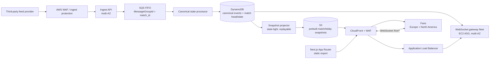
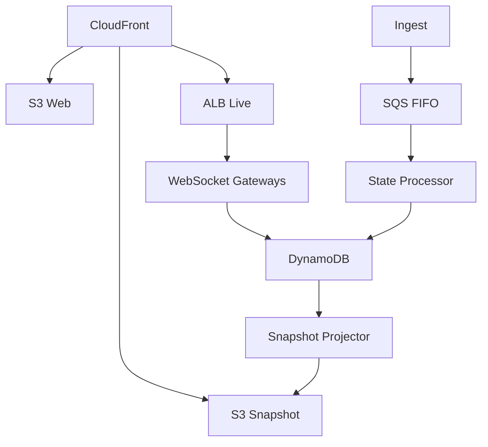

# EQC-AC Architecture Contract — Live Match Centre Take-Home

**Architecture ID:** `ARCH-LMC-001`  
**Architecture Version:** `v0.2.1`  
**EQC-AC Standard:** `EQC-AC v1.5.1`  
**Date:** 2026-08-19  
**Status:** `REVIEW`  
**Readiness:** `ARCH_BLOCKED_UNVALIDATED_CRITICAL_ASSUMPTION`  
**System:** Production Live Match Centre  
**Governing assignment:** `requirement.pdf` — *Take-Home Assignment: Senior Fullstack Engineer*  
**AI control document:** `AGENTS.md` — *Live Match Centre Take-Home — AI/Implementation Control Contract*  
**Purpose:** Turn the assignment into a complete, explicit architecture contract before compressing the result into the required `proposal.md` and before choosing/finalizing the POC.

> **Important packaging note:** This is an internal working architecture document. The assignment's final ZIP asks for `proposal.md`, `README.md`, `poc/`, and agent instruction files actually used. This architecture contract should not be placed in the final ZIP unless deliberately reclassified as an agent instruction file or the reviewer explicitly requests it.

---

# 0. Architecture Decision Summary

The proposed production system is an **AWS, single-region/multi-AZ authoritative backend with global CloudFront delivery**, a durable ordered ingest path, DynamoDB as the canonical event/state store, S3 + CloudFront for very fast snapshot/history delivery, and a **custom WebSocket fan-out tier** behind CloudFront and an Application Load Balancer.

The architecture deliberately does **not** use API Gateway WebSockets, AppSync Events, or a per-recipient managed pub/sub service for live delivery. At 100,000 viewers, per-message fan-out pricing can become the dominant cost. Instead, the design pays primarily for a bounded number of gateway instances, load-balancer capacity, and network egress.

The key data path is:



The WebSocket gateways do **not** need a separate Redis/Kafka/pub-sub tier. Each gateway independently observes the eight match high-water marks in DynamoDB at a short fixed interval using **strongly consistent reads on the base table**, fetches newly committed canonical events with strongly consistent queries, and broadcasts them to its own connected viewers. This makes origin/database work scale with **gateway count and match count**, not directly with viewer count.

Snapshot materialization is deliberately separated from canonical event processing. A replayable snapshot projector observes the same durable match heads, catches up from canonical events, and publishes full lobby/match snapshots to S3. A temporary S3/projector failure therefore cannot block canonical event processing or live delivery.

For late join/reload/wake-up:

```text
CloudFront snapshot
    -> {full history, score, clock anchor, last_seq}
    -> open/reopen WebSocket with after=last_seq
    -> gateway replays canonical events after last_seq
    -> continue live
```

The architecture-critical POC assumption is:

> **A small, horizontally scalable WebSocket gateway fleet can sustain the required concurrent connections and surge while broadcasting the assignment's event burst with enough server-side latency headroom to keep the end-to-end goal p95 under 2 seconds.**

That assumption is intentionally not marked proven. It is the POC target.

---

# 1. System Goal and Non-Goals

## 1.1 Goal

Build a production Live Match Centre for anonymous, read-only fans that:

- shows every live match and its current score/minute in a lobby;
- streams goals/cards and match events without manual refresh;
- provides full match history immediately on late join/reload/wake-up;
- keeps visible score, clock, and event history coherent;
- prevents application-induced duplicate/disappearing/out-of-order display;
- keeps goal latency at `p95 <= 2s` from ingest to viewer screen;
- keeps other-event latency at `p95 <= 5s`;
- remains materially equivalent at 100 viewers and 100,000 viewers;
- handles `+40,000` viewers within two minutes;
- fits within `<= $3,000/month` at the declared peak-month workload;
- supports weekly deployment during live matches without visible data gaps.

These are assignment facts, not inferred requirements.

## 1.2 Non-goals

The following are explicitly out of scope unless needed to satisfy the assignment:

- user accounts;
- authentication for fans;
- write actions from fans;
- video/audio streaming;
- betting/trading features;
- social/chat features;
- a full event-provider reconciliation product;
- a second provider;
- a full multi-region active-active backend;
- analytics/data warehouse architecture;
- Kubernetes;
- service mesh;
- Kafka/MSK;
- a managed WebSocket service billed per fan message;
- cloud deployment of the POC;
- full production implementation.

## 1.3 Provider-boundary non-goal

The application cannot guarantee recovery of an event **never delivered by the third-party provider**. The architecture guarantee starts when the application has durably accepted an event.

```text
provider loss != application loss
```

---

# 2. System Context

## 2.1 Actors

| ID | Actor | Relationship |
|---|---|---|
| `ACT-FAN` | Anonymous fan | Public read-only consumer |
| `ACT-FEED` | Third-party feed provider | Pushes match events |
| `ACT-ENGINEERING` | Engineering/deployment operator | Deploys and operates system |
| `ACT-REVIEWER` | Take-home reviewer | Evaluates architecture and POC evidence |

## 2.2 External systems

### `EXT-FEED-PROVIDER`

**Known from assignment**

- Pushes approximately `10 events/s total`.
- Bursts to approximately `50 events/s`.
- Delivery is best-effort.
- There is no long retry window.
- Score and clock are derived from the event stream.

**Not supplied by assignment**

The assignment does not state whether the provider supplies:

- a globally unique event ID;
- a per-match monotonic sequence;
- an occurrence timestamp;
- duplicate deliveries;
- replay;
- snapshot/reconciliation endpoint;
- authentication mechanism;
- IP ranges;
- schema versioning guarantees.

These must not be silently promoted to guarantees.

## 2.3 Responsibility boundary

### System owns

- durable acceptance of events after successful ingest;
- application canonical sequence;
- application-side idempotency;
- derived match state;
- canonical history;
- current snapshot materialization;
- viewer resume/replay;
- live delivery;
- fan-facing ordering;
- deployment continuity;
- downstream gap recovery from the application's canonical store.

### System does not own

- whether the provider generated the correct event;
- whether the provider delivered every real-world event;
- provider-side duplicate semantics that cannot be distinguished from legitimate identical events;
- provider outage/replay capability not stated in the assignment.

---

# 2A. Stakeholders, Concerns, Views

## 2A.1 Stakeholder/concern registry

| Concern ID | Stakeholder | Concern | Priority | Architecture response |
|---|---|---|---|---|
| `CONCERN-LIVE` | Fan | Goal feels live | HARD | End-to-end p95 budget, persistent push |
| `CONCERN-TRUST` | Fan | No gaps/dupes/order doubt | HARD | Sequence + idempotency + replay |
| `CONCERN-JOIN` | Fan | Full history within 2s | HARD | Edge-cached prebuilt snapshot |
| `CONCERN-SURGE` | Fan/ops | +40k/2min | HARD | Pre-scaled gateway capacity + autoscaling |
| `CONCERN-GEO` | Fan | EU + NA | HARD input | CloudFront global edge; one backend region initially |
| `CONCERN-COST` | Business | <= $3k/month | HARD | Custom fan-out + compact payload + cost sensitivity |
| `CONCERN-DEPLOY` | Fan/engineering | Live deploy invisible | HARD | Resumeable connection + draining |
| `CONCERN-UPSTREAM` | Engineering | Provider is best-effort | HARD boundary | Fast durable ingress; honest loss boundary |
| `CONCERN-EXPLAIN` | Reviewer | Every number/decision defensible | HARD assignment process | Evidence/assumption registry |

## 2A.2 Required architecture views

- `VIEW-CONTEXT`
- `VIEW-COMPONENT`
- `VIEW-INTERACTION`
- `VIEW-STATE`
- `VIEW-DEPLOYMENT`
- `VIEW-FAILURE`
- `VIEW-CAPACITY`
- `VIEW-COST`

All views use the component/interface/state IDs in this document.

## 2A.3 Controlled vocabulary

| Term | Meaning in this architecture |
|---|---|
| **received** | bytes/request reached `COMP-INGEST`; not yet durable |
| **accepted** | normalized event has been durably enqueued in SQS FIFO and the system may acknowledge the provider |
| **committed** | canonical event + idempotency record + derived match head/state transaction completed in DynamoDB |
| **canonical sequence (`seq`)** | application-owned per-match monotonic order assigned to committed accepted events |
| **provider occurrence time** | provider-supplied event-time field if one exists; never silently substituted for canonical sequence |
| **snapshot** | derived complete lobby/match representation coherent through its declared `last_seq` |
| **resume sequence** | highest canonical sequence the viewer has applied |
| **live** | delivery after a known canonical sequence through the WebSocket path |
| **late join** | initial load, reload, reconnect after sleep, or any case where durable history must be reconstructed before continuing |
| **viewer-screen latency** | ingest measurement boundary to browser receipt/state update/render measurement point; not merely server-send latency |

`event time`, `ingest time`, `commit time`, and `viewer render time` are distinct clocks and MUST remain separately named.

## 2A.4 Model kinds

### `MK-COMPONENT-CONNECTOR`
Elements: component, datastore, external, browser, edge.  
Relationships: calls, pushes, queues-to, reads, writes, streams-to.

### `MK-STATE-OWNERSHIP`
Elements: state domain, owner, reader, writer.  
Rule: every authoritative mutable state domain has one logical writer.

### `MK-DEPLOYMENT`
Elements: runtime unit, AZ, edge, managed service, scaling group.

### `MK-FAILURE`
Elements: failure domain, recovery source, degraded mode.

## 2A.5 Cross-model correspondence rules

- Every runtime component in `VIEW-COMPONENT` maps to a deployment/runtime owner in `VIEW-DEPLOYMENT`, except browser/managed-edge abstractions.
- Every authoritative state write in `VIEW-STATE` maps to exactly one allowed writer in the dependency/interaction model.
- Every cross-component arrow in a diagram maps to an interaction ID in §6.
- Every WebSocket/live-delivery relationship maps to `FLOW-VIEWER-LIVE` plus `FLOW-GATEWAY-POLL` / `FLOW-GATEWAY-EVENT-READ`.
- Every late-join path maps to `STATE-SNAPSHOT` + `last_seq` + durable replay.
- Every failure claim maps to a recovery source or is explicitly declared unrecoverable.
- Every hard latency/cost/capacity claim maps to a workload/budget/validation item.
- Diagrams are projections of the registries; if a diagram and a registry disagree, the registry/contract is authoritative until the inconsistency is corrected.

---

# 3. Requirement Index

## 3.1 Hard assignment requirements

| Requirement ID | Assignment statement | Architecture binding | Status |
|---|---|---|---|
| `REQ-MATCHES` | 8 concurrent live matches | SQS groups, state partitions, gateway polling | SATISFIED_BY_DESIGN |
| `REQ-INGEST-STEADY` | ~10 events/s total | ingress + SQS FIFO + processor | SATISFIED_BY_DESIGN |
| `REQ-INGEST-BURST` | ~50 events/s | same | SATISFIED_BY_DESIGN |
| `REQ-VIEWERS` | 100,000 concurrent | WebSocket gateway fleet | **POC REQUIRED** |
| `REQ-SURGE` | +40,000 / 2 min | CloudFront handshake path + pre-scaled gateways | **POC REQUIRED** |
| `REQ-GEO` | ~60% Europe / ~40% North America | CloudFront edge + EU primary | NEEDS LATENCY VALIDATION |
| `REQ-GOAL-LAT` | p95 <=2s ingest -> viewer screen | latency budget | NEEDS END-TO-END EVIDENCE |
| `REQ-OTHER-LAT` | p95 <=5s | latency budget | NEEDS END-TO-END EVIDENCE |
| `REQ-LATE-JOIN` | full history <=2s | S3 snapshot + CloudFront + replay | NEEDS VALIDATION |
| `REQ-BUDGET` | <=$3k/month at peak | cost model | CONDITIONAL ON WORKLOAD/PAYLOAD |
| `REQ-DEPLOY` | weekly live deploys unnoticed | drain/reconnect/resume | NEEDS INTEGRATION VALIDATION |
| `REQ-FRONTEND` | Next.js App Router | static App Router app | SATISFIED_BY_DESIGN |
| `REQ-AWS` | AWS preferred | AWS architecture | SATISFIED |
| `REQ-SCORE-CLOCK` | derived from event stream | state processor + canonical `state_after` | SATISFIED_BY_DESIGN |
| `REQ-LOBBY` | lobby shows all live matches, score/minute, goals/cards live | lobby snapshot + subscription to all 8 matches | SATISFIED_BY_DESIGN |
| `REQ-NO-BLANK` | never blank/manual refresh | edge snapshot + preserve-visible-state reconnect policy + explicit error state | SATISFIED_BY_DESIGN |
| `REQ-CORRECTNESS` | score agrees with events; no app-induced duplicate/disappear/out-of-order | transactional canonical state + sequence + replay | SATISFIED_BY_DESIGN |
| `REQ-CROWD-EQUIV` | experience materially identical at 100 and 100k viewers | viewer-independent canonical path + scalable gateways | **POC REQUIRED** |

## 3.2 Quality-attribute scenarios

### `QA-GOAL-LATENCY`

```yaml
source: third-party feed
stimulus: goal event is durably accepted at ingest
environment: peak viewer load
artifact: ingest -> canonical state -> gateway -> browser
response: goal rendered in subscribed viewer UI
measure: p95 <= 2 seconds
```

### `QA-OTHER-LATENCY`

```yaml
source: third-party feed
stimulus: non-goal event durably accepted
environment: peak viewer load
response: event rendered
measure: p95 <= 5 seconds
```

### `QA-LATE-JOIN`

```yaml
source: fan
stimulus: opens/reloads/wakes match page
environment: live match, peak load
response: complete canonical history through a known sequence is visible
measure: <= 2 seconds
```

### `QA-SURGE`

```yaml
source: fans
stimulus: +40,000 connections within 120 seconds
environment: popular kickoff
response: new viewers receive snapshot and live connection without materially degrading existing viewers
measure: no material violation of latency/correctness requirements
```

### `QA-DEPLOY`

```yaml
source: engineering
stimulus: weekly production deployment
environment: live match
response: new connections go to new version; existing connection closes/drains only after resume path is ready; replay removes gaps
measure: no visible event loss/duplicate/order break caused by deployment
```

## 3.3 Architecture principles

1. `MANDATORY` — durable acknowledgement before provider success response.
2. `MANDATORY` — one logical canonical sequence per match.
3. `MANDATORY` — client-visible state/history is sequence-bound.
4. `MANDATORY` — fan-out nodes are not authoritative state owners.
5. `MANDATORY` — reconnect/reload always has a replay source.
6. `DEFAULT_WITH_JUSTIFIED_EXCEPTION` — avoid per-viewer managed-message pricing.
7. `DEFAULT_WITH_JUSTIFIED_EXCEPTION` — avoid extra distributed systems until required by evidence.
8. `MANDATORY` — mutable external facts remain sourced/dated.

## 3.4 Requirement feasibility note

The assignment gives a **monthly budget** and a **peak concurrency**, but it does not state:

- how many hours per month 100,000 viewers persist;
- average live-event payload size;
- how viewers distribute among match pages versus the lobby;
- duration/frequency of the 50 events/s burst.

Therefore an exact monthly transfer cost is mathematically underdetermined from assignment data alone.

This is not treated as permission to ignore the budget. The architecture uses:

- a cost formula;
- explicit workload assumptions;
- sensitivity thresholds;
- a requirement that final `proposal.md` state the assumption.

If the required interpretation is **100,000 viewers continuously, 24x7 for a full month**, the outbound transfer component alone may breach $3,000 depending on payload volume. That interpretation would require either a different budget, much stronger payload aggregation/compression, or a different delivery economics model.

---

# 4. Architecture Overview

## 4.1 Selected architecture

### Frontend
- Next.js App Router.
- Static export (`output: 'export'`) because public pages do not require server-side user state.
- Static routes such as `/` and `/match`; match identity may be passed in query/navigation state rather than requiring arbitrary dynamic static-export paths.
- Hosted in S3.
- Delivered through CloudFront.

### Snapshot/history
- State processor creates a complete match snapshot after each committed canonical event.
- Snapshot contains:
  - full canonical event history needed by the UI;
  - derived score;
  - period;
  - clock anchor;
  - `last_seq`;
  - schema version.
- Written to S3 with a stable match key.
- CloudFront caches it briefly (target `~1s`, exact cache policy to be validated).
- Lobby snapshot is separately materialized.

### Ingest
- Dedicated provider-only ingest endpoint.
- AWS WAF/allowlisting/HMAC where provider capabilities permit.
- Multi-AZ stateless ingest service.
- Performs bounded validation/normalization.
- Computes application dedupe key.
- Sends event to SQS FIFO.
- Returns provider success only after SQS acknowledges.

### Ordering/state processor
- SQS FIFO `MessageGroupId = match_id`.
- Parallel across matches; serialized within one match.
- Processor derives canonical application sequence `seq`.
- DynamoDB transaction:
  - persists canonical event;
  - persists durable idempotency key;
  - advances match head/current state conditionally.
- Processor materializes S3 snapshot after commit.
- SQS message is deleted after the canonical DynamoDB transaction succeeds. Snapshot projection is independently replayable from committed state and cannot block the canonical queue.

### Live delivery
- CloudFront explicitly supports WebSockets to custom origins.
- `/live/*` behavior is non-cacheable and routes to an ALB.
- ALB routes persistent upgraded connections to a WebSocket gateway fleet.
- Gateway fleet runs in an EC2 Auto Scaling Group across >=3 AZs.
- Each gateway:
  - holds only ephemeral connection state;
  - maps viewers to lobby/match subscriptions;
  - polls the eight DynamoDB match-head records at a short fixed interval;
  - fetches only newly committed events;
  - broadcasts compact frames;
  - keeps a small non-authoritative ring buffer for fast reconnect;
  - falls back to DynamoDB replay if the ring buffer is insufficient.

## 4.2 Why no Redis/Kafka in the selected architecture

At only eight live matches and 10-50 events/s, adding Redis Pub/Sub, Kinesis, Kafka/MSK, or another fan-out bus is not required to decouple producer rate from viewer count.

The gateway tier already needs the durable event store for replay. Polling eight high-water marks at a sub-second interval is bounded by:

```text
gateway_instances * 8 match heads
```

not:

```text
viewer_count
```

This keeps one fewer failure domain and one fewer live-delivery dependency.

If the number of matches grows by orders of magnitude later, a dedicated event bus becomes a reasonable revisit.

## 4.3 Why WebSocket instead of managed WebSocket fan-out

A managed connection/message service is operationally attractive, but the architecture must account for recipient-multiplied message economics at 100,000 viewers.

The selected option keeps broadcast compute under direct control:

```text
one canonical event
  -> N gateway processes
  -> many socket writes
```

rather than creating a cloud-billed managed message delivery for each recipient.

## 4.4 Why WebSocket instead of SSE

SSE is semantically attractive because traffic is server-to-client only and resume is simple. WebSocket wins in the selected composition because:

- CloudFront has explicit documented WebSocket support;
- ALB has explicit documented WebSocket support;
- compact/binary framing is available if cost/throughput requires it;
- the same persistent-channel abstraction supports explicit resume by `last_seq`;
- reconnect semantics can be implemented in the client deterministically.

This is a preference reversal: SSE wins on protocol simplicity; WebSocket wins after explicit CDN support, byte efficiency, and fan-out stress are considered together.

---

# 5. Component Contracts

## `COMP-WEB-APP`

**Kind:** browser application / static web artifact  
**Technology:** Next.js App Router + React + TypeScript  
**Purpose:** render lobby/match UI; merge snapshot + live canonical stream.

**Responsibilities**
- display cached initial shell immediately;
- fetch lobby or match snapshot;
- verify snapshot schema;
- establish live connection with `after=last_seq`;
- for lobby, subscribe to all eight active match IDs after applying the lobby snapshot;
- on `visibilitychange`, `pageshow`, network restoration, or a stale/dead socket after phone sleep, retain visible state, reconnect, and resume from `last_seq`;
- never clear already-valid history merely because the live socket is reconnecting;
- if initial snapshot cannot be obtained, show an explicit unavailable/error state rather than an empty feed that looks valid;
- apply event only if its `seq` is the expected next sequence;
- suppress duplicate sequence;
- detect gaps;
- reconnect and replay;
- render canonical `score_after`/clock state carried with live events rather than independently inventing authoritative score state;
- extrapolate display clock only from a canonical running clock anchor using a monotonic browser timer;
- resynchronize clock when a newer canonical anchor arrives.

**Non-responsibilities**
- authoritative score;
- authoritative ordering;
- provider validation;
- permanent event storage.

---

## `COMP-CLOUDFRONT`

**Kind:** edge/CDN  
**Purpose:** global entry point for static app, snapshots, and WebSocket handshakes/transport.

**Responsibilities**
- global edge routing;
- TLS at edge;
- cache static app/assets;
- cache snapshots with short freshness policy;
- forward `/live/*` as non-cacheable WebSocket traffic;
- attach WAF controls;
- keep AWS-origin-to-CloudFront transfer economics explicit.

**Non-responsibilities**
- canonical state;
- fan-out aggregation;
- live message durability.

---

## `COMP-S3-WEB`

Static Next.js export.

## `COMP-S3-SNAPSHOT`

Prebuilt lobby/match snapshots. Not authoritative; each object identifies the canonical `last_seq` it represents.

Snapshot cache contract:

```text
browser max-age = 0
CloudFront MinTTL = 0
CloudFront DefaultTTL = 1s
CloudFront MaxTTL = 1s
```

The exact deployed cache policy must be verified before production. The design intentionally tolerates a briefly stale snapshot because `last_seq` makes catch-up deterministic.

---

## `COMP-SNAPSHOT-PROJECTOR`

**Kind:** replayable derived-state projector  
**Purpose:** keep complete lobby/match snapshots fresh without coupling S3 availability to canonical processing.

**Responsibilities**
- strongly read the eight match heads on a short interval;
- load its last successful snapshot/cursor on startup;
- query only missing canonical events;
- update in-memory derived snapshot;
- write full snapshot atomically as one S3 object;
- publish lobby snapshot from the same canonical match heads;
- expose `canonical_head_seq - snapshot_last_seq` lag.

**Recovery**
- no local state is authoritative;
- on restart, load S3 snapshot and catch up from DynamoDB;
- if S3 snapshot is absent/corrupt, rebuild from canonical events.

**Non-responsibilities**
- canonical event ordering;
- provider acknowledgement;
- fan live delivery.

---

## `COMP-INGEST`

**Kind:** stateless service  
**Placement:** multi-AZ  
**Purpose:** convert provider push into durable accepted work quickly.

**Input:** provider event envelope  
**Output:** SQS FIFO message

**Responsibilities**
- authenticate/authorize provider if provider capability exists;
- schema validation;
- bounded normalization;
- timestamp `ingest_received_at`;
- derive dedupe identity;
- enqueue durably;
- acknowledge only after enqueue success.

**Must not**
- perform expensive fan-out;
- wait for viewer-facing processing;
- own match state.

---

## `COMP-SQS-FIFO`

**Purpose:** durability, per-match ordered work serialization, burst buffer.

`MessageGroupId = match_id`.

Application idempotency remains necessary because SQS FIFO deduplication is not a permanent event-identity store.

---

## `COMP-STATE-PROCESSOR`

**Kind:** worker  
**Purpose:** sole logical writer of canonical match state.

**Responsibilities**
- process one match group in order;
- resolve idempotency;
- assign canonical app `seq`;
- derive score and clock anchor;
- transactionally persist event + head/state/idempotency;
- persist the canonical `score_after` and clock anchor associated with each committed sequence;
- recover cleanly after redelivery/restart.

**Non-responsibilities**
- viewer connections.

---

## `COMP-DDB-CANONICAL`

**Kind:** durable canonical datastore  
**Capacity mode:** on-demand initially.

Stores:
- event log keyed by `(match_id, seq)`;
- match head/current state;
- idempotency record keyed by normalized provider identity;
- optional compact metadata.

**Authoritative for**
- application canonical sequence;
- canonical accepted history;
- derived score/state.

---

## `COMP-WS-GATEWAY`

**Kind:** state-light fan-out server  
**Runtime:** optimized async/event-loop implementation on EC2.

**Responsibilities**
- accept WebSocket connection;
- validate subscription target;
- perform resume/replay;
- maintain per-connection last sent sequence;
- poll match heads;
- fetch new canonical events;
- broadcast in sequence;
- heartbeats;
- bounded per-client output buffers;
- disconnect slow clients before memory becomes unbounded;
- expose connection/queue/latency metrics.

**Non-responsibilities**
- canonical state mutation;
- provider ingest;
- permanent client session.

---

## `COMP-ALB-LIVE`

**Purpose:** healthy-target routing for WebSocket gateways.

Architecture relies on documented ALB WebSocket support and connection draining.

---

## `COMP-WAF`

**Purpose:** public endpoint protection.

Controls:
- handshake/request rate limits;
- obvious abusive IP/device patterns;
- bot/burst controls where appropriate;
- provider-ingest restrictions.

WAF does not replace application buffer limits or connection admission control.

---

# 5A. Architecture Invariant Registry

## `INV-SEQUENCE-MONOTONIC`

For each `match_id`, canonical `seq` is strictly increasing and never reused.

## `INV-SINGLE-WRITER`

At most one logical state mutation for a match proceeds at a time through the FIFO group + conditional DynamoDB transaction.

## `INV-IDEMPOTENT-EVENT`

Processing the same accepted provider event identity more than once does not create a second canonical event or apply score mutation twice.

## `INV-SCORE-HISTORY-COHERENT`

For any canonical `last_seq = N`, visible derived score/state is the result of applying canonical events through `N`.

## `INV-SNAPSHOT-BOUND`

Every snapshot carries `last_seq`. It never claims to contain history beyond that sequence.

## `INV-LIVE-ORDER`

A client must not apply event `N+1` before event `N`.

If a gap is detected:

```text
do not guess
-> pause application of later events
-> replay from durable store
```

## `INV-RECONNECT-NO-GAP`

Reconnection after sequence `N` resumes from `N+1`, regardless of which gateway receives the new connection.

## `INV-GATEWAY-NONAUTHORITATIVE`

Loss of all gateway memory cannot destroy canonical history/state.

## `INV-UPSTREAM-BOUNDARY`

No downstream mechanism claims to recover an event never delivered to ingest.

---

# 5B. Cross-Cutting Architecture Policies

## `POLICY-EVENT-IDENTITY`

Preferred identity:
1. provider immutable unique event ID, if supplied;
2. otherwise a deterministic hash over the normalized immutable event fields.

**Open assumption:** the provider envelope contains enough immutable information to distinguish two legitimate distinct events. If not, perfect dedupe is impossible without a stronger provider contract.

## `POLICY-CANONICAL-ORDER`

The application does not infer an unstated provider global ordering guarantee.

The canonical application order is the durable per-match acceptance/processing sequence. Provider match clock/occurrence time remains event data and can be shown, but fan delivery never reorders already-committed canonical sequence.

If the provider contract later supplies a stronger authoritative sequence, that sequence should become part of canonicalization.

## `POLICY-RETRY`

- ingest producer retries SQS enqueue on transient AWS failure only while provider request remains open within a bounded response budget;
- processor retries database/materialization side effects idempotently;
- fan client reconnect uses capped exponential backoff + jitter;
- no infinite in-memory retry queue.

## `POLICY-BACKPRESSURE`

Gateway output buffer per client is bounded.

If a client cannot consume the stream fast enough:

```text
disconnect slow client
-> reconnect
-> resume from last_seq
```

Do not let one slow viewer consume unbounded gateway memory.

## `POLICY-PAYLOAD`

Use compact event envelope.

Provisional wire fields:

```json
{
  "m":"match-id",
  "s":123,
  "t":"goal",
  "c":4567,
  "p":{...}
}
```

Human-readable field names may be used if measured capacity/cost permits. Compact binary encoding remains an optional optimization, not a requirement, until the POC demonstrates a need.

## `POLICY-HEARTBEAT`

Gateway emits a small heartbeat often enough to keep intermediaries from treating an otherwise idle live connection as dead. Exact interval is configuration and must remain below applicable idle timeouts.

---

# 6. Interaction Contracts

## `FLOW-FEED-INGEST`

```yaml
source: EXT-FEED-PROVIDER
target: COMP-INGEST
mode: HTTPS request
delivery: provider best effort
system_ack: only after SQS durable acknowledgement
retry: provider-defined / not assumed
failure: non-2xx if system cannot durably accept
```

## `FLOW-INGEST-QUEUE`

```yaml
source: COMP-INGEST
target: COMP-SQS-FIFO
MessageGroupId: match_id
MessageDeduplicationId: application/provider identity where available
ordering: FIFO within match group
```

## `FLOW-QUEUE-PROCESS`

```yaml
source: COMP-SQS-FIFO
target: COMP-STATE-PROCESSOR
parallelism: across match groups
serialization: within match group
```

## `FLOW-PROCESS-DDB`

```yaml
mode: conditional transactional write
writes:
  - event
  - match head/state
  - durable idempotency marker
postcondition:
  canonical event and matching derived head become committed together
```

## `FLOW-SNAPSHOT-PROJECTION`

```yaml
source: COMP-DDB-CANONICAL
target: COMP-SNAPSHOT-PROJECTOR
mode: strongly consistent head polling + delta query
ordering: canonical seq
recovery: projector resumes from snapshot last_seq or rebuilds from canonical log
failure:
  snapshot becomes stale; canonical processing/live delivery continue
```

## `FLOW-PROJECTOR-S3`

```yaml
source: COMP-SNAPSHOT-PROJECTOR
target: COMP-S3-SNAPSHOT
mode: atomic whole-object PUT
idempotence: newer/equal last_seq replaces derived snapshot; older state must never overwrite newer state
failure:
  retry from durable canonical source; alert on snapshot lag
```

## `FLOW-SNAPSHOT-VIEWER`

CloudFront GET.

Snapshot may be briefly stale but carries `last_seq`, allowing deterministic catch-up.

## `FLOW-GATEWAY-POLL`

Every active gateway periodically reads eight match heads using strongly consistent reads on the DynamoDB **base table** (`ConsistentRead=true`).

Target interval: **250 ms initial design value**.

This is an architecture decision, not an assignment fact. It provides at most ~250ms polling delay before database/network/processing, leaving significant room inside the 2s goal SLO.

If cost/read pressure is higher than expected, increase interval while preserving goal budget. If latency is too high, decrease interval or add push notification.

## `FLOW-GATEWAY-EVENT-READ`

When head for match advances from `N` to `M`, query canonical events `(N, M]` from the base table with `ConsistentRead=true` and emit in `seq` order.

Strong consistency is deliberate: the gateway must not observe a committed head and then miss its corresponding freshly committed canonical event because of an eventually consistent read. This is cheap at the assignment's event/match scale and directly protects the no-gap latency path.

## `FLOW-VIEWER-LIVE`

Viewer WebSocket opens with:

```text
match_id
after=<snapshot last_seq>
schema_version
```

Gateway sends only `seq > after`.

On reconnect, client supplies the highest sequence it has applied.

---

# 7. Interface and Schema Ownership

## `IFACE-PROVIDER-EVENT`

Owner: provider externally; normalized copy owned by ingest contract.

Minimum logical fields needed by application:

- match identifier;
- event type;
- event payload;
- enough event identity material for idempotency;
- match clock / state data needed to derive score/clock.

Anything beyond that is UNKNOWN until provider schema exists.

## `IFACE-CANONICAL-EVENT-v1`

```yaml
match_id: string
seq: uint64
event_key: string
event_type: enum
provider_time: optional timestamp
match_clock_seconds: optional integer
period: optional enum
payload: object
ingest_received_at: timestamp
committed_at: timestamp
score_after: object
clock_after:
  period: optional
  base_seconds: optional
  running: optional
  anchor_utc: optional
schema_version: 1
```

## `IFACE-SNAPSHOT-v1`

```yaml
match_id: string
last_seq: uint64
score: object
clock:
  period: ...
  base_seconds: ...
  running: bool
  anchor_utc: ...
events:
  - IFACE-CANONICAL-EVENT-v1
schema_version: 1
generated_at: timestamp
```

## `IFACE-WS-EVENT-v1`

Minimum:

```yaml
match_id
seq
event_type
score_after
clock_after
payload
```

The wire format may be compacted after POC measurement without changing canonical semantics.

## Schema evolution

- Additive optional fields: backward compatible within version.
- Meaning change / removal / required-field change: new schema major version.
- During weekly rolling deploy, gateways and web clients must tolerate the declared compatibility window.
- Existing browser tabs may remain on old static asset versions during a deployment.

---

# 8. State and Consistency

## `STATE-CANONICAL-EVENTS`
Owner: state processor.  
Store: DynamoDB.  
Readers: gateway, recovery tooling.

## `STATE-MATCH-HEAD`
Owner: state processor.  
Contains:
- `last_seq`;
- derived score;
- clock anchor;
- latest materialization marker.

## `STATE-IDEMPOTENCY`
Owner: state processor.  
Retention: at least through the full live/recovery horizon for a match; exact TTL must not expire while a provider retry/duplicate can still matter.

## `STATE-SNAPSHOT`
Owner: state processor as derived data.  
Store: S3.  
Not authoritative.

## `STATE-GATEWAY-RING`
Owner: gateway.  
Ephemeral, bounded.  
Not authoritative.

## Consistency model

Within one match, application canonical state is serialized and transactionally advanced.

Across different matches, no global ordering is required.

Snapshot consistency:

```text
snapshot last_seq=N
=> snapshot state/history is coherent through N
```

Live stream consistency:

```text
client applied N
=> next applicable canonical event is N+1
```

---

# 8A. Data Lifecycle and Governance

The product data is public sports-event information under the assignment scenario.

No user account/profile data is required.

## Canonical events
Retention: architecture decision, initially match duration + operational replay window; final retention policy not required by assignment.

## Snapshots
Overwritten by match key; optionally retained/versioned briefly for debugging.

## Logs
Do not log full IP/user-agent indefinitely without purpose. Public access metadata is operational data, not product state.

## Derived/cache distinction

```text
DynamoDB canonical event/head = authoritative
S3 snapshot = derived
gateway ring buffer = cache
CloudFront object = cache
browser state = presentation cache
```

---

# 8B. Time, Concurrency, and Transaction Semantics

## 8B.1 Time semantics

The architecture distinguishes:

- **provider occurrence time** — if supplied by the feed;
- **ingest time** — when our ingest boundary receives the event;
- **commit time** — when the canonical transaction commits;
- **viewer receive/render time** — client measurement point;
- **match clock state** — domain state derived from the feed.

The browser is never authoritative for match time.

A canonical clock anchor is:

```yaml
period: ...
base_seconds: ...
running: true | false
anchor_utc: ...
seq: ...
```

When `running=true`, the browser may render:

```text
display_clock =
  base_seconds + monotonic_elapsed_since(anchor_received/anchor_utc correction)
```

until a newer canonical anchor arrives. Pause/period transitions reset the anchor. Exact football-clock semantics depend on the provider event schema and remain `UNKNOWN` until that schema is known; the client must not invent missing provider semantics.

## 8B.2 Concurrency boundary

`match_id` is the serialization key.

SQS FIFO permits independent matches to process concurrently while one match group's canonical mutations remain ordered. DynamoDB conditional/transactional writes enforce the match-head version so stale/retried workers cannot advance the same head twice.

## 8B.3 Transaction boundary

One canonical acceptance application uses one DynamoDB transaction containing:

```text
canonical event(seq=N)
+ durable idempotency record
+ match head/state -> last_seq=N
```

The transaction does **not** include S3. Snapshot state is intentionally a derived asynchronous projection.

There is no claim of a distributed transaction across SQS, DynamoDB, S3, gateway, and browser. Recovery is by idempotent redelivery/replay and sequence reconciliation.

---

# 9. Dependency Graph



## Forbidden dependencies

- `COMP-WEB-APP -> DynamoDB` direct.
- `COMP-WEB-APP -> SQS`.
- `COMP-WS-GATEWAY -> mutate canonical DynamoDB state`.
- `COMP-INGEST -> fan viewers`.
- `COMP-S3-SNAPSHOT -> canonical authority`.
- `COMP-CLOUDFRONT -> invent event ordering`.

No component may bypass the state processor for canonical mutation.

---

# 10. Deployment Topology

## 10.1 Primary region

Initial design: **EU (Ireland), `eu-west-1`**.

Reason:
- assignment audience is ~60% Europe;
- CloudFront serves static/snapshot content globally;
- live p95 target is seconds, not tens of milliseconds;
- one authoritative backend region avoids cross-region ordering/state complexity;
- North American WebSocket traffic gains CloudFront edge entry but still terminates at the EU origin.

This is a deliberate trade-off, not a claim that single-region is universally superior.

## 10.2 Availability zones

At least three AZs for:
- gateway ASG;
- stateless ingest tasks/instances where supported;
- processor placement.

Managed SQS/DynamoDB/S3/CloudFront provide their AWS-managed regional/service availability characteristics.

## 10.3 Gateway fleet

Initial planned production shape:

```text
minimum: 3 instances
peak target: 6 instances
AZ distribution: >= 3 AZs
autoscaling: connections + network + CPU + event-loop delay
```

Exact instance family/size is **not frozen before the POC**.

The POC exists partly to determine the capacity per gateway process/host.

## 10.4 Ingest/processor runtime

ECS Fargate or small EC2/ECS tasks are both credible.

Selected direction:
- ECS Fargate for stateless ingest and low-throughput processor;
- EC2 ASG for high-connection WebSocket gateway because OS/socket/network tuning is architecture-critical and the POC should map cleanly to a tunable host.

## 10.5 Frontend runtime

No Next.js runtime server in the initial architecture.

Current Next.js documentation supports App Router static exports and static hosting. The architecture uses that option because all live data is client-fetched/pushed and there is no authenticated per-request SSR requirement.

---

# 10A. Environment and Dynamic Configuration

## Environment profiles

### `ENV-POC`
Local containers only. No cloud dependencies. Used exclusively to measure the selected locally testable assumption.

### `ENV-STAGING`
Production-shaped protocols/configuration at reduced capacity. Used for integration, snapshot/replay, deployment-drain, and geo/synthetic checks.

### `ENV-PROD`
`eu-west-1`, multi-AZ backend + CloudFront global edge, real AWS managed dependencies.

Evidence obtained in `ENV-POC` is not silently promoted to production proof.

## Architecture-significant configuration

| Config ID | Initial value | Owner | Change rule |
|---|---:|---|---|
| `CONFIG-GW-POLL-MS` | 250 ms | live gateway | dynamic only after latency/read-cost validation |
| `CONFIG-SNAPSHOT-POLL-MS` | 250 ms | snapshot projector | dynamic with snapshot-lag validation |
| `CONFIG-CF-SNAPSHOT-TTL` | 1 s | edge config | deploy/config change |
| `CONFIG-CLIENT-BUFFER` | POC-derived | gateway | must remain bounded |
| `CONFIG-HEARTBEAT` | below intermediary idle timeout | gateway | evidence-bound |
| `CONFIG-GW-MIN` | 3 instances | ops | deployment config |
| `CONFIG-GW-PEAK` | 6 provisional | ops | **POC-derived; not frozen** |

A feature flag or config value may tune the approved architecture, but it may not silently turn the system into another topology/consistency model.

---

# 10B. Runtime Lifecycle and Operational Modes

## Gateway lifecycle

**Startup**
1. load configuration/schema compatibility;
2. verify DynamoDB connectivity;
3. establish current head cursors;
4. expose readiness only when replay/live reads are usable.

**Drain**
1. stop accepting new live connections;
2. keep current sockets temporarily;
3. tell clients to reconnect or allow load-balancer deregistration;
4. preserve each client's last applied `seq` in the browser, not the gateway.

**Shutdown**
Gateway may terminate only after drain deadline. Lost ephemeral ring-buffer data is harmless because replay source is DynamoDB.

## Processor lifecycle

Readiness requires SQS + DynamoDB access. On shutdown, stop receiving new messages, finish/abandon current message safely, and rely on SQS visibility/redelivery plus idempotency.

## Snapshot projector lifecycle

Readiness requires DynamoDB and S3 access. On restart, recover from the last snapshot `last_seq` and canonical log.

## Operational modes

### `MODE-NORMAL`
All paths healthy.

### `MODE-LIVE-DEGRADED`
Canonical ingest/state works but one or more gateways/edge paths are impaired. Existing/returning viewers reconnect/replay. No correctness relaxation.

### `MODE-SNAPSHOT-DEGRADED`
Snapshot projector/S3 path is stale or unavailable. Canonical/live processing continues; late-join requirement may be at risk and must alert.

### `MODE-OVERLOAD-PROTECTION`
Slow clients are disconnected before unbounded queue growth. Correctness is preserved by replay; availability for the slow client is temporarily reduced.

### `MODE-UPSTREAM-DEGRADED`
Provider is unavailable or not delivering. System continues to display last canonical state and must not fabricate events/clock transitions.

### `MODE-RECOVERY`
A recovering component catches up from canonical sequence before returning to `NORMAL`.

Maintenance/deployment must not bypass security, sequence, idempotency, or replay invariants.

---

# 11. Failure and Recovery

## `FAIL-PROVIDER-NEVER-DELIVERS`

**Effect:** real-world event absent.  
**Recovery:** none available from assignment.  
**Truth:** cannot be repaired by application.

## `FAIL-INGEST-INSTANCE`

ALB routes to healthy instance/task in another AZ. Provider success response is not sent until queue acceptance.

## `FAIL-SQS-TEMPORARY`

Ingest returns failure if durable acceptance cannot complete in bounded time. Because provider has no long retry window, this can cause upstream loss. This is an unavoidable provider/system-boundary risk, mitigated by using a highly available managed queue and keeping ingest path minimal.

## `FAIL-PROCESSOR`

SQS message remains/reappears. Processing is idempotent.

## `FAIL-DDB`

Processor retries; SQS buffers; live latency may degrade if outage exceeds budget.

## `FAIL-S3-SNAPSHOT`

Canonical event remains in DynamoDB. Snapshot update retries. A stale CloudFront/S3 snapshot remains resumable because `last_seq` identifies its boundary.

## `FAIL-GATEWAY`

Affected sockets disconnect. Client reconnects to another healthy gateway with `after=last_applied_seq`. Missing events replay from DynamoDB.

## `FAIL-ALB-CLOUDFRONT-CONNECTION`

Client reconnect policy.

## `FAIL-SLOW-CLIENT`

Bounded gateway queue exceeds threshold -> disconnect client -> replay on reconnect.

## `FAIL-DEPLOY-GATEWAY`

1. Add new healthy gateway capacity.
2. Stop routing new handshakes to old target.
3. Drain.
4. Close remaining old sockets deliberately before termination if necessary.
5. Clients reconnect and replay.

AWS documents target draining/deregistration. The application still owns no-gap resume semantics.

## `FAIL-REGION`

Not fully mitigated in `v0.2.1`.

A region-level failure can stop live delivery and canonical ingest. Multi-region active/standby is intentionally deferred because the assignment does not specify a regional availability target and the added distributed consistency/cost complexity does not currently earn its place.

Revisit if:
- reviewer/product requires region-failure tolerance;
- measured NA live latency is inadequate;
- business SLO requires regional DR.

---

# 11.1 Recovery Objectives

The assignment supplies no formal disaster-recovery RTO/RPO. The architecture therefore does not invent a regional SLA.

## 11.1.1 Within-region application/process failures

Architecture target:

```yaml
accepted_event_rpo: 0
condition: SQS durable acknowledgement already succeeded
recovery_source: SQS / DynamoDB canonical log
```

For committed canonical events:

```yaml
committed_event_rpo: 0
recovery_source: DynamoDB canonical log
```

Viewer connection recovery is sequence-based; target reconnect time is governed by the 2s/5s user-facing latency goals where the failure occurs during live use, but exact reconnect RTO requires measurement.

## 11.1.2 Regional disaster

```yaml
regional_rto: UNCOMMITTED
regional_rpo: UNCOMMITTED
reason: no multi-region/DR requirement is supplied by the assignment
```

Claiming regional RPO=0 or automatic regional failover would be false for this `v0.2.0` architecture.

---

# 11A. Workload / Demand Model

## `WORKLOAD-ASSIGNMENT-PEAK`

Known:

```yaml
matches: 8
event_rate_total_steady: ~10/s
event_rate_total_burst: ~50/s
viewers_peak: 100000
viewer_surge: +40000/120s
audience:
  europe: ~60%
  north_america: ~40%
```

## Missing workload variables

```yaml
peak_hours_per_month: UNKNOWN
match_page_vs_lobby_fraction: UNKNOWN
viewer_distribution_per_match: UNKNOWN
average_wire_event_bytes: UNKNOWN
50eps_burst_duration/frequency: UNKNOWN
full_history_average_bytes: UNKNOWN
```

## Planning assumptions for architecture cost sensitivity

These are **not assignment facts**:

```yaml
planning_peak_hours_per_month: 120
# 4 peak hours/day * 30 days, used only as a sensitivity point

average_match_event_rate_per_match_at_steady:
  10 total / 8 matches = 1.25 events/s

planning_wire_event_bytes:
  180 bytes/event before transport/TLS overhead

transport_overhead_multiplier:
  1.5

planning_burst:
  50 total events/s for 5 minutes per 4 peak hours
```

These assumptions must be changed if better assignment/interview information exists.

## Worst-case concentration

Capacity test must include a harsher case than the average distribution:

```text
all or most viewers concentrated on one match
AND
event burst concentrated on that match
```

This is the important gateway fan-out stress case.

---

# 12. Performance and Capacity

## 12.1 End-to-end goal latency budget

Engineering allocation, not probabilistic addition:

| Segment | Target engineering allowance |
|---|---:|
| ingest validation + SQS send | 150 ms |
| queue dwell + state commit | 250 ms |
| gateway head polling detection | <=250 ms nominal |
| gateway fetch + broadcast | 250 ms |
| CloudFront/network to viewer | 400 ms |
| browser decode/state/render | 150 ms |
| reserve/variance | 550 ms |
| **Total engineering envelope** | **2.0 s** |

These are component budgets, not a claim that p95s can be added mathematically.

The final p95 must be measured end-to-end.

## 12.2 Other events

Same architecture path. The 5s requirement leaves more headroom.

Routine events may be micro-batched up to a small bounded window if the POC shows broadcast syscall pressure, but the architecture starts without batching. A goal event must never wait behind an avoidable multi-second batch.

## 12.3 Snapshot budget

Target envelope:

| Stage | Allowance |
|---|---:|
| static shell from edge | 300 ms |
| snapshot edge fetch | 700 ms |
| browser parse/render | 300 ms |
| replay catch-up connection | 500 ms |
| reserve | 200 ms |

Again, validate rather than summing percentiles as proof.

## 12.4 Gateway connection capacity

Architecture target before POC:

```text
100,000 / 6 peak gateways ≈ 16,667 connections/gateway
```

With the +40k/120s surge:

```text
333 new connections/s across fleet
≈ 56 new connections/s/gateway at 6 gateways
```

A healthy design needs margin beyond these averages because load balancing is not perfectly even.

## 12.5 Fan-out workload

Average steady match page if events evenly distributed:

```text
10 total events/s / 8 matches = 1.25 events/s per match
```

At worst concentration, one match can temporarily receive a much larger share. The POC must measure high fan-out event rate, not only idle socket count.

## 12.6 Head-poll database load

For six gateways, eight match heads, 250ms polling:

```text
6 gateways * 8 match heads * 4 polls/s
= 192 head-item reads/s before batching optimization
```

Using BatchGet can reduce API call count further. Viewer count does not multiply this read load.

## 12.7 ALB connection capacity economics

AWS ALB pricing defines one LCU active-connection dimension as 3,000 active connections/minute for normal TLS/HTTP usage and a new-connection dimension of 25 new connections/s, with pricing based on the maximum LCU dimension.

At 100k active sockets:

```text
100,000 / 3,000 ≈ 33.3 active-connection LCUs
```

At +40k/120s:

```text
333 new/s / 25 ≈ 13.3 new-connection LCUs
```

So active connections are likely a larger ALB connection dimension than the declared surge, while processed bytes may dominate during heavy fan-out.

This must be recalculated using the exact selected AWS region/pricing before final proposal.

---

# 13. Availability

The assignment requires uninterrupted user experience during weekly deploys, but does not provide a monthly uptime SLA.

Architecture target:

- multi-AZ within the primary region;
- no single application instance required for normal operation;
- canonical replay after downstream connection/process failure;
- no claimed region-level availability.

## SLI candidates

- successful durable ingest rate;
- ingest-to-committed p95;
- committed-to-gateway-observed p95;
- gateway-to-browser p95;
- end-to-end goal p95;
- connection success rate;
- resume success rate;
- snapshot fetch p95;
- sequence-gap rate;
- duplicate-apply rate.

---

# 14. Security and Trust

## Public fan path

- HTTPS/WSS only.
- CloudFront.
- WAF.
- no fan authentication.
- strict subscription validation (`match_id` must be active/known).
- connection admission limits.
- per-IP/subnet rate controls where appropriate.
- bounded frames.
- server rejects unexpected large client payloads.

## Provider path

Preferred:
- separate hostname/path;
- provider HMAC/API secret;
- AWS WAF IP allowlist if stable provider IP ranges exist;
- TLS.

Because provider authentication details are absent from the assignment, exact mechanism remains an assumption/interface question.

## Internal AWS path

- private subnets for backend/gateways where practical;
- least-privilege IAM;
- S3 origin access via CloudFront;
- DynamoDB/SQS access only from required roles;
- no public DynamoDB/SQS.

## DDoS/abuse

Use standard AWS edge/load-balancer protections plus WAF controls. Do not add paid Shield Advanced unless a concrete requirement/cost model justifies it.

---

# 14A. Privacy, Compliance, and Residency

The assignment defines anonymous public fans and no accounts. It does **not** state a regulatory or data-residency requirement, so none is invented.

Potential operational personal data is limited to infrastructure metadata such as IP address/user-agent/request logs.

Architecture rules:

- collect only what operations/security requires;
- use bounded log retention;
- do not introduce fan profiles/device identity as product state;
- do not replicate request logs cross-border unless an actual operational need and governing policy allow it;
- secrets/provider credentials remain in managed secret storage, not application configuration or logs.

```yaml
data_residency_requirement: NOT_APPLICABLE_WITH_REASON
reason: no residency/compliance constraint is supplied in the assignment
```

If a real production organization supplies GDPR/privacy/residency rules, they become governing requirements and can change logging/region/vendor decisions.

---

# 15. Observability and Operability

## Required metrics

### Ingest
- requests/s;
- accepted/rejected;
- auth failures;
- SQS enqueue latency;
- enqueue failures;
- provider request latency.

### Queue/processor
- queue age/depth;
- processing latency;
- duplicate suppression;
- conditional-write conflicts;
- DDB latency/errors;
- snapshot materialization failures.

### Gateway
- active connections per instance;
- handshakes/s;
- reconnects/s;
- connection duration;
- outbound bytes/s;
- messages/events/s;
- per-client buffer occupancy;
- slow-client disconnects;
- event-loop delay;
- CPU/memory;
- network utilization;
- last observed sequence per match;
- DDB head poll latency;
- canonical commit -> gateway observation latency.

### Browser telemetry
Sample rather than send from every event/viewer:
- ingest timestamp -> receive/render timestamp when event carries server timestamps;
- snapshot load;
- gap/replay count;
- reconnect duration.

### Correctness counters
- duplicate canonical event attempt;
- client/gateway gap;
- replay request;
- unexpected sequence regression;
- score recomputation mismatch in validation job.

## Operational ownership

For the take-home, these are roles rather than named production teams:

| Capability | Operational owner |
|---|---|
| provider ingest + queue | backend/on-call |
| canonical processor/state | backend/on-call |
| snapshot projection | backend/on-call |
| WebSocket gateway + ALB | platform/backend on-call |
| CloudFront/S3 web delivery | platform/frontend |
| browser reconnect/render correctness | frontend |
| security/WAF/provider credentials | security/platform |
| cost/budget alarms | architecture/platform |

## Required runbook bindings

- `RUNBOOK-GATEWAY-SATURATION`
- `RUNBOOK-RECONNECT-SPIKE`
- `RUNBOOK-SNAPSHOT-LAG`
- `RUNBOOK-QUEUE-AGE`
- `RUNBOOK-DDB-ERROR`
- `RUNBOOK-PROVIDER-OUTAGE`
- `RUNBOOK-LIVE-DEPLOY-ROLLBACK`

The detailed runbook steps are downstream operational artifacts, but their ownership is architectural.

## Control plane vs data plane

The AWS deployment/control plane is not required synchronously for an already-running viewer data path. A temporary CI/CD or configuration-control failure must not stop already-running live traffic.

## Alerts

- goal e2e p95 approaches 2s;
- queue oldest-message age > latency budget;
- gateway output buffer saturation;
- reconnect spike;
- snapshot older than canonical head by > threshold;
- DDB throttling/errors;
- WAF/block spike.

---

# 16. Cost Model

## 16.1 Cost principle

The dominant variable is not ingest. It is **fan-out bytes to 100,000 viewers**.

Therefore the architecture is designed so:
- database work is viewer-independent;
- event broker work is viewer-independent;
- per-viewer cost is primarily socket memory/network, not managed-message API calls.

## 16.2 Planning transfer sensitivity

Using the explicit planning assumptions:

```text
steady per-match event rate = 1.25/s
viewers = 100,000
wire event = 180 bytes
overhead multiplier = 1.5
peak hours/month = 120
```

Approximate live payload transfer:

```text
1.25 * 100000 * 180 * 1.5 * 3600 * 120
≈ 14.58 TB
```

Add the example extra burst assumption:

```text
50 total/s for 5 minutes per four peak hours
=> ~1.2 TB additional vs steady baseline
```

Illustrative total:
```text
~15.8 TB/month live transport under this planning scenario
```

At a simple `$0.09/GB` sensitivity rate, that is roughly `$1.4k` before compute/load-balancer/storage/observability.

**This is not the final AWS quote.** It demonstrates why payload size and peak-hours interpretation are architecture-significant.

## 16.3 Cost envelope

Target working allocation:

| Category | Planning ceiling |
|---|---:|
| CloudFront/live data transfer | $1,600 |
| WebSocket EC2 fleet | $450 |
| ALB | $250 |
| DynamoDB + SQS | $200 |
| S3 static/snapshot + requests | $150 |
| Fargate ingest/processor | $150 |
| WAF/CloudWatch/logging | $150 |
| contingency | $50 |
| **Target** | **$3,000** |

These are **budget envelopes**, not current quoted prices.

Before `proposal.md`, replace/validate them with an AWS Pricing Calculator or exact current `eu-west-1` rates.

## 16.4 Cost sensitivity points

### `ATP-WIRE-BYTES`
If average wire bytes double, live transfer cost approximately doubles.

### `ATP-PEAK-HOURS`
If 100k-viewer peak hours double, the peak-load transfer component approximately doubles.

### `ATP-MATCH-DISTRIBUTION`
Viewer distribution does not greatly change total delivery bytes at a fixed per-viewer match-event rate, but it changes per-gateway hot-match CPU/write pressure.

### `ATP-FRONTEND`
Static Next.js export avoids permanent server-rendering compute.

### `ATP-MANAGED-FANOUT`
A managed per-recipient message service can become expensive because one canonical event becomes many billed deliveries.

---

# 17. External Dependencies

## `EXT-AWS-CLOUDFRONT`

Used for:
- static frontend;
- snapshot cache;
- WebSocket edge proxy.

Documented external facts currently used:
- CloudFront supports WebSockets.
- For AWS origins, origin-to-CloudFront transfer is not charged as ordinary internet DTO according to AWS CloudFront documentation.
- CloudFront charges viewer data transfer and requests.
- exact current regional pricing must be revalidated.

## `EXT-AWS-ALB`

Used for WebSocket target health/routing.

Documented:
- native WebSocket support;
- 60s default idle timeout, configurable;
- connection draining/deregistration;
- LCU dimensions include 3,000 active connections/minute and 25 new connections/s for the standard ALB calculation described by AWS.

## `EXT-AWS-SQS-FIFO`

Documented:
- preserves strict order inside a `MessageGroupId`;
- different groups can proceed independently;
- FIFO queue deduplication exists but is time-bounded, so it does not replace durable application idempotency.

## `EXT-AWS-DYNAMODB`

Used in on-demand mode initially.

Documented:
- on-demand automatically handles changing workload without provisioned capacity planning;
- strongly consistent reads available;
- transactional writes consume higher request units;
- pricing depends on read/write units/storage.

## `EXT-NEXTJS`

Current official Next.js documentation states:
- App Router supports static export;
- static export can be hosted on any static file server;
- dynamic request-time server features are unavailable in export mode.

This is acceptable because live state is loaded in the browser.

---

# 18. Decision Log

## `ADR-ARCH-001` — Static Next.js vs runtime Next.js server

### Candidates
A. Next.js SSR/runtime server  
B. Static App Router export + client snapshot/live data

### Hard gates
Both can meet assignment.

### Composed result
B wins:
- cheaper;
- fewer deploy/runtime failure modes;
- edge cacheable;
- no user-specific server rendering needed;
- faster global shell;
- live data already separate.

### Revisit
If SEO/server rendering of dynamic match URLs becomes a product requirement.

**Selected:** B.

---

## `ADR-ARCH-002` — Polling vs persistent live channel

A. HTTP polling  
B. WebSocket  
C. SSE

Polling loses because goal p95 <=2s at 100k viewers would require frequent requests and creates avoidable request/origin cost.

SSE is simple but WebSocket has explicit CloudFront + ALB support and allows compact framing.

**Selected:** WebSocket.

---

## `ADR-ARCH-003` — Managed WebSocket fan-out vs custom gateway fleet

A. API Gateway/AppSync/managed recipient messaging  
B. Custom async gateway on EC2

A wins operational simplicity.  
B wins cost-control and payload efficiency under very high recipient multiplication.

**Selected:** B, conditional on POC.

**Revisit:** POC shows unacceptable gateway scaling/operations.

---

## `ADR-ARCH-004` — Pub/sub bus vs direct gateway canonical polling

A. Redis/Valkey pubsub  
B. Kinesis/Kafka  
C. Gateway polling canonical match heads + replay store

At 8 matches / 50 events/s, C has lower component count and retains durability through DynamoDB.

**Selected:** C.

**Revisit:** match count or canonical event rate increases by orders of magnitude, or 250ms polling cannot meet latency economics.

---

## `ADR-ARCH-005` — Single region vs multi-region active/active

A. EU single authoritative region, multi-AZ  
B. EU + NA active/active state/fan-out

B reduces NA network distance and region risk but introduces cross-region canonical ordering, replication, deployment, and cost complexity.

Given 2s/5s SLOs and only a geographic distribution input—not a region-failure SLO—A wins currently.

**Selected:** A.

**Revisit:** measured NA p95 threatens budget or explicit regional DR required.

---

## `ADR-ARCH-006` — Snapshot from live database vs materialized S3 snapshot

A. fan/reload API queries DynamoDB on demand  
B. processor materializes complete snapshot to S3, CloudFront caches it

B makes late-join load largely CDN/S3 work and protects DynamoDB from +40k simultaneous page loads.

**Selected:** B.

---

## `ADR-ARCH-007` — Provider event order

The application will not invent an unstated provider sequence. Canonical application delivery order is the per-match committed sequence after durable acceptance/normalization.

If a stronger provider semantic sequence is later known, adopt it through schema/architecture update.

---

# 18A. Technology Lifecycle and Pattern Adoption

No external reference architecture is normative.

The design uses these patterns descriptively:

- event-driven ingest;
- per-key serialized state machine;
- event log + materialized view;
- snapshot + resume/replay;
- stateless/state-light horizontal fan-out.

Pattern names do not override the concrete contracts in this document.

Architecture-significant technology choices and revisit triggers:

| Choice | Why architecture-significant | Revisit trigger |
|---|---|---|
| Next.js static export | removes runtime frontend server | dynamic SSR/auth requirement appears |
| SQS FIFO | per-match serialization/durable burst buffer | throughput/group semantics no longer fit |
| DynamoDB | canonical conditional/transactional state + strong base-table reads | cost/consistency/data model no longer fits |
| S3 + CloudFront snapshot | edge late-join path | snapshot size/latency misses requirement |
| EC2 WebSocket gateway | fan-out cost/capacity | POC rejects capacity/economics |
| single EU authoritative region | consistency simplicity + EU majority | NA p95 or DR requirement fails |

Service/framework deprecation, pricing change, quota change, or behavior change triggers evidence refresh and architecture impact analysis; it does not silently alter the approved design.

---

# 19. Assumption Ledger

| ID | Assumption | Impact if false | Confidence | Testability | Status |
|---|---|---|---|---|---|
| `ASM-GW-CAPACITY` | Small gateway fleet handles target sockets/fan-out with latency headroom | Architecture-invalidating / cost | LOW until POC | LOCAL | **OPEN / POC** |
| `ASM-PROVIDER-IDENTITY` | Provider event has enough stable identity fields for safe dedupe | HIGH | UNKNOWN | provider contract | OPEN |
| `ASM-NA-LATENCY` | EU origin through CloudFront meets NA goal p95 | HIGH | MEDIUM | staging/prod | OPEN |
| `ASM-SNAPSHOT-SIZE` | Full match history object remains small enough for <2s edge delivery | MEDIUM | MEDIUM | LOCAL | OPEN |
| `ASM-BUDGET-HOURS` | Peak-month concurrency is not 100k 24x7 | HIGH | UNKNOWN | assignment clarification | OPEN |
| `ASM-WIRE-BYTES` | Compact event around planning 180B order of magnitude | HIGH cost | LOW until implementation | LOCAL | OPEN |
| `ASM-PROVIDER-AUTH` | Feed supports a practical authentication mechanism | MEDIUM | UNKNOWN | external | OPEN |
| `ASM-250MS-POLL` | 250ms gateway head polling leaves adequate goal latency margin | HIGH | HIGH logically, measure needed | LOCAL/staging | OPEN |

## Architecture-invalidating assumptions and POC selection

`ASM-BUDGET-HOURS` is the least-resolved **external workload/cost interpretation** because the assignment gives peak concurrency and a monthly budget without peak-hours duration. It cannot be falsified by a local technical experiment; the proposal must state its workload assumption and cost sensitivity rather than pretending it was measured.

`ASM-GW-CAPACITY` is the riskiest **locally testable architecture assumption** and is therefore the selected POC target, consistent with the assignment's instruction to test the riskiest locally testable assumption when the genuine highest-risk assumption cannot be tested locally.

If `ASM-GW-CAPACITY` fails badly:

- gateway count/cost changes;
- WebSocket technology may change;
- managed fan-out may need reconsideration;
- cost ceiling may fail;
- latency may fail.

---

# 20. Risk and Falsification Plan

## Risk ranking

| Risk | Impact | Uncertainty | Late-discovery cost | Priority |
|---|---|---|---|---|
| Gateway socket + broadcast capacity | Very high | High | High | 1 |
| Monthly transfer economics | Very high | High due missing usage | High | 2 |
| Provider event identity/order details | High | High | Medium | 3 |
| NA live latency from EU origin | High | Medium | Medium | 4 |
| Snapshot->live resume correctness | High | Low/medium | High | 5 |
| Weekly live deployment reconnect | High | Medium | Medium | 6 |

## Falsification questions

1. Can one representative gateway actually keep enough concurrent sockets?
2. What happens when one match receives most viewers and 50 events/s?
3. Does output buffering/GC/event-loop delay push p95 beyond acceptable server allowance?
4. What load level becomes the knee?
5. Does the load generator hit file descriptor/ephemeral-port/CPU limits before server saturation?
6. If event payload grows, how quickly does throughput/cost deteriorate?
7. Is the architecture still under budget at plausible peak-hour totals?

---

# 21. Validation Plan and Evidence

## `VAL-POC-GATEWAY`

### Assumption

A gateway implementation on representative constrained resources can maintain a sufficiently large number of persistent WebSocket clients and broadcast burst traffic with enough latency headroom that six production gateways can plausibly cover 100k viewers plus surge.

### Architecture dependency

`ADR-ARCH-003`.

### Local method

One-command Docker experiment:

```text
gateway container
load generator container(s)
metrics collector / console output
```

Simulate:
- subscriptions across up to 8 match IDs;
- concentrated hot-match case;
- steady 10 events/s total;
- burst 50 events/s total;
- connection ramp corresponding to 40k/120s after scale normalization;
- fixed event payload sizes;
- reconnects;
- bounded duration.

### Metrics

- established connections;
- failed connections;
- connection-establishment rate;
- event sends;
- receiver event count;
- drops;
- duplicate sequence;
- out-of-order sequence;
- server publish -> client receive p50/p95/p99;
- CPU;
- memory;
- event-loop delay;
- network bytes;
- gateway output-buffer overflow.

### Final acceptance criteria

**Must be frozen before the final measured run.**

The architecture contract intentionally does not invent a pass threshold before the POC implementation establishes the local machine/container resource envelope and scaled mapping.

The final POC contract must record:
- resource limit;
- target connection count;
- scaled surge rate;
- p95 allowance;
- zero-loss/order criteria.

Changing those after the final measured run creates a new experiment.

## `VAL-SNAPSHOT-HANDOFF`

Property/integration test:
- continuously append events;
- repeatedly fetch snapshots;
- reconnect from snapshot `last_seq`;
- verify complete sequence `1..N` exactly once.

## `VAL-STATE-REPLAY`

Reprocess duplicate SQS messages:
- no duplicate canonical events;
- no score double-apply.

## `VAL-DEPLOY-RECONNECT`

Kill/drain gateways during event flow:
- client reconnect;
- replay;
- exact sequence.

## `VAL-COST`

AWS Pricing Calculator or documented rate calculation with:
- eu-west-1;
- exact instance type after POC;
- ALB LCU dimensions;
- CloudFront request + transfer;
- S3;
- DynamoDB;
- SQS;
- WAF;
- CloudWatch;
- declared peak hours and payload.

## `VAL-GEO`

Synthetic/browser measurements from Europe and North America:
- CloudFront shell/snapshot;
- WebSocket handshake;
- goal-like event receive/render.

## Architecture fitness functions

| Fitness ID | Executable/continuous check | Expected |
|---|---|---|
| `FIT-SEQ` | replay canonical events for each match | contiguous strictly increasing sequence |
| `FIT-IDEMPOTENCY` | inject duplicate accepted event | one canonical effect |
| `FIT-SNAPSHOT-HANDOFF` | snapshot while events append + resume | exact sequence, no gaps/dupes |
| `FIT-FORBIDDEN-DEP` | dependency/IAM/config lint | no unauthorized canonical writer |
| `FIT-SNAPSHOT-LAG` | head seq - snapshot seq | within late-join engineering budget |
| `FIT-LIVE-LAT` | sampled synthetic/client trace | goal p95 <=2s, other p95 <=5s |
| `FIT-COST` | pricing/workload recalculation | <=$3k under declared peak-month model |
| `FIT-EVIDENCE` | source freshness check | mutable critical evidence current |

Statuses: `PASS | FAIL | INCONCLUSIVE | NOT_RUN`.

A failed critical fitness function reopens the bound architecture decision; it is not merely an observability warning.

---

# 22. Downstream Contract

## Frontend subsystem must preserve

- snapshot `last_seq`;
- live resume;
- duplicate suppression;
- gap detection;
- coherent score/history;
- clock correction;
- no optimistic fan-created state.

## Ingest subsystem must preserve

- bounded validation;
- durable ACK boundary;
- match grouping;
- event identity;
- no heavy work before ACK.

## State subsystem must preserve

- single logical mutation order;
- idempotency;
- transaction between event and head/state;
- canonical `seq`;
- snapshot materialization.

## Gateway subsystem must preserve

- no authoritative mutation;
- exact sequence;
- replay;
- bounded slow-client memory;
- metrics;
- graceful drain.

Example FIC binding:

```yaml
architecture_binding:
  architecture_id: ARCH-LMC-001
  architecture_version: v0.2.1
  component_id: COMP-WS-GATEWAY
  invariants:
    - INV-LIVE-ORDER
    - INV-RECONNECT-NO-GAP
    - INV-GATEWAY-NONAUTHORITATIVE
  budgets:
    - QA-GOAL-LATENCY
    - QA-SURGE
  decisions:
    - ADR-ARCH-002
    - ADR-ARCH-003
    - ADR-ARCH-004
```

---

# 23. Version / Migration / Change Propagation

## Current version

`v0.2.1` because the architecture has undergone the completeness/correctness review and this patch fixes internal version/section consistency; POC and final cost validation remain incomplete.

## Changes requiring architecture MAJOR review

- changing canonical state owner;
- replacing per-match sequence model;
- changing snapshot/live resume contract;
- moving to multi-region active/active;
- replacing custom gateway with managed per-message fan-out;
- removing durable event log;
- weakening provider acceptance boundary.

## MINOR-compatible examples

- adding gateway instances;
- changing EC2 family after capacity validation;
- shortening polling interval;
- additive schema fields;
- improving WAF rules.

## PATCH examples

- wording;
- evidence refresh with same decision;
- diagram clarification.

## Transitional architecture

For take-home scope, no legacy production architecture exists.

If the POC rejects custom WebSocket gateway:

```text
v0.2.1 custom gateway
  -> architecture decision reopened
  -> compare managed fanout / alternate protocol / larger fleet
  -> recalculate monthly cost
  -> issue v0.3.0 or v1.0.0 only after new design passes gates
```

---

# 23A. Governance / Approval Authority

For this take-home:

- **Architecture owner:** candidate.
- **Requirement owner:** assignment author/reviewer; candidate may not silently modify.
- **POC acceptance criteria owner:** candidate, frozen before final run.
- **Waiver authority:** no assignment requirement may be waived by the candidate without explicitly stating the design no longer satisfies it.
- **AI:** advisory only; cannot approve architecture.

---

# 23B. Applicability / Conformance Statement

```yaml
eqc_ac_conformance:
  standard: EQC-AC
  standard_version: "1.5.1"
  architecture_id: ARCH-LMC-001
  architecture_version: v0.2.1
  claimed_level: 2

  applicability:
    system_context: SATISFIED
    stakeholder_concerns: SATISFIED
    component_registry: SATISFIED
    state_ownership: SATISFIED
    deployment_topology: SATISFIED
    data_lifecycle: SATISFIED
    disaster_recovery:
      status: NOT_APPLICABLE_WITH_REASON
      reason: "Regional DR target is not in the assignment; regional failure is documented as residual risk."
    data_residency:
      status: NOT_APPLICABLE_WITH_REASON
      reason: "No residency constraint or account data is specified."
    architecture_validation:
      status: DEFERRED_BLOCKING
      reason: "Gateway capacity POC not yet run."
    exact_cost_validation:
      status: DEFERRED_BLOCKING
      reason: "Instance sizing and peak-hours/payload assumptions require finalization."
    time_concurrency_transactions: SATISFIED
    environment_configuration: SATISFIED
    runtime_lifecycle_modes: SATISFIED
    privacy_compliance_residency:
      status: NOT_APPLICABLE_WITH_REASON
      reason: "No product-account, regulatory, or residency constraint is supplied; operational metadata minimization is documented."
    operational_ownership: SATISFIED
    technology_lifecycle: SATISFIED
    evidence_freshness: SATISFIED
```

---

# 24. Architecture Readiness Gate

## Passed by design review

- [x] System boundary explicit.
- [x] Assignment constraints preserved.
- [x] Provider loss boundary explicit.
- [x] Components have reasons to exist.
- [x] No Kafka/Kubernetes/service mesh added without need.
- [x] Authoritative state has one owner.
- [x] Canonical event sequence explicit.
- [x] Idempotency explicit.
- [x] Snapshot/live boundary explicit.
- [x] Reconnect/replay source explicit.
- [x] Multi-AZ instance failure model explicit.
- [x] Weekly deploy strategy explicit.
- [x] EU/NA distribution considered.
- [x] Public abuse/security boundary considered.
- [x] Cost-sensitive architecture choice explicit.
- [x] Alternatives compared compositionally.
- [x] Architecture-critical assumptions named.
- [x] POC derived from riskiest locally testable architecture dependency.
- [x] Mutable external facts placed in evidence registry.
- [x] Controlled vocabulary separates receive/accept/commit/event-time/render-time semantics.
- [x] Cross-model correspondence rules defined.
- [x] Strongly consistent gateway reads protect committed-head -> committed-event visibility.
- [x] Snapshot projection is failure-isolated from canonical processing.
- [x] Time/concurrency/transaction boundaries explicit.
- [x] Environment/configuration/lifecycle/operational modes explicit.
- [x] Privacy/compliance/residency applicability explicit.
- [x] Operational ownership/runbook bindings explicit.
- [x] Technology lifecycle/revisit triggers explicit.
- [x] Architecture fitness functions explicit.
- [x] Evidence freshness/invalidation rules explicit.

## Blocking before `ARCH_READY`

- [ ] Run/freeze `VAL-POC-GATEWAY`.
- [ ] Confirm selected gateway instance/resource mapping.
- [ ] Build exact `eu-west-1` AWS cost estimate.
- [ ] Confirm peak-month usage interpretation/payload sensitivity in proposal.
- [ ] Validate snapshot/replay property.
- [ ] Validate goal p95 end-to-end boundary or state clearly which portion remains inferred.
- [ ] Validate North America live path p95 or keep it as explicit production inference.
- [ ] Verify exact provider identity/auth/schema assumptions if information becomes available.

**Current readiness:** `ARCH_BLOCKED_UNVALIDATED_CRITICAL_ASSUMPTION`.

---

# 24A. Architecture Lock Status

No `ARCH_READY` semantic lockfile is issued yet because the gateway POC and final cost validation are blocking.

When those gates pass, the lock should record digests for:

```text
this architecture contract
requirement.pdf
AGENTS.md
POC experiment contract/result
final workload + cost model
critical evidence registry
```

Any downstream FIC generated before the final lock must bind to `ARCH-LMC-001@v0.2.1` and be treated as provisional if a blocking decision changes.

---

# 25. Architecture Evidence Provenance Registry

## `EVID-ASSIGNMENT`

**Source:** local `requirement.pdf`  
**Authority:** governing requirement  
**Observed:** 2026-08-19  
**Supports:** all `REQ-*` fixed constraints  
**Freshness:** stable for this assignment unless a revised PDF is supplied.

---

## `EVID-NEXT-STATIC`

**Claim:** Next.js App Router supports static export that can be hosted on a static server; request-time server features are unavailable in export mode.  
**Source owner:** Next.js / Vercel official documentation  
**Source:** https://nextjs.org/docs/app/guides/static-exports  
**Last checked:** 2026-08-19  
**Supports:** `ADR-ARCH-001`  
**Status:** current

---

## `EVID-CF-WS`

**Claim:** CloudFront supports WebSocket connections to custom origins.  
**Source owner:** AWS  
**Source:** https://docs.aws.amazon.com/AmazonCloudFront/latest/DeveloperGuide/distribution-working-with.websockets.html  
**Last checked:** 2026-08-19  
**Supports:** `ADR-ARCH-002`, `COMP-CLOUDFRONT`  
**Status:** current

---

## `EVID-ALB-WS`

**Claim:** Application Load Balancer provides native WebSocket support.  
**Source owner:** AWS  
**Source:** https://docs.aws.amazon.com/elasticloadbalancing/latest/application/load-balancer-listeners.html  
**Last checked:** 2026-08-19  
**Supports:** `COMP-ALB-LIVE`  
**Status:** current

---

## `EVID-ALB-ATTR`

**Claim:** ALB default idle timeout is 60 seconds and target deregistration supports connection draining.  
**Source owner:** AWS  
**Sources:**
- https://docs.aws.amazon.com/elasticloadbalancing/latest/application/edit-load-balancer-attributes.html
- https://docs.aws.amazon.com/elasticloadbalancing/latest/application/edit-target-group-attributes.html  
**Last checked:** 2026-08-19  
**Supports:** heartbeat/deploy policy  
**Status:** current

---

## `EVID-ALB-PRICE-DIMS`

**Claim:** ALB LCU dimensions include 25 new connections/s, 3,000 active connections/minute, processed bytes, and rule evaluations; AWS bills on the highest LCU dimension.  
**Source owner:** AWS  
**Source:** https://aws.amazon.com/elasticloadbalancing/pricing/  
**Last checked:** 2026-08-19  
**Supports:** capacity/cost model  
**Limitation:** exact region-specific price must be verified in calculator/pricing page before final proposal.  
**Status:** current

---

## `EVID-SQS-FIFO`

**Claim:** SQS FIFO preserves strict processing order within a `MessageGroupId`; groups can be processed independently; dedupe IDs are time-bounded.  
**Source owner:** AWS  
**Sources:**
- https://docs.aws.amazon.com/AWSSimpleQueueService/latest/SQSDeveloperGuide/sqs-fifo-queues.html
- https://docs.aws.amazon.com/AWSSimpleQueueService/latest/SQSDeveloperGuide/using-messagegroupid-property.html
- https://docs.aws.amazon.com/AWSSimpleQueueService/latest/SQSDeveloperGuide/FIFO-queues-exactly-once-processing.html  
**Last checked:** 2026-08-19  
**Supports:** ingest/order design  
**Status:** current

---

## `EVID-DDB`

**Claim:** DynamoDB on-demand handles varying request traffic without manual capacity provisioning; `GetItem`/`Query` on the base table support `ConsistentRead=true`, returning the most up-to-date data after successful writes; transactional reads/writes have documented request-unit semantics.  
**Source owner:** AWS  
**Sources:**
- https://docs.aws.amazon.com/amazondynamodb/latest/developerguide/on-demand-capacity-mode.html
- https://docs.aws.amazon.com/amazondynamodb/latest/developerguide/HowItWorks.ReadConsistency.html
- https://aws.amazon.com/dynamodb/pricing/  
**Last checked:** 2026-08-19  
**Supports:** canonical store, `FLOW-GATEWAY-POLL`, `FLOW-GATEWAY-EVENT-READ`  
**Status:** current

---

## `EVID-S3-CONSISTENCY`

**Claim:** S3 provides strong read-after-write consistency for new object PUTs and overwrites, with single-key updates atomic.  
**Source owner:** AWS  
**Source:** https://docs.aws.amazon.com/AmazonS3/latest/userguide/  
**Last checked:** 2026-08-19  
**Supports:** snapshot projection/recovery  
**Status:** current

---

## `EVID-CF-TTL`

**Claim:** CloudFront cache policies support minimum/default/maximum TTL controls; minimum supported expiration can be 0 seconds and an object may use a short `Cache-Control` max-age/s-maxage.  
**Source owner:** AWS  
**Sources:**
- https://docs.aws.amazon.com/AmazonCloudFront/latest/DeveloperGuide/cache-key-understand-cache-policy.html
- https://docs.aws.amazon.com/AmazonCloudFront/latest/DeveloperGuide/Expiration.html  
**Last checked:** 2026-08-19  
**Supports:** one-second snapshot cache design  
**Status:** current

---

## `EVID-CF-TRANSFER`

**Claim:** CloudFront charges viewer transfer/requests; AWS-origin transfer to CloudFront is not billed as normal origin internet DTO according to CloudFront documentation.  
**Source owner:** AWS  
**Sources:**
- https://docs.aws.amazon.com/AmazonCloudFront/latest/DeveloperGuide/Introduction.html
- https://aws.amazon.com/cloudfront/faqs/  
**Last checked:** 2026-08-19  
**Supports:** cost architecture  
**Status:** current

---

## `EVID-TRANSFER-SENSITIVITY`

**Claim:** AWS public examples currently show internet data transfer around `$0.09/GB` in EU (Ireland) for first-tier EC2/S3-style transfer scenarios, while CloudFront examples for US/Europe have historically/publicly used `$0.085/GB` first tier.  
**Source owner:** AWS  
**Sources:**
- https://aws.amazon.com/ec2/pricing/on-demand/
- https://aws.amazon.com/s3/pricing/
- https://aws.amazon.com/blogs/networking-and-content-delivery/implementing-granular-cost-analysis-for-multi-tenant-cloudfront-distributions/  
**Last checked:** 2026-08-19  
**Use:** sensitivity only, not final quote.  
**Status:** revalidate before proposal.

---

# 25A. Evidence Freshness / Conflict / Invalidation

For this assignment:

- `EVID-ASSIGNMENT` remains authoritative until the assignment PDF is replaced.
- AWS/Next.js **capability, pricing, limit, quota, regional-availability, and framework-behavior evidence must be rechecked before final `proposal.md` if materially stale or if the architecture changes.**
- Pricing used in the final budget must be rechecked immediately before submission rather than copied from this working contract.
- POC measurements are valid only for their recorded host/container limits, code version, payload size, and workload.

Evidence states:

```text
CURRENT
STALE
SUPERSEDED
DISPUTED
UNAVAILABLE
```

If critical evidence becomes stale/superseded/disputed:

```text
evidence
-> affected assumption/fact
-> ADR / budget / provider contract
-> readiness gate
-> downstream FIC/POC impact
```

Conflicting credible evidence is recorded and scoped by date/version/region/environment; the architecture must not choose whichever result is more convenient.

---

# 26. Unknowns

## `UNK-PROVIDER-SCHEMA`
Does provider supply stable event ID/sequence/occurrence timestamp?

## `UNK-PROVIDER-AUTH`
How is push endpoint authenticated?

## `UNK-PEAK-HOURS`
How should "≤$3,000/month at peak" map peak concurrent load to monthly active hours?

## `UNK-HISTORY-SIZE`
Typical/max number and byte size of events per match.

## `UNK-CLIENT-DISTRIBUTION`
Lobby vs match page population distribution.

None of these are silently replaced with invented facts.

---

# 27. Final Architecture Traceability

```text
100k viewers + 40k surge
  -> avoid per-viewer origin reads / per-recipient managed message economics
  -> CloudFront snapshot + custom gateway fleet
  -> gateway capacity becomes architecture-critical
  -> POC measures gateway capacity/fan-out

late join <=2s
  -> replayable snapshot projector
  -> prebuilt S3 snapshot at edge
  -> snapshot carries last_seq
  -> live resume after last_seq
  -> property test verifies no gap/duplicate

score/history must agree
  -> one serialized per-match state processor
  -> transactional event + head/state
  -> snapshot generated from committed state

best-effort provider
  -> minimal ingest path
  -> ACK only after SQS durable acceptance
  -> no claim to recover never-delivered provider event

weekly deploy while live
  -> stateless gateway
  -> connection draining
  -> reconnect with last_seq
  -> durable replay

$3k/month
  -> compact event payload
  -> no managed per-message recipient fanout
  -> static Next.js
  -> viewer-independent DynamoDB polling
  -> transfer sensitivity explicitly calculated
```

---

# 28. Current Verdict

The architecture is coherent and intentionally small for the assignment scale.

The central locally testable unresolved risk is **not ingest throughput**: 10-50 events/s is small. It is **connection/fan-out economics and performance at 100,000 viewers**, especially when a popular match concentrates both viewers and burst events.

The least-resolved external constraint interpretation is the number of monthly hours represented by the 100,000-viewer peak; that must be exposed as a cost sensitivity rather than pretended to be locally measurable.

Therefore the next artifact derived from this contract should be the POC experiment contract/code for `ASM-GW-CAPACITY`.

The production architecture must remain provisional until that measured result and final current-price cost calculation exist.

**Architecture readiness: `ARCH_BLOCKED_UNVALIDATED_CRITICAL_ASSUMPTION`.**
